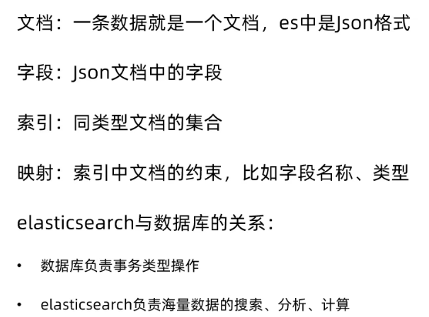
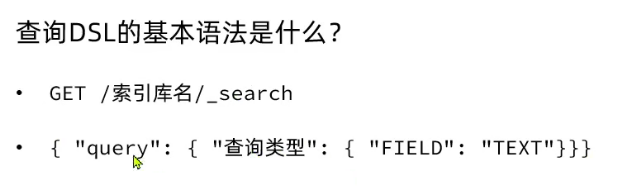

# 分布式搜索引擎01

-- elasticsearch基础


# 1.初识elasticsearch

## 1.1.了解ES


### 1.1.1.elasticsearch的作用

elasticsearch是一款非常强大的开源搜索引擎，具备非常多强大功能，可以帮助我们从海量数据中快速找到需要的内容

例如：

- 在GitHub搜索代码

  

- 在电商网站搜索商品

  

- 在百度搜索答案

  

- 在打车软件搜索附近的车

  


### 1.1.2.ELK技术栈

elasticsearch结合kibana、Logstash、Beats，也就是elastic stack（ELK）。被广泛应用在日志数据分析、实时监控等领域：


而**elasticsearch是elastic stack的核心**，负责存储、搜索、分析数据。


### 1.1.3.elasticsearch和lucene

elasticsearch底层是基于**lucene**来实现的。

**Lucene**是一个Java语言的搜索引擎类库，是Apache公司的顶级项目，由DougCutting于1999年研发。官网地址：https://lucene.apache.org/ 。


**elasticsearch**的发展历史：

- 2004年Shay Banon基于Lucene开发了Compass
- 2010年Shay Banon 重写了Compass，取名为Elasticsearch。


### 1.1.4.为什么不是其他搜索技术？

目前比较知名的搜索引擎技术排名：


虽然在早期，Apache Solr是最主要的搜索引擎技术，但随着发展elasticsearch已经渐渐超越了Solr，独占鳌头：


### 1.1.5.总结

什么是elasticsearch？

- 一个**开源的分布式搜索引擎**，可以用来实现搜索、日志统计、分析、系统监控等功能

什么是elastic stack（ELK）？

- 是以elasticsearch为核心的技术栈，包括beats、Logstash、kibana、elasticsearch

什么是Lucene？

- 是Apache的开源搜索引擎类库，提供了搜索引擎的核心API


## 1.2.倒排索引

倒排索引的概念是基于MySQL这样的正向索引而言的。

### 1.2.1.正向索引

那么什么是正向索引呢？例如给下表（tb_goods）中的id创建索引：


如果是根据id查询，那么直接走索引，查询速度非常快。


但如果是基于title做模糊查询，只能是逐行扫描数据，流程如下：

1）用户搜索数据，条件是title符合`"%手机%"`

2）逐行获取数据，比如id为1的数据

3）判断数据中的title是否符合用户搜索条件

4）如果符合则放入结果集，不符合则丢弃。回到步骤1


逐行扫描，也就是全表扫描，随着数据量增加，其查询效率也会越来越低。当数据量达到数百万时，就是一场灾难。


### 1.2.2.倒排索引

倒排索引中有两个非常重要的概念：

- 文档（`Document`）：用来搜索的数据，其中的**每一条数据就是一个文档**。例如一个网页、一个商品信息
- 词条（`Term`）：对文档数据或用户搜索数据，利用某种算法分词，得到的**具备含义的词语就是词条**。例如：我是中国人，就可以分为：我、是、中国人、中国、国人这样的几个词条


**创建倒排索引**是对正向索引的一种特殊处理，流程如下：

- 将每一个文档的数据利用算法分词，得到一个个词条
- 创建表，每行数据包括词条、词条所在文档id、位置等信息
- 因为**词条唯一性，可以给词条创建索引**，例如hash表结构索引

如图：


倒排索引的**搜索流程**如下（以搜索"华为手机"为例）：

1）用户输入条件`"华为手机"`进行搜索。

2）对用户输入内容**分词**，得到词条：`华为`、`手机`。

3）拿着词条在倒排索引中查找，可以得到包含词条的文档id：1、2、3。

4）拿着文档id到正向索引中查找具体文档。

如图：


虽然要先查询倒排索引，再查询倒排索引，但是无论是词条、还是文档id都建立了索引，查询速度非常快！无需全表扫描。


### 1.2.3.正向和倒排

那么为什么一个叫做正向索引，一个叫做倒排索引呢？

- **正向索引**是最传统的，根据id索引的方式。但根据词条查询时，必须先逐条获取每个文档，然后判断文档中是否包含所需要的词条，是**根据文档找词条的过程**。

- 而**倒排索引**则相反，是先找到用户要搜索的词条，根据词条得到保护词条的文档的id，然后根据id获取文档。是**根据词条找文档的过程**。

是不是恰好反过来了？


那么两者方式的优缺点是什么呢？

**正向索引**：

- 优点：
  - 可以给多个字段创建索引
  - 根据索引字段搜索、排序速度非常快
- 缺点：
  - 根据非索引字段，或者索引字段中的部分词条查找时，只能全表扫描。

**倒排索引**：

- 优点：
  - 根据词条搜索、模糊搜索时，速度非常快
- 缺点：
  - 只能给词条创建索引，而不是字段
  - 无法根据字段做排序


## 1.3.es的一些概念

elasticsearch中有很多独有的概念，与mysql中略有差别，但也有相似之处。


### 1.3.1.文档和字段

elasticsearch是面向**文档（Document）**存储的，可以是**数据库中的一条商品数据**，一个订单信息。文档数据会被序列化为json格式后存储在elasticsearch中：


而Json文档中往往包含很多的**字段（Field）**，类似于数据库中的列。


### 1.3.2.索引和映射

**索引（Index）**，就是**相同类型的文档的集合**。

例如：

- 所有用户文档，就可以组织在一起，称为用户的索引；
- 所有商品的文档，可以组织在一起，称为商品的索引；
- 所有订单的文档，可以组织在一起，称为订单的索引；


因此，我们可以把索引当做是数据库中的表。

数据库的表会有约束信息，用来定义表的结构、字段的名称、类型等信息。因此，索引库中就有**映射（mapping）**，是索引中文档的字段约束信息，类似表的结构约束。


### 1.3.3.mysql与elasticsearch

我们统一的把mysql与elasticsearch的概念做一下对比：

| **MySQL** | **Elasticsearch** | **说明**                                                     |
| --------- | ----------------- | ------------------------------------------------------------ |
| Table     | Index             | 索引(index)，就是文档的集合，类似数据库的表(table)           |
| Row       | Document          | 文档（Document），就是一条条的数据，类似数据库中的行（Row），文档都是JSON格式 |
| Column    | Field             | 字段（Field），就是JSON文档中的字段，类似数据库中的列（Column） |
| Schema    | Mapping           | Mapping（映射）是索引中文档的约束，例如字段类型约束。类似数据库的表结构（Schema） |
| SQL       | DSL               | DSL是elasticsearch提供的JSON风格的请求语句，用来操作elasticsearch，实现CRUD |

是不是说，我们学习了elasticsearch就不再需要mysql了呢？

并不是如此，两者各自有自己的擅长支出：

- Mysql：擅长事务类型操作，可以确保数据的安全和一致性

- Elasticsearch：擅长海量数据的搜索、分析、计算


因此在企业中，往往是两者结合使用：

- 对**安全性要求较高的写操作**，使用mysql实现
- 对**查询性能要求较高的搜索需求**，使用elasticsearch实现
- 两者再基于某种方式，实现数据的同步，保证一致性





## 1.4.安装es、kibana


### 1.4.1.安装

参考课前资料：

安装elasticsearch.md


### 1.4.2.分词器

es在创建倒排索引时需要对文档分词；在搜索时，需要对用户输入内容分词。但**默认的分词规则对中文处理并不友好。**
我们在kibana的DevTools中测试：

```
POST /_analyze
{
  "analyzer": "standard",
  "text": "黑马程序员学习java太棒了！"
}
```

语法说明：
POST：请求方式
 	/_analyze：请求路径，这里省略了http://192.168.150.101:9200，有kibana帮我们补充
		请求参数，json风格：
	analyzer：分词器类型，这里是默认的standard分词器
	text：要分词的内容

处理中文分词，一般会**使用IK分词器**。https://github.com/medcl/elasticsearch-analysis-ik
安装IK分词器，参考课前资料《安装elasticsearch.md》：

ik分词器包含两种模式：
	ik_smart：最少切分，粗粒度
	ik_max_word：最细切分，细粒度


### 1.4.3.总结

分词器的作用是什么？

- 创建倒排索引时对文档分词
- 用户搜索时，对输入的内容分词

IK分词器有几种模式？

- ik_smart：智能切分，粗粒度
- ik_max_word：最细切分，细粒度

IK分词器如何拓展词条？如何停用词条？

- 利用config目录的IkAnalyzer.cfg.xml文件添加拓展词典和停用词典
- 在词典中添加拓展词条或者停用词条


# 2.索引库操作

索引库就类似数据库表，mapping映射就类似表的结构。

我们要向es中存储数据，必须先创建“库”和“表”。


## 2.1.mapping映射属性

官方文档 

https://www.elastic.co/guide/en/elasticsearch/reference/current/index.html

mapping是对索引库中文档的约束，常见的mapping属性包括：

- type：字段数据类型，常见的简单类型有：
  - **字符串**：**text（可分词的文本**）、**keyword（精确值**，例如：品牌、国家、ip地址）
  - 数值：long、integer、short、byte、double、float、
  - 布尔：boolean
  - 日期：date
  - 对象：object
- index：是否创建索引，**默认为true**
- analyzer：使用哪种分词器
- properties：该字段的子字段


例如下面的json文档：

```json
{
    "age": 21,
    "weight": 52.1,
    "isMarried": false,
    "info": "黑马程序员Java讲师",
    "email": "zy@itcast.cn",
    "score": [99.1, 99.5, 98.9],
    "name": {
        "firstName": "云",
        "lastName": "赵"
    }
}
```

对应的每个字段映射（mapping）：

- age：类型为 integer；参与搜索，因此需要index为true；无需分词器
- weight：类型为float；参与搜索，因此需要index为true；无需分词器
- isMarried：类型为boolean；参与搜索，因此需要index为true；无需分词器
- info：类型为字符串，需要分词，因此是text；参与搜索，因此需要index为true；分词器可以用ik_smart
- email：类型为字符串，但是不需要分词，因此是keyword；不参与搜索，因此需要index为false；无需分词器
- score：虽然是数组，但是我们只看元素的类型，类型为float；参与搜索，因此需要index为true；无需分词器
- name：类型为object，需要定义多个子属性
  - name.firstName；类型为字符串，但是不需要分词，因此是keyword；参与搜索，因此需要index为true；无需分词器
  - name.lastName；类型为字符串，但是不需要分词，因此是keyword；参与搜索，因此需要index为true；无需分词器


## 2.2.索引库的CRUD

这里我们统一使用Kibana编写DSL的方式来演示。


### 2.2.1.创建索引库和映射

#### 基本语法：

- 请求方式：PUT
- 请求路径：/索引库名，可以自定义
- 请求参数：mapping映射

格式：

```json
PUT /索引库名称
{
  "mappings": {
    "properties": {
      "字段名":{
        "type": "text",
        "analyzer": "ik_smart"
      },
      "字段名2":{
        "type": "keyword",
        "index": "false"
      },
      "字段名3":{
        "properties": {
          "子字段": {
            "type": "keyword"
          }
        }
      },
      // ...略
    }
  }
}
```


#### 示例：

```sh
PUT /heima
{
  "mappings": {
    "properties": {
      "info":{
        "type": "text",
        "analyzer": "ik_smart"
      },
      "email":{
        "type": "keyword",
        "index": "false"
      },
      "name":{
        "type": "object", 
        "properties": {
          "firstName": {
            "type": "keyword"
          },
          "lastName": {
            "type": "keyword"
          }
        }
      }
    }
  }
}
```

在[Dev Tools](http://192.168.194.128:5601/app/dev_tools#/)运行可得到

```json
{
  "acknowledged" : true,
  "shards_acknowledged" : true,
  "index" : "heima"
}
```


### 2.2.2.查询索引库

**基本语法**：

- 请求方式：GET

- 请求路径：/索引库名

- 请求参数：无

**格式**：

```
GET /索引库名
```

**示例**：


### 2.2.3.修改索引库

倒排索引结构虽然不复杂，但是一旦数据结构改变（比如改变了分词器），就需要重新创建倒排索引，这简直是灾难。因此**索引库一旦创建，无法修改mapping**。


虽然无法修改mapping中已有的字段，但是却**允许添加新的字段到mapping中**，因为不会对倒排索引产生影响。

**语法说明**：

```json
PUT /索引库名/_mapping
{
  "properties": {
    "新字段名":{
      "type": "integer"
    }
  }
}
```


**示例**：


```sh
# 修改索引库，添加新字段
PUT /heima/_mapping
{
  "properties":{
    "age":{
      "type": "integer"
    }
  }
}
```


### 2.2.4.删除索引库

**语法：**

- 请求方式：DELETE

- 请求路径：/索引库名

- 请求参数：无

**格式：**

```
DELETE /索引库名
```

在kibana中测试：


### 2.2.5.总结

索引库操作有哪些？

- 创建索引库：PUT /索引库名
- 查询索引库：GET /索引库名
- 删除索引库：DELETE /索引库名
- 添加字段：PUT /索引库名/_mapping


# 3.文档操作

## 3.1.新增文档

**语法：**

```json
POST /索引库名/_doc/文档id
{
    "字段1": "值1",
    "字段2": "值2",
    "字段3": {
        "子属性1": "值3",
        "子属性2": "值4"
    },
    // ...
}
```

**示例：**

```json
# 插入文档
POST /heima/_doc/1
{
    "info": "黑马程序员Java讲师",
    "email": "zy@itcast.cn",
    "name": {
        "firstName": "云",
        "lastName": "赵"
    }
}
```

**响应：**


## 3.2.查询文档

根据rest风格，新增是post，查询应该是get，不过查询一般都需要条件，这里我们把文档id带上。

**语法：**

```json
GET /{索引库名称}/_doc/{id}
```

**通过kibana查看数据：**

```js
# 查询文档
GET /heima/_doc/1
```

**查看结果：**


## 3.3.删除文档

删除使用DELETE请求，同样，需要根据id进行删除：

**语法：**

```js
DELETE /{索引库名}/_doc/id值
```

**示例：**

```json
# 根据id删除数据
DELETE /heima/_doc/1
```

**结果：**


## 3.4.修改文档

修改有两种方式：

- 全量修改：**直接覆盖**原来的文档
- 增量修改：**修改文档中的部分**字段


### 3.4.1.全量修改

全量修改是覆盖原来的文档，其本质是：

- 根据指定的id删除文档
- 新增一个相同id的文档

**注意**：如果根据id删除时，**id不存在**，第二步的新增也会执行，也就**从修改变成了新增操作了**。


**语法：**

```json
PUT /{索引库名}/_doc/文档id
{
    "字段1": "值1",
    "字段2": "值2",
    // ... 略
}

```


**示例：**

```json
# 全量修改文档
PUT /heima/_doc/1
{
    "info": "黑马程序员高级Java讲师",
    "email": "zy@itcast.cn",
    "name": {
        "firstName": "云",
        "lastName": "赵"
    }
}
```


### 3.4.2.增量修改

增量修改是只修改指定id匹配的文档中的部分字段。

**语法：**

```json
POST /{索引库名}/_update/文档id
{
    "doc": {
         "字段名": "新的值",
    }
}
```


**示例：**

```json
# 局部修改文档
POST /heima/_update/1
{
  "doc": {
    "email": "ZhaoYun@itcast.cn"
  }
}
```


## 3.5.总结

文档操作有哪些？

- 创建文档：POST /{索引库名}/_doc/文档id   { json文档 }
- 查询文档：GET /{索引库名}/_doc/文档id
- 删除文档：DELETE /{索引库名}/_doc/文档id
- 修改文档：
  - 全量修改：PUT /{索引库名}/_doc/文档id { json文档 }
  - 增量修改：POST /{索引库名}/_update/文档id { "doc": {字段}}


# 4.RestClient操作索引库

**什么是RestClient**

ES官方提供了各种不同语言的客户端，用来操作ES。这些客户端的本质就是组装DSL语句，通过http请求发送给ES。官方文档地址：https://www.elastic.co/guide/en/elasticsearch/client/index.html

其中的Java Rest Client又包括两种：

- Java Low Level Rest Client
- Java High Level Rest Client


我们学习的是Java HighLevel Rest Client客户端API


## 4.0.导入Demo工程

### 4.0.1.导入数据

首先导入课前资料提供的数据库数据：

tb_hotel.sql

数据结构如下：

```sql
CREATE TABLE `tb_hotel` (
  `id` bigint(20) NOT NULL COMMENT '酒店id',
  `name` varchar(255) NOT NULL COMMENT '酒店名称；例：7天酒店',
  `address` varchar(255) NOT NULL COMMENT '酒店地址；例：航头路',
  `price` int(10) NOT NULL COMMENT '酒店价格；例：329',
  `score` int(2) NOT NULL COMMENT '酒店评分；例：45，就是4.5分',
  `brand` varchar(32) NOT NULL COMMENT '酒店品牌；例：如家',
  `city` varchar(32) NOT NULL COMMENT '所在城市；例：上海',
  `star_name` varchar(16) DEFAULT NULL COMMENT '酒店星级，从低到高分别是：1星到5星，1钻到5钻',
  `business` varchar(255) DEFAULT NULL COMMENT '商圈；例：虹桥',
  `latitude` varchar(32) NOT NULL COMMENT '纬度；例：31.2497',
  `longitude` varchar(32) NOT NULL COMMENT '经度；例：120.3925',
  `pic` varchar(255) DEFAULT NULL COMMENT '酒店图片；例:/img/1.jpg',
  PRIMARY KEY (`id`)
) ENGINE=InnoDB DEFAULT CHARSET=utf8mb4;
```


### 4.0.2.导入项目

然后导入课前资料提供的项目:

hotel-demo文件夹


项目结构如图：


### 4.0.3.mapping映射分析

创建索引库，最关键的是mapping映射，而mapping映射要考虑的信息包括：

- 字段名
- 字段数据类型
- 是否参与搜索
- 是否需要分词
- 如果分词，分词器是什么？

其中：

- 字段名、字段数据类型，可以参考数据表结构的名称和类型
- 是否参与搜索要分析业务来判断，例如图片地址，就无需参与搜索
- 是否分词呢要看内容，内容如果是一个整体就无需分词，反之则要分词
- 分词器，我们可以统一使用ik_max_word


来看下酒店数据的索引库结构:

```json
# 酒店的mapping
PUT /hotel
{
  "mappings": {
    "properties": {
      "id": {
        "type": "keyword"
      },
      "name":{
        "type": "text",
        "analyzer": "ik_max_word",
        "copy_to": "all"
      },
      "address":{
        "type": "keyword",
        "index": false
      },
      "price":{
        "type": "integer"
      },
      "score":{
        "type": "integer"
      },
      "brand":{
        "type": "keyword",
        "copy_to": "all"
      },
      "city":{
        "type": "keyword",
        "copy_to": "all"
      },
      "starName":{
        "type": "keyword"
      },
      "business":{
        "type": "keyword"
      },
      "location":{
        "type": "geo_point"
      },
      "pic":{
        "type": "keyword",
        "index": false
      },
      "all":{
        "type": "text",
        "analyzer": "ik_max_word"
      }
    }
  }
}
```


几个特殊字段说明：

- location：地理坐标，里面包含精度、纬度
- all：一个组合字段，其目的是将多字段的值 利用copy_to合并，提供给用户搜索


地理坐标说明：


copy_to说明：


### 4.0.4.初始化JavaRestClient

在elasticsearch提供的API中，与elasticsearch一切交互都封装在一个名为RestHighLevelClient的类中，必须先完成这个对象的初始化，建立与elasticsearch的连接。

分为三步：

1）引入es的RestHighLevelClient依赖：

```xml
<!--elasticsearch-->
<dependency>
    <groupId>org.elasticsearch.client</groupId>
    <artifactId>elasticsearch-rest-high-level-client</artifactId>
</dependency>
```


2）因为SpringBoot默认的ES版本是7.6.2，所以我们**需要覆盖默认的ES版本**：

```xml
<properties>
    <java.version>1.8</java.version>
    <elasticsearch.version>7.12.1</elasticsearch.version>
</properties>
```


3）初始化RestHighLevelClient：

初始化的代码如下：

```java
RestHighLevelClient client = new RestHighLevelClient(RestClient.builder(
        HttpHost.create("http://192.168.150.101:9200")
));
```


这里为了单元测试方便，我们创建一个测试类HotelIndexTest，然后将初始化的代码编写在@BeforeEach方法中：

```java
package cn.itcast.hotel;

import org.apache.http.HttpHost;
import org.elasticsearch.client.RestHighLevelClient;
import org.junit.jupiter.api.AfterEach;
import org.junit.jupiter.api.BeforeEach;
import org.junit.jupiter.api.Test;

import java.io.IOException;

public class HotelIndexTest {
    private RestHighLevelClient client;
    
	@Test
    void testInit(){
        System.out.println(client);
    }
    @BeforeEach
    void setUp() {
        this.client = new RestHighLevelClient(RestClient.builder(
                HttpHost.create("http://192.168.150.101:9200")
        ));
    }

    @AfterEach
    void tearDown() throws IOException {
        this.client.close();
    }
}
```


## 4.1.创建索引库

### 4.1.1.代码解读

创建索引库的API如下：


代码分为三步：

- 1）创建Request对象。因为是创建索引库的操作，因此Request是CreateIndexRequest。
- 2）添加请求参数，其实就是DSL的JSON参数部分。因为json字符串很长，这里是定义了静态字符串常量MAPPING_TEMPLATE，让代码看起来更加优雅。
- 3）发送请求，client.indices()方法的返回值是IndicesClient类型，封装了所有与索引库操作有关的方法。


### 4.1.2.完整示例

在hotel-demo的cn.itcast.hotel.constants包下，创建一个类，定义mapping映射的JSON字符串常量：

```java
package cn.itcast.hotel.constants;

public class HotelConstants {
    public static final String MAPPING_TEMPLATE = "{\n" +
            "  \"mappings\": {\n" +
            "    \"properties\": {\n" +
            "      \"id\": {\n" +
            "        \"type\": \"keyword\"\n" +
            "      },\n" +
            "      \"name\":{\n" +
            "        \"type\": \"text\",\n" +
            "        \"analyzer\": \"ik_max_word\",\n" +
            "        \"copy_to\": \"all\"\n" +
            "      },\n" +
            "      \"address\":{\n" +
            "        \"type\": \"keyword\",\n" +
            "        \"index\": false\n" +
            "      },\n" +
            "      \"price\":{\n" +
            "        \"type\": \"integer\"\n" +
            "      },\n" +
            "      \"score\":{\n" +
            "        \"type\": \"integer\"\n" +
            "      },\n" +
            "      \"brand\":{\n" +
            "        \"type\": \"keyword\",\n" +
            "        \"copy_to\": \"all\"\n" +
            "      },\n" +
            "      \"city\":{\n" +
            "        \"type\": \"keyword\",\n" +
            "        \"copy_to\": \"all\"\n" +
            "      },\n" +
            "      \"starName\":{\n" +
            "        \"type\": \"keyword\"\n" +
            "      },\n" +
            "      \"business\":{\n" +
            "        \"type\": \"keyword\"\n" +
            "      },\n" +
            "      \"location\":{\n" +
            "        \"type\": \"geo_point\"\n" +
            "      },\n" +
            "      \"pic\":{\n" +
            "        \"type\": \"keyword\",\n" +
            "        \"index\": false\n" +
            "      },\n" +
            "      \"all\":{\n" +
            "        \"type\": \"text\",\n" +
            "        \"analyzer\": \"ik_max_word\"\n" +
            "      }\n" +
            "    }\n" +
            "  }\n" +
            "}";
}
```


在hotel-demo中的HotelIndexTest测试类中，编写单元测试，实现创建索引：

```java
@Test
void createHotelIndex() throws IOException {
    // 1.创建Request对象
    CreateIndexRequest request = new CreateIndexRequest("hotel");
    // 2.准备请求的参数：DSL语句
    request.source(MAPPING_TEMPLATE, XContentType.JSON);
    // 3.发送请求
    client.indices().create(request, RequestOptions.DEFAULT);
}
```

可在http://192.168.153.128:5601/app/dev_tools#/console测试

```sh
GET /hotel
```


## 4.2.删除索引库

删除索引库的DSL语句非常简单：

```json
DELETE /hotel
```

与创建索引库相比：

- 请求方式从PUT变为DELTE
- 请求路径不变
- 无请求参数

所以代码的差异，注意体现在Request对象上。依然是三步走：

- 1）创建Request对象。这次是DeleteIndexRequest对象
- 2）准备参数。这里是无参
- 3）发送请求。改用delete方法

在hotel-demo中的HotelIndexTest测试类中，编写单元测试，实现删除索引：

```java
@Test
void testDeleteHotelIndex() throws IOException {
    // 1.创建Request对象
    DeleteIndexRequest request = new DeleteIndexRequest("hotel");
    // 2.发送请求
    client.indices().delete(request, RequestOptions.DEFAULT);
}
```


## 4.3.判断索引库是否存在

判断索引库是否存在，本质就是查询，对应的DSL是：

```json
GET /hotel
```


因此与删除的Java代码流程是类似的。依然是三步走：

- 1）创建Request对象。这次是GetIndexRequest对象
- 2）准备参数。这里是无参
- 3）发送请求。改用exists方法

```java
@Test
void testExistsHotelIndex() throws IOException {
    // 1.创建Request对象
    GetIndexRequest request = new GetIndexRequest("hotel");
    // 2.发送请求
    boolean exists = client.indices().exists(request, RequestOptions.DEFAULT);
    // 3.输出
    System.err.println(exists ? "索引库已经存在！" : "索引库不存在！");
}
```


## 4.4.总结

JavaRestClient操作elasticsearch的流程基本类似。核心是client.indices()方法来获取索引库的操作对象。

索引库操作的基本步骤：

- 初始化RestHighLevelClient
- 创建XxxIndexRequest。XXX是Create、Get、Delete
- 准备DSL**（ Create时需要，其它是无参）**
- 发送请求。调用RestHighLevelClient#indices().xxx()方法，xxx是create、exists、delete


# 5.RestClient操作文档

为了与索引库操作分离，我们再次参加一个测试类，做两件事情：

- 初始化RestHighLevelClient
- 我们的酒店数据在数据库，需要利用IHotelService去查询，所以注入这个接口

```java
package cn.itcast.hotel;

import cn.itcast.hotel.pojo.Hotel;
import cn.itcast.hotel.service.IHotelService;
import org.junit.jupiter.api.AfterEach;
import org.junit.jupiter.api.BeforeEach;
import org.junit.jupiter.api.Test;
import org.springframework.beans.factory.annotation.Autowired;
import org.springframework.boot.test.context.SpringBootTest;

import java.io.IOException;
import java.util.List;

@SpringBootTest
public class HotelDocumentTest {
    @Autowired
    private IHotelService hotelService;

    private RestHighLevelClient client;

    @BeforeEach
    void setUp() {
        this.client = new RestHighLevelClient(RestClient.builder(
                HttpHost.create("http://192.168.150.101:9200")
        ));
    }

    @AfterEach
    void tearDown() throws IOException {
        this.client.close();
    }
}

```


## 5.1.新增文档

我们要将数据库的酒店数据查询出来，写入elasticsearch中。

### 5.1.1.索引库实体类

数据库查询后的结果是一个Hotel类型的对象。结构如下：

```java
@Data
@TableName("tb_hotel")
public class Hotel {
    @TableId(type = IdType.INPUT)
    private Long id;
    private String name;
    private String address;
    private Integer price;
    private Integer score;
    private String brand;
    private String city;
    private String starName;
    private String business;
    private String longitude;
    private String latitude;
    private String pic;
}
```

与我们的索引库结构存在差异：

- longitude和latitude需要合并为location

因此，我们需要定义一个新的类型，与**索引库结构吻合**：

```java
package cn.itcast.hotel.pojo;

import lombok.Data;
import lombok.NoArgsConstructor;

@Data
@NoArgsConstructor
public class HotelDoc {
    private Long id;
    private String name;
    private String address;
    private Integer price;
    private Integer score;
    private String brand;
    private String city;
    private String starName;
    private String business;
    private String location;
    private String pic;

    public HotelDoc(Hotel hotel) {
        this.id = hotel.getId();
        this.name = hotel.getName();
        this.address = hotel.getAddress();
        this.price = hotel.getPrice();
        this.score = hotel.getScore();
        this.brand = hotel.getBrand();
        this.city = hotel.getCity();
        this.starName = hotel.getStarName();
        this.business = hotel.getBusiness();
        this.location = hotel.getLatitude() + ", " + hotel.getLongitude();
        this.pic = hotel.getPic();
    }
}

```


### 5.1.2.语法说明

新增文档的DSL语句如下：

```json
POST /{索引库名}/_doc/1
{
    "name": "Jack",
    "age": 21
}
```

对应的java代码如图：


可以看到与创建索引库类似，同样是三步走：

- 1）创建Request对象
- 2）准备请求参数，也就是DSL中的JSON文档
- 3）发送请求

变化的地方在于，这里直接使用client.xxx()的API，不再需要client.indices()了。


### 5.1.3.完整代码

我们导入酒店数据，基本流程一致，但是需要考虑几点变化：

- 酒店数据来自于数据库，我们需要先查询出来，得到hotel对象
- hotel对象需要转为HotelDoc对象
- HotelDoc需要序列化为json格式

因此，代码整体步骤如下：

- 1）根据id查询酒店数据Hotel
- 2）将Hotel封装为HotelDoc
- 3）将HotelDoc序列化为JSON
- 4）创建IndexRequest，指定索引库名和id
- 5）准备请求参数，也就是JSON文档
- 6）发送请求

在hotel-demo的HotelDocumentTest测试类中，编写单元测试：

```java
@Test
void testAddDocument() throws IOException {
    // 1.根据id查询酒店数据
    Hotel hotel = hotelService.getById(61083L);
    // 2.转换为文档类型
    HotelDoc hotelDoc = new HotelDoc(hotel);
    // 3.将HotelDoc转json
    String json = JSON.toJSONString(hotelDoc);

    // 1.准备Request对象
    IndexRequest request = new IndexRequest("hotel").id(hotelDoc.getId().toString());
    // 2.准备Json文档
    request.source(json, XContentType.JSON);
    // 3.发送请求
    client.index(request, RequestOptions.DEFAULT);
}
```


## 5.2.查询文档

### 5.2.1.语法说明

查询的DSL语句如下：

```json
GET /hotel/_doc/{id}
```

非常简单，因此代码大概分两步：

- 准备Request对象
- 发送请求

不过查询的目的是得到结果，解析为HotelDoc，因此难点是结果的解析。完整代码如下：


可以看到，结果是一个JSON，其中文档放在一个`_source`属性中，因此解析就是拿到`_source`，反序列化为Java对象即可。

与之前类似，也是三步走：

- 1）准备Request对象。这次是查询，所以是GetRequest
- 2）发送请求，得到结果。因为是查询，这里调用client.get()方法
- 3）解析结果，就是对JSON做反序列化


### 5.2.2.完整代码

在hotel-demo的HotelDocumentTest测试类中，编写单元测试：

```java
@Test
void testGetDocumentById() throws IOException {
    // 1.准备Request
    GetRequest request = new GetRequest("hotel", "61082");
    // 2.发送请求，得到响应
    GetResponse response = client.get(request, RequestOptions.DEFAULT);
    // 3.解析响应结果
    String json = response.getSourceAsString();

    HotelDoc hotelDoc = JSON.parseObject(json, HotelDoc.class);
    System.out.println(hotelDoc);
}
```


## 5.3.删除文档

删除的DSL为是这样的：

```json
DELETE /hotel/_doc/{id}
```

与查询相比，仅仅是请求方式从DELETE变成GET，可以想象Java代码应该依然是三步走：

- 1）准备Request对象，因为是删除，这次是DeleteRequest对象。要指定索引库名和id
- 2）准备参数，无参
- 3）发送请求。因为是删除，所以是client.delete()方法


在hotel-demo的HotelDocumentTest测试类中，编写单元测试：

```java
@Test
void testDeleteDocument() throws IOException {
    // 1.准备Request
    DeleteRequest request = new DeleteRequest("hotel", "61083");
    // 2.发送请求
    client.delete(request, RequestOptions.DEFAULT);
}
```


## 5.4.修改文档

### 5.4.1.语法说明

修改我们讲过两种方式：

- 全量修改：本质是先根据id删除，再新增
- 增量修改：修改文档中的指定字段值


在RestClient的API中，全量修改与新增的API完全一致，判断依据是ID：

- 如果新增时，ID已经存在，则修改
- 如果新增时，ID不存在，则新增

这里不再赘述，我们主要关注增量修改。

代码示例如图：


与之前类似，也是三步走：

- 1）准备Request对象。这次是修改，所以是UpdateRequest
- 2）准备参数。也就是JSON文档，里面包含要修改的字段
- 3）更新文档。这里调用client.update()方法


### 5.4.2.完整代码

在hotel-demo的HotelDocumentTest测试类中，编写单元测试：

```java
@Test
void testUpdateDocument() throws IOException {
    // 1.准备Request
    UpdateRequest request = new UpdateRequest("hotel", "61083");
    // 2.准备请求参数
    request.doc(
        "price", "952",
        "starName", "四钻"
    );
    // 3.发送请求
    client.update(request, RequestOptions.DEFAULT);
}
```


## 5.5.批量导入文档

案例需求：利用BulkRequest批量将数据库数据导入到索引库中。

步骤如下：

- 利用mybatis-plus查询酒店数据

- 将查询到的酒店数据（Hotel）转换为文档类型数据（HotelDoc）

- 利用JavaRestClient中的BulkRequest批处理，实现批量新增文档


### 5.5.1.语法说明

批量处理BulkRequest，其本质就是将多个普通的CRUD请求组合在一起发送。

其中提供了一个add方法，用来添加其他请求：


可以看到，能添加的请求包括：

- IndexRequest，也就是新增
- UpdateRequest，也就是修改
- DeleteRequest，也就是删除

因此Bulk中添加了多个IndexRequest，就是批量新增功能了。示例：


其实还是三步走：

- 1）创建Request对象。这里是BulkRequest
- 2）准备参数。批处理的参数，就是其它Request对象，这里就是多个IndexRequest
- 3）发起请求。这里是批处理，调用的方法为client.bulk()方法


我们在导入酒店数据时，将上述代码改造成for循环处理即可。

### 5.5.2.完整代码

在hotel-demo的HotelDocumentTest测试类中，编写单元测试：

```java
@Test
void testBulkRequest() throws IOException {
    // 批量查询酒店数据
    List<Hotel> hotels = hotelService.list();

    // 1.创建Request
    BulkRequest request = new BulkRequest();
    // 2.准备参数，添加多个新增的Request
    for (Hotel hotel : hotels) {
        // 2.1.转换为文档类型HotelDoc
        HotelDoc hotelDoc = new HotelDoc(hotel);
        // 2.2.创建新增文档的Request对象
        request.add(new IndexRequest("hotel")
                    .id(hotelDoc.getId().toString())
                    .source(JSON.toJSONString(hotelDoc), XContentType.JSON));
    }
    // 3.发送请求
    client.bulk(request, RequestOptions.DEFAULT);
}
```

http://192.168.153.128:5601/app/dev_tools#/console中GET /hotel/_search可查看


## 5.6.小结

文档操作的基本步骤：

- 初始化RestHighLevelClient
- 创建XxxRequest。XXX是Index、Get、Update、Delete、Bulk
- 准备参数（Index、Update、Bulk时需要）
- 发送请求。调用RestHighLevelClient#.xxx()方法，xxx是index、get、update、delete、bulk
- 解析结果（Get时需要）

# 分布式搜索引擎02

在昨天的学习中，我们已经导入了大量数据到elasticsearch中，实现了elasticsearch的数据存储功能。但elasticsearch最擅长的还是搜索和数据分析。

所以今天，我们研究下elasticsearch的数据搜索功能。我们会分别使用**DSL**和**RestClient**实现搜索。


# 1.DSL查询文档

elasticsearch的查询依然是基于JSON风格的DSL来实现的。

## 1.1.DSL查询分类

Elasticsearch提供了基于JSON的DSL（[Domain Specific Language](https://www.elastic.co/guide/en/elasticsearch/reference/current/query-dsl.html)）来定义查询。常见的查询类型包括：

- **查询所有**：查询出所有数据，一般测试用。例如：match_all

- **全文检索（full text）查询**：利用分词器对用户输入内容分词，然后去倒排索引库中匹配。例如：
  - match_query
  - multi_match_query
- **精确查询**：根据精确词条值查找数据，一般是查找keyword、数值、日期、boolean等类型字段。例如：
  - ids
  - range
  - term
- **地理（geo）查询**：根据经纬度查询。例如：
  - geo_distance
  - geo_bounding_box
- **复合（compound）查询**：复合查询可以将上述各种查询条件组合起来，合并查询条件。例如：
  - bool
  - function_score


查询的语法基本一致：

```json
GET /indexName/_search
{
  "query": {
    "查询类型": {
      "查询条件": "条件值"
    }
  }
}
```

我们以查询所有为例，其中：

- 查询类型为match_all
- 没有查询条件

```json
// 查询所有
GET /indexName/_search
{
  "query": {
    "match_all": {
    }
  }
}
```

其它查询无非就是**查询类型**、**查询条件**的变化。



## 1.2.全文检索查询


### 1.2.1.使用场景

全文检索查询的基本流程如下：

- 对用户搜索的内容做分词，得到词条
- 根据词条去倒排索引库中匹配，得到文档id
- 根据文档id找到文档，返回给用户

比较常用的场景包括：

- 商城的输入框搜索
- 百度输入框搜索

例如京东：


因为是拿着词条去匹配，因此参与搜索的字段也必须是可分词的text类型的字段。


### 1.2.2.基本语法

常见的全文检索查询包括：

- match查询：单字段查询
- multi_match查询：多字段查询，任意一个字段符合条件就算符合查询条件

match查询语法如下：

```json
GET /indexName/_search
{
  "query": {
    "match": {
      "FIELD": "TEXT"
    }
  }
}
```

mulit_match语法如下：

```json
GET /indexName/_search
{
  "query": {
    "multi_match": {
      "query": "TEXT",
      "fields": ["FIELD1", " FIELD12"]
    }
  }
}
```


### 1.2.3.示例

match查询示例：

```sh
# match查询
GET /hotel/_search
{
  "query": {
    "match": {
      "all": "如家外滩"
    }
  }
}
```


multi_match查询示例：

```sh
# mutil_match查询
GET /hotel/_search
{
  "query": {
    "multi_match": {
      "query": "外滩如家",
      "fields": ["brand","name","business"]
    }
  }
}
```


可以看到，两种查询结果是一样的，为什么？

因为我们将brand、name、business值都利用copy_to复制到了all字段中。因此你根据三个字段搜索，和根据all字段搜索效果当然一样了。

但是，搜索字段越多，对查询性能影响越大，因此建议采用copy_to，然后单字段查询的方式。


### 1.2.4.总结

match和multi_match的区别是什么？

- match：根据一个字段查询
- multi_match：根据多个字段查询，参与查询字段越多，查询性能越差


## 1.3.精准查询

精确查询一般是查找keyword、数值、日期、boolean等类型字段。所以**不会**对搜索条件分词。常见的有：

- term：根据词条**精确值查询**
- range：根据**值的范围查询**


### 1.3.1.term查询

因为精确查询的字段搜是不分词的字段，因此查询的条件也必须是**不分词**的词条。查询时，用户输入的内容跟自动值完全匹配时才认为符合条件。如果用户输入的内容过多，反而搜索不到数据。


语法说明：

```json
// term查询
GET /indexName/_search
{
  "query": {
    "term": {
      "FIELD": {
        "value": "VALUE"
      }
    }
  }
}
```


示例：

当我搜索的是精确词条时，能正确查询出结果：

```sh
# term查询
GET /hotel/_search
{
  "query": {
    "term": {
      "city": {
        "value": "上海"
      }
    }
  }
}
```


但是，当我搜索的内容不是词条，而是多个词语形成的短语时，反而搜索不到：


### 1.3.2.range查询

范围查询，一般应用在对数值类型做范围过滤的时候。比如做价格范围过滤。

gte: greater than or equal

基本语法：

```json
// range查询
GET /indexName/_search
{
  "query": {
    "range": {
      "FIELD": {
        "gte": 10, // 这里的gte代表大于等于，gt则代表大于
        "lte": 20 // lte代表小于等于，lt则代表小于
      }
    }
  }
}
```


示例：

```sh
# range查询
GET /hotel/_search
{
  "query": {
    "range": {
      "price": {
        "gte": 100,
        "lte": 300
      }
    }
  }
}
```


### 1.3.3.总结

精确查询常见的有哪些？

- term查询：根据词条精确匹配，一般搜索keyword类型、数值类型、布尔类型、日期类型字段
- range查询：根据数值范围查询，可以是数值、日期的范围


## 1.4.地理坐标查询

所谓的地理坐标查询，其实就是根据经纬度查询，官方文档：https://www.elastic.co/guide/en/elasticsearch/reference/current/geo-queries.html

常见的使用场景包括：

- 携程：搜索我附近的酒店
- 滴滴：搜索我附近的出租车
- 微信：搜索我附近的人


附近的酒店：

 

附近的车：

 


### 1.4.1.矩形范围查询

矩形范围查询，也就是geo_bounding_box查询，查询坐标落在某个矩形范围的所有文档：


查询时，需要指定矩形的**左上**、**右下**两个点的坐标，然后画出一个矩形，落在该矩形内的都是符合条件的点。

语法如下：

```json
// geo_bounding_box查询
GET /indexName/_search
{
  "query": {
    "geo_bounding_box": {
      "FIELD": {
        "top_left": { // 左上点
          "lat": 31.1,
          "lon": 121.5
        },
        "bottom_right": { // 右下点
          "lat": 30.9,
          "lon": 121.7
        }
      }
    }
  }
}
```

这种并不**符合“附近的人”这样的需求，所以我们就不做了**。

用的少

### 1.4.2.附近查询

附近查询，也叫做距离查询（geo_distance）：查询到指定中心点小于某个距离值的所有文档。


换句话来说，在地图上找一个点作为圆心，以指定距离为半径，画一个圆，落在圆内的坐标都算符合条件：


语法说明：

```json
// geo_distance 查询
GET /indexName/_search
{
  "query": {
    "geo_distance": {
      "distance": "15km", // 半径
      "FIELD": "31.21,121.5" // 圆心
    }
  }
}
```


示例：

我们先搜索陆家嘴附近15km的酒店：

```sh
# distance查询
GET /hotel/_search
{
  "query": {
    "geo_distance": {
      "distance": "15km",
      "location": "31.21, 121.5"
    }
  }
}
```


发现共有47家酒店。


然后把半径缩短到3公里：


可以发现，搜索到的酒店数量减少到了5家。


## 1.5.复合查询

复合（compound）查询：复合查询可以将其它简单查询组合起来，实现更复杂的搜索逻辑。常见的有两种：

- fuction score：算分函数查询，可以控制文档相关性算分，控制文档排名
- bool query：布尔查询，利用逻辑关系组合多个其它的查询，实现复杂搜索


### 1.5.1.相关性算分

当我们利用match查询时，文档结果会根据与搜索词条的关联度打分（_score），返回结果时按照分值降序排列。

例如，我们搜索 "虹桥如家"，结果如下：

```json
[
  {
    "_score" : 17.850193,
    "_source" : {
      "name" : "虹桥如家酒店真不错",
    }
  },
  {
    "_score" : 12.259849,
    "_source" : {
      "name" : "外滩如家酒店真不错",
    }
  },
  {
    "_score" : 11.91091,
    "_source" : {
      "name" : "迪士尼如家酒店真不错",
    }
  }
]
```


在elasticsearch中，早期使用的打分算法是TF-IDF算法，公式如下：


在后来的5.1版本升级中，elasticsearch将算法改进为BM25算法，公式如下：


TF-IDF算法有一各缺陷，就是词条频率越高，文档得分也会越高，单个词条对文档影响较大。而BM25则会让单个词条的算分有一个上限，曲线更加平滑：


小结：elasticsearch会根据词条和文档的相关度做打分，算法由两种：

- TF-IDF算法
- BM25算法，elasticsearch5.1版本后采用的算法


### 1.5.2.算分函数查询

根据相关度打分是比较合理的需求，但**合理的不一定是产品经理需要**的。

以百度为例，你搜索的结果中，并不是相关度越高排名越靠前，而是谁掏的钱多排名就越靠前。如图：


要想认为控制相关性算分，就需要利用elasticsearch中的function score 查询了。


#### 1）语法说明


function score 查询中包含四部分内容：

- **原始查询**条件：query部分，基于这个条件搜索文档，并且基于BM25算法给文档打分，**原始算分**（query score)
- **过滤条件**：filter部分，符合该条件的文档才会重新算分
- **算分函数**：符合filter条件的文档要根据这个函数做运算，得到的**函数算分**（function score），有四种函数
  - weight：函数结果是常量
  - field_value_factor：以文档中的某个字段值作为函数结果
  - random_score：以随机数作为函数结果
  - script_score：自定义算分函数算法
- **运算模式**：算分函数的结果、原始查询的相关性算分，两者之间的运算方式，包括：
  - multiply：相乘
  - replace：用function score替换query score
  - 其它，例如：sum、avg、max、min


function score的运行流程如下：

- 1）根据**原始条件**查询搜索文档，并且计算相关性算分，称为**原始算分**（query score）
- 2）根据**过滤条件**，过滤文档
- 3）符合**过滤条件**的文档，基于**算分函数**运算，得到**函数算分**（function score）
- 4）将**原始算分**（query score）和**函数算分**（function score）基于**运算模式**做运算，得到最终结果，作为相关性算分。


因此，其中的关键点是：

- 过滤条件：决定哪些文档的算分被修改
- 算分函数：决定函数算分的算法
- 运算模式：决定最终算分结果


#### 2）示例

需求：给“如家”这个品牌的酒店排名靠前一些

翻译一下这个需求，转换为之前说的四个要点：

- 原始条件：不确定，可以任意变化
- 过滤条件：brand = "如家"
- 算分函数：可以简单粗暴，直接给固定的算分结果，weight
- 运算模式：比如求和

因此最终的DSL语句如下：

```json
GET /hotel/_search
{
  "query": {
    "function_score": {
      "query": {  .... }, // 原始查询，可以是任意条件
      "functions": [ // 算分函数
        {
          "filter": { // 满足的条件，品牌必须是如家
            "term": {
              "brand": "如家"
            }
          },
          "weight": 2 // 算分权重为2
        }
      ],
      "boost_mode": "sum" // 加权模式，求和
    }
  }
}
```


测试，在未添加算分函数时，如家得分如下：

```sh
GET /hotel/_search
{
  "query": {
    "function_score": {
      "query": {
        "match": {
          "all": "外滩"
        }
      }
    }
  }
}
```


添加了算分函数后，如家得分就提升了：

```sh
# function_score查询
GET /hotel/_search
{
  "query": {
    "function_score": {
      "query": {
        "match": {
          "all": "外滩"
        }
      },
      "functions": [
      {
        "filter":{
          "term":{
            "brand":"如家"
          }
        },
        "weight": 10
      }
    ],
      "boost_mode": "sum"
    }
  }
}
```


#### 3）小结

function score query定义的三要素是什么？

- 过滤条件：哪些**文档要加分**
- 算分函数：如何计算function score
- 加权方式：function score 与 query score如何运算


### 1.5.3.布尔查询

布尔查询是一个或多个查询子句的组合，每一个子句就是一个**子查询**。子查询的组合方式有：

- must：必须匹配每个子查询，类似“与”
- should：选择性匹配子查询，类似“或”
- must_not：必须不匹配，**不参与算分**，类似“非”
- filter：必须匹配，**不参与算分**

**不算分效率高**

比如在搜索酒店时，除了关键字搜索外，我们还可能根据品牌、价格、城市等字段做过滤：


每一个不同的字段，其查询的条件、方式都不一样，必须是多个不同的查询，而要组合这些查询，就必须用bool查询了。


需要注意的是，搜索时，参与**打分的字段越多，查询的性能也越差**。因此这种多条件查询时，建议这样做：

- 搜索框的关键字搜索，是全文检索查询，使用must查询，参与算分
- 其它过滤条件，采用filter查询。不参与算分


#### 1）语法示例：

```json
GET /hotel/_search
{
  "query": {
    "bool": {
      "must": [
        {"term": {"city": "上海" }}
      ],
      "should": [
        {"term": {"brand": "皇冠假日" }},
        {"term": {"brand": "华美达" }}
      ],
      "must_not": [
        { "range": { "price": { "lte": 500 } }}
      ],
      "filter": [
        { "range": {"score": { "gte": 45 } }}
      ]
    }
  }
}
```


#### 2）示例

需求：搜索名字包含“如家”，价格不高于400，在坐标31.21,121.5周围10km范围内的酒店。

分析：

- 名称搜索，属于全文检索查询，应该参与算分。放到must中
- 价格不高于400，用range查询，属于过滤条件，不参与算分。放到must_not中
- 周围10km范围内，用geo_distance查询，属于过滤条件，不参与算分。放到filter中

```sh
GET /hotel/_search
{
  "query": {
    "bool": {
      "must": [
        {
          "match": {
            "name": "如家"
          }
        }
      ],
      "must_not": [
        {
          "range": {
            "price": {
              "gt": 400
            }
          }
        }
      ],
      "filter": [
        {
          "geo_distance": {
            "distance": "10km",
            "location": {
              "lat": 31.21,
              "lon": 121.5
            }
          }
        }
      ]
    }
  }
}
```


#### 3）小结

bool查询有几种逻辑关系？

- must：必须匹配的条件，可以理解为“与”
- should：选择性匹配的条件，可以理解为“或”
- must_not：必须不匹配的条件，不参与打分
- filter：必须匹配的条件，不参与打分


# 2.搜索结果处理

搜索的结果可以按照用户指定的方式去处理或展示。

## 2.1.排序

elasticsearch默认是根据相关度算分（_score）来排序，但是也支持自定义方式对搜索[结果排序](https://www.elastic.co/guide/en/elasticsearch/reference/current/sort-search-results.html)。可以排序字段类型有：keyword类型、数值类型、地理坐标类型、日期类型等。

### 2.1.1.普通字段排序

keyword、数值、日期类型排序的语法基本一致。

**语法**：

```json
GET /indexName/_search
{
  "query": {
    "match_all": {}
  },
  "sort": [
    {
      "FIELD": "desc"  // 排序字段、排序方式ASC、DESC
    }
  ]
}
```

排序条件是一个数组，也就是可以写多个排序条件。按照声明的顺序，当第一个条件相等时，再按照第二个条件排序，以此类推


**示例**：

需求描述：酒店数据按照用户评价（score)降序排序，评价相同的按照价格(price)升序排序

```sh
# sort排序
GET /hotel/_search
{
  "query": {
    "match_all": {}
  },
  "sort": [
    {
      "score":  "desc"
    },{
      "price":  "asc"
    }
  ]
}
```


### 2.1.2.地理坐标排序

地理坐标排序略有不同。

**语法说明**：

```json
GET /indexName/_search
{
  "query": {
    "match_all": {}
  },
  "sort": [
    {
      "_geo_distance" : {
          "FIELD" : "纬度，经度", // 文档中geo_point类型的字段名、目标坐标点
          "order" : "asc", // 排序方式
          "unit" : "km" // 排序的距离单位
      }
    }
  ]
}
```

这个查询的含义是：

- 指定一个坐标，作为目标点
- 计算每一个文档中，指定字段（必须是geo_point类型）的坐标 到目标点的距离是多少
- 根据距离排序


**示例：**

需求描述：实现对酒店数据按照到你的位置坐标的距离升序排序

提示：获取你的位置的经纬度的方式：https://lbs.amap.com/demo/jsapi-v2/example/map/click-to-get-lnglat/

```sh
# 找到121,31周围的酒店，距离升序排序
GET /hotel/_search
{
  "query": {"match_all": {}},
  "sort": [
    {
      "_geo_distance": {
        "location": {
          "lat": 31,
          "lon": 121
        },
        "order": "asc",
        "unit": "km"
      }
    }
  ]
}
```


假设我的位置是：31.034661，121.612282，寻找我周围距离最近的酒店。


## 2.2.分页

elasticsearch 默认情况下只**返回top10的数据**。而如果要查询更多数据就需要修改分页参数了。elasticsearch中通过修改from、size参数来控制要返回的分页结果：

- from：从第几个文档开始
- size：总共查询几个文档

类似于mysql中的`limit ?, ?`

### 2.2.1.基本的分页

分页的基本语法如下：

```json
# 分页查询
GET /hotel/_search
{
  "query": {
    "match_all": {}
  },
  "from": 0, // 分页开始的位置，默认为0
  "size": 10, // 期望获取的文档总数
  "sort": [
    {"price": "asc"}
  ]
}
```


### 2.2.2.深度分页问题

现在，我要查询990~1000的数据，查询逻辑要这么写：

```json
GET /hotel/_search
{
  "query": {
    "match_all": {}
  },
  "from": 990, // 分页开始的位置，默认为0
  "size": 10, // 期望获取的文档总数
  "sort": [
    {"price": "asc"}
  ]
}
```

这里是查询990开始的数据，也就是 第990~第1000条 数据。

不过，elasticsearch内部分页时，必须先查询 0~1000条，然后截取其中的990 ~ 1000的这10条：


查询TOP1000，如果es是单点模式，这并无太大影响。

但是elasticsearch将来一定是集群，例如我集群有5个节点，我要查询TOP1000的数据，并不是每个节点查询200条就可以了。

因为节点A的TOP200，在另一个节点可能排到10000名以外了。

因此要想获取整个集群的TOP1000，必须先查询出每个节点的TOP1000，汇总结果后，重新排名，重新截取TOP1000。


那如果我要查询9900~10000的数据呢？是不是要先查询TOP10000呢？那每个节点都要查询10000条？汇总到内存中？


当查询分页深度较大时，汇总数据过多，对内存和CPU会产生非常大的压力，因此elasticsearch会禁止from+ size 超过10000的请求。


针对深度分页，ES提供了两种解决方案，[官方文档](https://www.elastic.co/guide/en/elasticsearch/reference/current/paginate-search-results.html)：

- search after：分页时需要排序，原理是从上一次的排序值开始，查询下一页数据。官方推荐使用的方式。
- scroll：原理将排序后的文档id形成快照，保存在内存。官方已经不推荐使用。


### 2.2.3.小结

分页查询的常见实现方案以及优缺点：

- `from + size`：
  - 优点：支持随机翻页
  - 缺点：深度分页问题，默认查询上限（from + size）是10000
  - 场景：百度、京东、谷歌、淘宝这样的随机翻页搜索
- `after search`：
  - 优点：没有查询上限（单次查询的size不超过10000）
  - 缺点：只能向后逐页查询，不支持随机翻页
  - 场景：没有随机翻页需求的搜索，例如手机向下滚动翻页

- `scroll`：
  - 优点：没有查询上限（单次查询的size不超过10000）
  - 缺点：会有额外内存消耗，并且搜索结果是非实时的
  - 场景：海量数据的获取和迁移。从ES7.1开始不推荐，建议用 after search方案。


## 2.3.高亮

### 2.3.1.高亮原理

什么是高亮显示呢？

我们在百度，京东搜索时，关键字会变成红色，比较醒目，这叫高亮显示：


高亮显示的实现分为两步：

- 1）给文档中的所有关键字都添加一个标签，例如`<em>`标签
- 2）页面给`<em>`标签编写CSS样式


### 2.3.2.实现高亮

**高亮的语法**：

```json
GET /hotel/_search
{
 "query": {
  "match": {
   "FIELD": "TEXT" // 查询条件，高亮一定要使用全文检索查询
  }
 },
 "highlight": {
  "fields": { // 指定要高亮的字段
   "FIELD": {
    "pre_tags": "<em>", // 用来标记高亮字段的前置标签
    "post_tags": "</em>" // 用来标记高亮字段的后置标签
   }
  }
 }
}
```


**注意：**

- 高亮是对关键字高亮，因此**搜索条件必须带有关键字**，而不能是范围这样的查询。
- 默认情况下，**高亮的字段，必须与搜索指定的字段一致**，否则无法高亮
- 如果要对非搜索字段高亮，则需要添加一个属性：required_field_match=false

```
GET /hotel/_search
{
 "query": {
  "match": {
   "FIELD": "TEXT" // 查询条件，高亮一定要使用全文检索查询
  }
 },
 "highlight": {
  "fields": { // 指定要高亮的字段
   "FIELD": {
    "pre_tags": "<em>", // 用来标记高亮字段的前置标签
    "post_tags": "</em>" // 用来标记高亮字段的后置标签
   }
  }
 }
}
```


**示例**：

```sh
# 高亮查询，默认情况下，ES搜索字段必须与高亮字段一致
GET /hotel/_search
{
 "query": {
  "match": {
   "all": "如家"
  }
 },
 "highlight": {
  "fields": { 
   "name": {
     "require_field_match": "false", 
    "pre_tags": "<em>", 
    "post_tags": "</em>" 
   }
  }
 }
}
```


## 2.4.总结

查询的DSL是一个大的JSON对象，包含下列属性：

- query：查询条件
- from和size：分页条件
- sort：排序条件
- highlight：高亮条件

示例：


# 3.RestClient查询文档

文档的查询同样适用昨天学习的 RestHighLevelClient对象，基本步骤包括：

- 1）准备Request对象
- 2）准备请求参数
- 3）发起请求
- 4）解析响应


## 3.1.快速入门

我们以match_all查询为例

### 3.1.1.发起查询请求


代码解读：

- 第一步，创建`SearchRequest`对象，指定索引库名

- 第二步，利用`request.source()`构建DSL，DSL中可以包含查询、分页、排序、高亮等
  - `query()`：代表查询条件，利用`QueryBuilders.matchAllQuery()`构建一个match_all查询的DSL
- 第三步，利用client.search()发送请求，得到响应


这里关键的API有两个，一个是`request.source()`，其中包含了查询、排序、分页、高亮等所有功能：


另一个是`QueryBuilders`，其中包含match、term、function_score、bool等各种查询：


### 3.1.2.解析响应

响应结果的解析：


elasticsearch返回的结果是一个JSON字符串，结构包含：

- `hits`：命中的结果
  - `total`：总条数，其中的value是具体的总条数值
  - `max_score`：所有结果中得分最高的文档的相关性算分
  - `hits`：搜索结果的文档数组，其中的每个文档都是一个json对象
    - `_source`：文档中的原始数据，也是json对象

因此，我们解析响应结果，就是逐层解析JSON字符串，流程如下：

- `SearchHits`：通过response.getHits()获取，就是JSON中的最外层的hits，代表命中的结果
  - `SearchHits#getTotalHits().value`：获取总条数信息
  - `SearchHits#getHits()`：获取SearchHit数组，也就是文档数组
    - `SearchHit#getSourceAsString()`：获取文档结果中的_source，也就是原始的json文档数据


### 3.1.3.完整代码

完整代码如下：

```java
@Test
void testMatchAll() throws IOException {
    // 1.准备Request
    SearchRequest request = new SearchRequest("hotel");
    // 2.准备DSL
    request.source()
        .query(QueryBuilders.matchAllQuery());
    // 3.发送请求
    SearchResponse response = client.search(request, RequestOptions.DEFAULT);

    // 4.解析响应
    handleResponse(response);
}

private void handleResponse(SearchResponse response) {
    // 4.解析响应
    SearchHits searchHits = response.getHits();
    // 4.1.获取总条数
    long total = searchHits.getTotalHits().value;
    System.out.println("共搜索到" + total + "条数据");
    // 4.2.文档数组
    SearchHit[] hits = searchHits.getHits();
    // 4.3.遍历
    for (SearchHit hit : hits) {
        // 获取文档source
        String json = hit.getSourceAsString();
        // 反序列化
        HotelDoc hotelDoc = JSON.parseObject(json, HotelDoc.class);
        System.out.println("hotelDoc = " + hotelDoc);
    }
}
```


### 3.1.4.小结

查询的基本步骤是：

1. 创建SearchRequest对象

2. 准备Request.source()，也就是DSL。

   ① QueryBuilders来构建查询条件

   ② 传入Request.source() 的 query() 方法

3. 发送请求，得到结果

4. 解析结果（参考JSON结果，从外到内，逐层解析）


## 3.2.match查询

全文检索的match和multi_match查询与match_all的API基本一致。差别是查询条件，也就是query的部分。

 


因此，Java代码上的差异主要是request.source().query()中的参数了。同样是利用QueryBuilders提供的方法：

 

而结果解析代码则完全一致，可以抽取并共享。


完整代码如下：

```java
@Test
void testMatch() throws IOException {
    // 1.准备Request
    SearchRequest request = new SearchRequest("hotel");
    // 2.准备DSL
    request.source()
        .query(QueryBuilders.matchQuery("all", "如家"));
    // 3.发送请求
    SearchResponse response = client.search(request, RequestOptions.DEFAULT);
    // 4.解析响应
    handleResponse(response);

}
```


## 3.3.精确查询

精确查询主要是两者：

- term：词条精确匹配
- range：范围查询

与之前的查询相比，差异同样在查询条件，其它都一样。

查询条件构造的API如下：

 


## 3.4.布尔查询

布尔查询是用must、must_not、filter等方式组合其它查询，代码示例如下：


可以看到，API与其它查询的差别同样是在查询条件的构建，QueryBuilders，结果解析等其他代码完全不变。


完整代码如下：

```java
@Test
void testBool() throws IOException {
    // 1.准备Request
    SearchRequest request = new SearchRequest("hotel");
    // 2.准备DSL
    // 2.1.准备BooleanQuery
    BoolQueryBuilder boolQuery = QueryBuilders.boolQuery();
    // 2.2.添加term
    boolQuery.must(QueryBuilders.termQuery("city", "杭州"));
    // 2.3.添加range
    boolQuery.filter(QueryBuilders.rangeQuery("price").lte(250));

    request.source().query(boolQuery);
    // 3.发送请求
    SearchResponse response = client.search(request, RequestOptions.DEFAULT);
    // 4.解析响应
    handleResponse(response);

}
```


## 3.5.排序、分页

搜索结果的排序和分页是与query同级的参数，因此同样是使用request.source()来设置。

对应的API如下：


完整代码示例：

```java
@Test
void testPageAndSort() throws IOException {
    // 页码，每页大小
    int page = 1, size = 5;

    // 1.准备Request
    SearchRequest request = new SearchRequest("hotel");
    // 2.准备DSL
    // 2.1.query
    request.source().query(QueryBuilders.matchAllQuery());
    // 2.2.排序 sort
    request.source().sort("price", SortOrder.ASC);
    // 2.3.分页 from、size
    request.source().from((page - 1) * size).size(5);
    // 3.发送请求
    SearchResponse response = client.search(request, RequestOptions.DEFAULT);
    // 4.解析响应
    handleResponse(response);

}
```


## 3.6.高亮

高亮的代码与之前代码差异较大，有两点：

- 查询的DSL：其中除了查询条件，还需要添加高亮条件，同样是与query同级。
- 结果解析：结果除了要解析_source文档数据，还要解析高亮结果

### 3.6.1.高亮请求构建

高亮请求的构建API如下：


上述代码省略了查询条件部分，但是大家不要忘了：高亮查询必须使用全文检索查询，并且要有搜索关键字，将来才可以对关键字高亮。

完整代码如下：

```java
@Test
void testHighlight() throws IOException {
    // 1.准备Request
    SearchRequest request = new SearchRequest("hotel");
    // 2.准备DSL
    // 2.1.query
    request.source().query(QueryBuilders.matchQuery("all", "如家"));
    // 2.2.高亮
    request.source().highlighter(new HighlightBuilder().field("name").requireFieldMatch(false));
    // 3.发送请求
    SearchResponse response = client.search(request, RequestOptions.DEFAULT);
    // 4.解析响应
    handleResponse(response);

}
```


### 3.6.2.高亮结果解析

高亮的结果与查询的文档结果默认是分离的，并不在一起。

因此解析高亮的代码需要额外处理：


代码解读：

- 第一步：从结果中获取source。hit.getSourceAsString()，这部分是非高亮结果，json字符串。还需要反序列为HotelDoc对象
- 第二步：获取高亮结果。hit.getHighlightFields()，返回值是一个Map，key是高亮字段名称，值是HighlightField对象，代表高亮值
- 第三步：从map中根据高亮字段名称，获取高亮字段值对象HighlightField
- 第四步：从HighlightField中获取Fragments，并且转为字符串。这部分就是真正的高亮字符串了
- 第五步：用高亮的结果替换HotelDoc中的非高亮结果


完整代码如下：

```java
private void handleResponse(SearchResponse response) {
    // 4.解析响应
    SearchHits searchHits = response.getHits();
    // 4.1.获取总条数
    long total = searchHits.getTotalHits().value;
    System.out.println("共搜索到" + total + "条数据");
    // 4.2.文档数组
    SearchHit[] hits = searchHits.getHits();
    // 4.3.遍历
    for (SearchHit hit : hits) {
        // 获取文档source
        String json = hit.getSourceAsString();
        // 反序列化
        HotelDoc hotelDoc = JSON.parseObject(json, HotelDoc.class);
        // 获取高亮结果
        Map<String, HighlightField> highlightFields = hit.getHighlightFields();
        if (!CollectionUtils.isEmpty(highlightFields)) {
            // 根据字段名获取高亮结果
            HighlightField highlightField = highlightFields.get("name");
            if (highlightField != null) {
                // 获取高亮值
                String name = highlightField.getFragments()[0].string();
                // 覆盖非高亮结果
                hotelDoc.setName(name);
            }
        }
        System.out.println("hotelDoc = " + hotelDoc);
    }
}
```


# 4.黑马旅游案例

下面，我们通过黑马旅游的案例来实战演练下之前学习的知识。

我们实现四部分功能：

- 酒店搜索和分页
- 酒店结果过滤
- 我周边的酒店
- 酒店竞价排名


启动我们提供的hotel-demo项目，其默认端口是8089，访问http://localhost:8090，就能看到项目页面了：


## 4.1.酒店搜索和分页

案例需求：实现黑马旅游的酒店搜索功能，完成关键字搜索和分页

### 4.1.1.需求分析

在项目的首页，有一个大大的搜索框，还有分页按钮：


点击搜索按钮，可以看到浏览器控制台发出了请求：


请求参数如下：


由此可以知道，我们这个请求的信息如下：

- 请求方式：POST
- 请求路径：/hotel/list
- 请求参数：JSON对象，包含4个字段：
  - key：搜索关键字
  - page：页码
  - size：每页大小
  - sortBy：排序，目前暂不实现
- 返回值：分页查询，需要返回分页结果PageResult，包含两个属性：
  - `total`：总条数
  - `List<HotelDoc>`：当前页的数据


因此，我们实现业务的流程如下：

- 步骤一：定义实体类，接收请求参数的JSON对象
- 步骤二：编写controller，接收页面的请求
- 步骤三：编写业务实现，利用RestHighLevelClient实现搜索、分页


### 4.1.2.定义实体类

实体类有两个，一个是前端的请求参数实体，一个是服务端应该返回的响应结果实体。

1）请求参数

前端请求的json结构如下：

```json
{
    "key": "搜索关键字",
    "page": 1,
    "size": 3,
    "sortBy": "default"
}
```

因此，我们在`cn.itcast.hotel.pojo`包下定义一个实体类：

```java
package cn.itcast.hotel.pojo;

import lombok.Data;

@Data
public class RequestParams {
    private String key;
    private Integer page;
    private Integer size;
    private String sortBy;
}
```


2）返回值

分页查询，需要返回分页结果PageResult，包含两个属性：

- `total`：总条数
- `List<HotelDoc>`：当前页的数据

因此，我们在`cn.itcast.hotel.pojo`中定义返回结果：

```java
package cn.itcast.hotel.pojo;

import lombok.Data;

import java.util.List;

@Data
public class PageResult {
    private Long total;
    private List<HotelDoc> hotels;

    public PageResult() {
    }

    public PageResult(Long total, List<HotelDoc> hotels) {
        this.total = total;
        this.hotels = hotels;
    }
}
```


### 4.1.3.定义controller

定义一个HotelController，声明查询接口，满足下列要求：

- 请求方式：Post
- 请求路径：/hotel/list
- 请求参数：对象，类型为RequestParam
- 返回值：PageResult，包含两个属性
  - `Long total`：总条数
  - `List<HotelDoc> hotels`：酒店数据


因此，我们在`cn.itcast.hotel.web`中定义HotelController：

```java
@RestController
@RequestMapping("/hotel")
public class HotelController {

    @Autowired
    private IHotelService hotelService;
	// 搜索酒店数据
    @PostMapping("/list")
    public PageResult search(@RequestBody RequestParams params){
        return hotelService.search(params);
    }
}
```


### 4.1.4.实现搜索业务

我们在controller调用了IHotelService，并没有实现该方法，因此下面我们就在IHotelService中定义方法，并且去实现业务逻辑。

1）在`cn.itcast.hotel.service`中的`IHotelService`接口中定义一个方法：

```java
/**
 * 根据关键字搜索酒店信息
 * @param params 请求参数对象，包含用户输入的关键字 
 * @return 酒店文档列表
 */
PageResult search(RequestParams params);
```


2）实现搜索业务，肯定离不开RestHighLevelClient，我们需要把它注册到Spring中作为一个Bean。在`cn.itcast.hotel`中的`HotelDemoApplication`中声明这个Bean：

```java
@Bean
public RestHighLevelClient client(){
    return  new RestHighLevelClient(RestClient.builder(
        HttpHost.create("http://192.168.150.101:9200")
    ));
}
```


3）在`cn.itcast.hotel.service.impl`中的`HotelService`中实现search方法：

```java
@Service
public class HotelService extends ServiceImpl<HotelMapper, Hotel> implements IHotelService {

    @Autowired
    private RestHighLevelClient client;

    @Override
    public PageResult search(RequestParams params) {
        try {
            // 1.准备Request
            SearchRequest request = new SearchRequest("hotel");
            // 2.准备DSL
            // 2.1.query
            String key = params.getKey();
            if (key == null || "".equals(key)) {
                request.source().query(QueryBuilders.matchAllQuery());
            } else {
                request.source().query(QueryBuilders.matchQuery("all", key));
            }

            // 2.2.分页
            int page = params.getPage();
            int size = params.getSize();
            request.source().from((page - 1) * size).size(size);

            // 3.发送请求
            SearchResponse response = client.search(request, RequestOptions.DEFAULT);
            // 4.解析响应
            return handleResponse(response);
        } catch (IOException e) {
            throw new RuntimeException(e);
        }
    }

    // 结果解析
    private PageResult handleResponse(SearchResponse response) {
        // 4.解析响应
        SearchHits searchHits = response.getHits();
        // 4.1.获取总条数
        long total = searchHits.getTotalHits().value;
        // 4.2.文档数组
        SearchHit[] hits = searchHits.getHits();
        // 4.3.遍历
        List<HotelDoc> hotels = new ArrayList<>();
        for (SearchHit hit : hits) {
            // 获取文档source
            String json = hit.getSourceAsString();
            // 反序列化
            HotelDoc hotelDoc = JSON.parseObject(json, HotelDoc.class);
            // 放入集合
            hotels.add(hotelDoc);
        }
        // 4.4.封装返回
        return new PageResult(total, hotels);
    }
}
```


## 4.2.酒店结果过滤

需求：添加品牌、城市、星级、价格等过滤功能

### 4.2.1.需求分析

在页面搜索框下面，会有一些过滤项：


传递的参数如图：

 

包含的过滤条件有：

- brand：品牌值
- city：城市
- minPrice~maxPrice：价格范围
- starName：星级

我们需要做两件事情：

- 修改请求参数的对象RequestParams，接收上述参数
- 修改业务逻辑，在搜索条件之外，添加一些过滤条件


### 4.2.2.修改实体类

修改在`cn.itcast.hotel.pojo`包下的实体类RequestParams：

```java
@Data
public class RequestParams {
    private String key;
    private Integer page;
    private Integer size;
    private String sortBy;
    // 下面是新增的过滤条件参数
    private String city;
    private String brand;
    private String starName;
    private Integer minPrice;
    private Integer maxPrice;
}
```


### 4.2.3.修改搜索业务

在HotelService的search方法中，只有一个地方需要修改：requet.source().query( ... )其中的查询条件。

在之前的业务中，只有match查询，根据关键字搜索，现在要添加条件过滤，包括：

- 品牌过滤：是keyword类型，用term查询
- 星级过滤：是keyword类型，用term查询
- 价格过滤：是数值类型，用range查询
- 城市过滤：是keyword类型，用term查询

多个查询条件组合，肯定是boolean查询来组合：

- 关键字搜索放到must中，参与算分
- 其它过滤条件放到filter中，不参与算分


因为条件构建的逻辑比较复杂，这里先封装为一个函数：


buildBasicQuery的代码如下：

```java
private void buildBasicQuery(RequestParams params, SearchRequest request) {
    // 1.构建BooleanQuery
    BoolQueryBuilder boolQuery = QueryBuilders.boolQuery();
    // 2.关键字搜索
    String key = params.getKey();
    if (key == null || "".equals(key)) {
        boolQuery.must(QueryBuilders.matchAllQuery());
    } else {
        boolQuery.must(QueryBuilders.matchQuery("all", key));
    }
    // 3.城市条件
    if (params.getCity() != null && !params.getCity().equals("")) {
        boolQuery.filter(QueryBuilders.termQuery("city", params.getCity()));
    }
    // 4.品牌条件
    if (params.getBrand() != null && !params.getBrand().equals("")) {
        boolQuery.filter(QueryBuilders.termQuery("brand", params.getBrand()));
    }
    // 5.星级条件
    if (params.getStarName() != null && !params.getStarName().equals("")) {
        boolQuery.filter(QueryBuilders.termQuery("starName", params.getStarName()));
    }
	// 6.价格
    if (params.getMinPrice() != null && params.getMaxPrice() != null) {
        boolQuery.filter(QueryBuilders
                         .rangeQuery("price")
                         .gte(params.getMinPrice())
                         .lte(params.getMaxPrice())
                        );
    }
	// 7.放入source
    request.source().query(boolQuery);
}
```


## 4.3.我周边的酒店

需求：我附近的酒店

### 4.3.1.需求分析

在酒店列表页的右侧，有一个小地图，点击地图的定位按钮，地图会找到你所在的位置：

 

并且，在前端会发起查询请求，将你的坐标发送到服务端：

 


我们要做的事情就是基于这个location坐标，然后按照距离对周围酒店排序。实现思路如下：

- 修改RequestParams参数，接收location字段
- 修改search方法业务逻辑，如果location有值，添加根据geo_distance排序的功能


### 4.3.2.修改实体类

修改在`cn.itcast.hotel.pojo`包下的实体类RequestParams：

```java
package cn.itcast.hotel.pojo;

import lombok.Data;

@Data
public class RequestParams {
    private String key;
    private Integer page;
    private Integer size;
    private String sortBy;
    private String city;
    private String brand;
    private String starName;
    private Integer minPrice;
    private Integer maxPrice;
    // 我当前的地理坐标
    private String location;
}

```


### 4.3.3.距离排序API

我们以前学习过排序功能，包括两种：

- 普通字段排序
- 地理坐标排序

我们只讲了普通字段排序对应的java写法。地理坐标排序只学过DSL语法，如下：

```json
GET /indexName/_search
{
  "query": {
    "match_all": {}
  },
  "sort": [
    {
      "price": "asc"  
    },
    {
      "_geo_distance" : {
          "FIELD" : "纬度，经度",
          "order" : "asc",
          "unit" : "km"
      }
    }
  ]
}
```

对应的java代码示例：


### 4.3.4.添加距离排序

在`cn.itcast.hotel.service.impl`的`HotelService`的`search`方法中，添加一个排序功能：


完整代码：

```java
@Override
public PageResult search(RequestParams params) {
    try {
        // 1.准备Request
        SearchRequest request = new SearchRequest("hotel");
        // 2.准备DSL
        // 2.1.query
        buildBasicQuery(params, request);

        // 2.2.分页
        int page = params.getPage();
        int size = params.getSize();
        request.source().from((page - 1) * size).size(size);

        // 2.3.排序
        String location = params.getLocation();
        if (location != null && !location.equals("")) {
            request.source().sort(SortBuilders
                                  .geoDistanceSort("location", new GeoPoint(location))
                                  .order(SortOrder.ASC)
                                  .unit(DistanceUnit.KILOMETERS)
                                 );
        }

        // 3.发送请求
        SearchResponse response = client.search(request, RequestOptions.DEFAULT);
        // 4.解析响应
        return handleResponse(response);
    } catch (IOException e) {
        throw new RuntimeException(e);
    }
}
```


### 4.3.5.排序距离显示

重启服务后，测试我的酒店功能：


发现确实可以实现对我附近酒店的排序，不过并没有看到酒店到底距离我多远，这该怎么办？


排序完成后，页面还要获取我附近每个酒店的具体**距离**值，这个值在响应结果中是独立的：


因此，我们在结果解析阶段，除了解析source部分以外，还要得到sort部分，也就是排序的距离，然后放到响应结果中。

我们要做两件事：

- 修改HotelDoc，添加排序距离字段，用于页面显示
- 修改HotelService类中的handleResponse方法，添加对sort值的获取


1）修改HotelDoc类，添加距离字段

```java
package cn.itcast.hotel.pojo;

import lombok.Data;
import lombok.NoArgsConstructor;


@Data
@NoArgsConstructor
public class HotelDoc {
    private Long id;
    private String name;
    private String address;
    private Integer price;
    private Integer score;
    private String brand;
    private String city;
    private String starName;
    private String business;
    private String location;
    private String pic;
    // 排序时的 距离值
    private Object distance;

    public HotelDoc(Hotel hotel) {
        this.id = hotel.getId();
        this.name = hotel.getName();
        this.address = hotel.getAddress();
        this.price = hotel.getPrice();
        this.score = hotel.getScore();
        this.brand = hotel.getBrand();
        this.city = hotel.getCity();
        this.starName = hotel.getStarName();
        this.business = hotel.getBusiness();
        this.location = hotel.getLatitude() + ", " + hotel.getLongitude();
        this.pic = hotel.getPic();
    }
}

```


2）修改HotelService中的handleResponse方法


```java
// 结果解析
    private PageResult handleResponse(SearchResponse response) {
        // 4.解析响应
        SearchHits searchHits = response.getHits();
        // 4.1.获取总条数
        long total = searchHits.getTotalHits().value;
        // 4.2.文档数组
        SearchHit[] hits = searchHits.getHits();
        // 4.3.遍历
        List<HotelDoc> hotels = new ArrayList<>();
        for (SearchHit hit : hits) {
            // 获取文档source
            String json = hit.getSourceAsString();
            // 反序列化
            HotelDoc hotelDoc = JSON.parseObject(json, HotelDoc.class);
            // 获取排序值
            Object[] sortValues = hit.getSortValues();
            if(sortValues.length > 0){
                Object sortValue = sortValues[0];
                hotelDoc.setDistance(sortValue);
            }
            // 放入集合
            hotels.add(hotelDoc);

        }
        // 4.4.封装返回
        return new PageResult(total, hotels);
    }
```


重启后测试，发现页面能成功显示距离了：


## 4.4.酒店竞价排名

需求：让指定的酒店在搜索结果中排名置顶

### 4.4.1.需求分析

要让指定酒店在搜索结果中排名置顶，效果如图：


页面会给指定的酒店添加**广告**标记。


那怎样才能让指定的酒店排名置顶呢？


我们之前学习过的function_score查询可以影响算分，算分高了，自然排名也就高了。而function_score包含3个要素：

- 过滤条件：哪些文档要加分
- 算分函数：如何计算function score
- 加权方式：function score 与 query score如何运算


这里的需求是：让**指定酒店**排名靠前。因此我们需要给这些酒店添加一个标记，这样在过滤条件中就可以**根据这个标记来判断，是否要提高算分**。

比如，我们给酒店添加一个字段：isAD，Boolean类型：

- true：是广告
- false：不是广告

这样function_score包含3个要素就很好确定了：

- 过滤条件：判断isAD 是否为true
- 算分函数：我们可以用最简单暴力的weight，固定加权值
- 加权方式：可以用默认的相乘，大大提高算分


因此，业务的实现步骤包括：

1. 给HotelDoc类添加isAD字段，Boolean类型

2. 挑选几个你喜欢的酒店，给它的文档数据添加isAD字段，值为true

3. 修改search方法，添加function score功能，给isAD值为true的酒店增加权重


### 4.4.2.修改HotelDoc实体

给`cn.itcast.hotel.pojo`包下的HotelDoc类添加isAD字段：

```java
@Data
@NoArgsConstructor
public class HotelDoc {
    private Long id;
    private String name;
    private String address;
    private Integer price;
    private Integer score;
    private String brand;
    private String city;
    private String starName;
    private String business;
    private String location;
    private String pic;
    // 排序时的 距离值
    private Object distance;
    // 广告标记
    private Boolean isAD;
```


### 4.4.3.添加广告标记

接下来，我们挑几个酒店，添加isAD字段，设置为true：

```json
POST /hotel/_update/1902197537
{
    "doc": {
        "isAD": true
    }
}
POST /hotel/_update/2056126831
{
    "doc": {
        "isAD": true
    }
}
POST /hotel/_update/1989806195
{
    "doc": {
        "isAD": true
    }
}
POST /hotel/_update/2056105938
{
    "doc": {
        "isAD": true
    }
}
```


### 4.4.4.添加算分函数查询

接下来我们就要修改查询条件了。之前是用的boolean 查询，现在要改成function_socre查询。


function_score查询结构如下：


对应的JavaAPI如下：


我们可以将之前写的boolean查询作为**原始查询**条件放到query中，接下来就是添加**过滤条件**、**算分函数**、**加权模式**了。所以原来的代码依然可以沿用。


修改`cn.itcast.hotel.service.impl`包下的`HotelService`类中的`buildBasicQuery`方法，添加算分函数查询：

```java
private void buildBasicQuery(RequestParams params, SearchRequest request) {
    // 1.构建BooleanQuery
    BoolQueryBuilder boolQuery = QueryBuilders.boolQuery();
    // 关键字搜索
    String key = params.getKey();
    if (key == null || "".equals(key)) {
        boolQuery.must(QueryBuilders.matchAllQuery());
    } else {
        boolQuery.must(QueryBuilders.matchQuery("all", key));
    }
    // 城市条件
    if (params.getCity() != null && !params.getCity().equals("")) {
        boolQuery.filter(QueryBuilders.termQuery("city", params.getCity()));
    }
    // 品牌条件
    if (params.getBrand() != null && !params.getBrand().equals("")) {
        boolQuery.filter(QueryBuilders.termQuery("brand", params.getBrand()));
    }
    // 星级条件
    if (params.getStarName() != null && !params.getStarName().equals("")) {
        boolQuery.filter(QueryBuilders.termQuery("starName", params.getStarName()));
    }
    // 价格
    if (params.getMinPrice() != null && params.getMaxPrice() != null) {
        boolQuery.filter(QueryBuilders
                         .rangeQuery("price")
                         .gte(params.getMinPrice())
                         .lte(params.getMaxPrice())
                        );
    }

    // 2.算分控制
    FunctionScoreQueryBuilder functionScoreQuery =
        QueryBuilders.functionScoreQuery(
        // 原始查询，相关性算分的查询
        boolQuery,
        // function score的数组
        new FunctionScoreQueryBuilder.FilterFunctionBuilder[]{
            // 其中的一个function score 元素
            new FunctionScoreQueryBuilder.FilterFunctionBuilder(
                // 过滤条件
                QueryBuilders.termQuery("isAD", true),
                // 算分函数
                ScoreFunctionBuilders.weightFactorFunction(10)
            )
        });
    request.source().query(functionScoreQuery);
}
```


