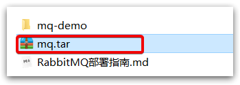

# RabbitMQ部署指南


# 1.单机部署

我们在Centos7虚拟机中使用Docker来安装。

## 1.1.下载镜像

方式一：在线拉取

``` sh
docker pull rabbitmq:3-management
```


方式二：从本地加载

在课前资料已经提供了镜像包：

 

上传到虚拟机中后，使用命令加载镜像即可：

```sh
docker load -i mq.tar
```


## 1.2.安装MQ

执行下面的命令来运行MQ容器：

```sh
docker run \
 -e RABBITMQ_DEFAULT_USER=itcast \
 -e RABBITMQ_DEFAULT_PASS=123321 \
 --name mq \
 --hostname mq1 \
 -p 15672:15672 \
 -p 5672:5672 \
 -d \
 rabbitmq:3-management
```

浏览器访问（ip自己改）http://192.168.194.128:15672/，


# 2.集群部署

接下来，我们看看如何安装RabbitMQ的集群。

## 2.1.集群分类

在RabbitMQ的官方文档中，讲述了两种集群的配置方式：

- 普通模式：普通模式集群不进行数据同步，每个MQ都有自己的队列、数据信息（其它元数据信息如交换机等会同步）。例如我们有2个MQ：mq1，和mq2，如果你的消息在mq1，而你连接到了mq2，那么mq2会去mq1拉取消息，然后返回给你。如果mq1宕机，消息就会丢失。
- 镜像模式：与普通模式不同，队列会在各个mq的镜像节点之间同步，因此你连接到任何一个镜像节点，均可获取到消息。而且如果一个节点宕机，并不会导致数据丢失。不过，这种方式增加了数据同步的带宽消耗。


我们先来看普通模式集群。

## 2.2.设置网络

首先，我们需要让3台MQ互相知道对方的存在。

分别在3台机器中，设置 /etc/hosts文件，添加如下内容：

```
192.168.150.101 mq1
192.168.150.102 mq2
192.168.150.103 mq3
```

并在每台机器上测试，是否可以ping通对方：

