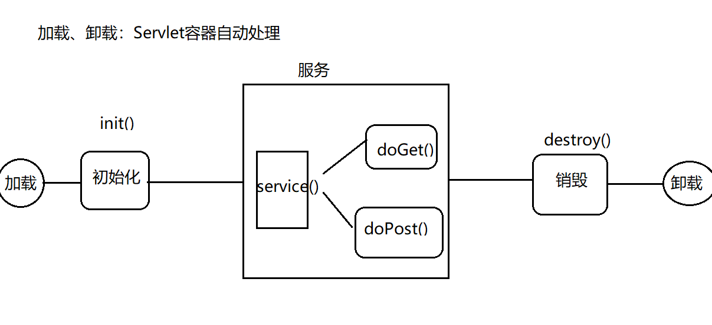

[TOC]

# 基础知识

## JSP:动态网页

静态、动态：  
1.不用 和 是否有“动感”混为一谈    
2.是否 随着 时间、地点、用户操作  的 改变而改变  

动态网页 需要使用到 服务端脚本语言（JSP）  

2架构  
CS：Client Server  
CS不足： 
a.如果 软件升级， 那么全部软件都需要升级  
b.维护麻烦：需要维护每一台 客户端软件  
c.每一台客户端 都需要安装 客户端软件  


BS ：Broswer Server    
客户端可以通过 浏览器  直接访问服务端     

注意：bs和cs各有优势。    

## 3.tomcat解压后目录：    

bin:可执行文件（startup.bat    shutdown.bat）    
conf:配置文件（server.xml）    
lib：tomcat依赖的jar文件    
log:日志文件（记录出错等信息）    
temp:临时文件    
webapps：可执行的项目（将我们开发的项目 放入该目录）    
work:存放由jsp翻译成的java,以及编辑成的class文件(jsp  ->java ->class)    

## 4.配置tomcat    
a.配置jdk  (必须配置JAVA_HOME)    
java_home  classPath  path    
b.配置catalina_home    

双击bin/startup.bat启动tomacat，    
常见错误： 可能与其他服务的端口号冲突    
tomcat端口号默认8080 （此端口号较为常见，容易冲突），建议修改此端口 （8888）    


修改端口号：    

## 5.访问tomcat    
http://localhost:8888/    

常见状态码：    
200：一切正常    
300/301: 页面重定向 （跳转）    
404:资源不存在     
403：权限不足 （如果访问a目录，但是a目录设置 不可见）    
500：服务器内部错误（代码有误）    
其他编码：积累    

jsp：在html中嵌套的java代码     

 在项目/WEB-INF/web.xml中设置 默认的 初始页面    

```xml  
<welcome-file-list>    
    <welcome-file>index.jsp</welcome-file>    
</welcome-file-list>    
```

6.虚拟路径    
a.方式一    
将web项目配置到 webapps以外的目录    
conf/server.xml中配置    
host标签中：    

```xml
<Context  docBase="D:\study\JspProject"  path="/JspProject"   />
```

docBase：实际路径     
path：虚拟路径  （绝对路径、相对路径【相对于webapps】）    
重启    

b.方式二    
D:\study\apache-tomcat-8.5.30\conf\Catalina\localhost    
中新建   “项目名.xml”中新增一行：    

```xml
<Context  docBase="D:\study\JspProject"  path="/JspProject"   />  
```

7.虚拟主机    
通过www.test.com访问本机    
a. conf/server.xml    

```xml
 <Engine name="Catalina" defaultHost="www.test.com">    
```

```xml
<Host appBase="D:\study\JspProject" name="www.test.com">    
	<Context docBase="D:\study\JspProject"   path="/"/>    
</Host>   
```

b.C:\Windows\System32\drivers\etc\host  
增加    
```
127.0.0.1       www.test.com  
```

流程：  
```
www.test.com -> host找映射关系 ->server.xml找Engine的defaultHost ->通过"/"映射到
```
D:\study\JspProject  
为了后续学习，将以上恢复成默认  

7.JSP执行流程  
jsp- java(Servlet文件) -class  
D:\study\apache-tomcat-8.5.30\work\Catalina\localhost\JspProject\org\apache\jsp  


Jsp 和Servlet 可以相互转换    

因为第一请求服务端 会有翻译 和编译的过程，因此比较慢； 后续访问 可以直接访问class,因此速度较快。但是 如果 服务端修改了代码，则再次访问时  会重新的翻译、编译。    

## 使用Eclipse开发Web项目  

(JSP项目)  tomcat  

2. 在Eclipse中创建的Web项目：  
 浏览器可以直接访问 WebContent中的文件，  
例如http://localhost:8888/MyJspProject/index1.jsp  
其中的index1.jsp就在WebContent目录中；  
但是WEB-INF中的文件  无法通过客户端（浏览器）直接访问，只能通过请求转发来访问  

注意：

> 并不是 任何的内部跳转都能访问WEB-INF；原因是 跳转有2种方式：请求转发 、重定向  

3.配置tomcat运行时环境  
	JSP<=>Servlet  

- 将tomcat/lib中的`servlet-api.jar`加入项目的构建路径  

- 右键项目->Build Path -> Add library ->Server Runtime  

4.部署tomcat  
在servers面板 新建一个 tomcat实例 ，  再在该实例中 部署项目（右键-add）  
之后运行  

注意：一般建议 将eclipse中的tomcat与 本地tomcat的配置信息保持一致： 将eclipse中的tomcat设置为托管模式：  

【第一次】创建tomcat实例之后， 双击，选择Server Location的第二项  

5.统一字符集编码  

a.编码分类：  
设置jsp文件的编码（jsp文件中的pageEncoding属性）：  jsp -> java          
设置浏览器读取jsp文件的编码（jsp文件中content属性）  
一般将上述设置成 一致的编码，推荐使用UTF-8  
文本编码：  
	i.将整个eclipse中的文件 统一设置 （推荐）  
	ii.设置 某一个项目  
	iii.设置单独文件  

# JSP

JAVA serve pages

## JSP的页面元素 

1. HTML 
2. JAVA代码（脚本Scriptlet）
3. 指令
4. 注释  

### 脚本Scriptlet  

i.      

```html  
<%     局部变量、java语句  %>  
```

ii.  

```html  
<%!  全局变量、定义方法  %>  
```

iii.  

```html  
<%=输出表达式 %>  
```

一般而言，修改web.xml、配置文件、java  需要重启tomcat服务  

但是如果修改 Jsp\html\css\js ，不需要重启  

> 注意: out.println()不能回车； 要想回车：“<br/>”，即out.print() <%= %> 可以直接解析html代码  

### 指令  

page指令  

`<%@ page  ....%>`page指定的属性：  
language: jsp页面使用的脚本语言  
import: 导入类  
pageEncoding: jsp文件自身编码  jsp ->java  
contentType:浏览器解析jsp的编码  

```html
<%@ page language="java" contentType="text/html; charset=UTF-8"  
    pageEncoding="UTF-8"  import="java.util.Date" %>  
```

### 注释  

HTML注释

```html
<!-- -->
```

  可以被客户 通过浏览器查看源码 所观察到 

JAVA注释

```java
//     /*...*/
```

JSP注释

```jsp
<%-- --%>  
```

## JSP九大内置对象  

自带的，不需要new 也能使用的对象  

### request：请求对象

存储“客户端向服务端发送的请求信息”  
request对象的常见方法：  

| name                                                         | description                                                  |
| ------------------------------------------------------------ | ------------------------------------------------------------ |
| String getParameter(String name)                             | 根据请求的字段名key （input标签的name属性值） ，返回字段值value （input标签的value属性值） |
| String[] getParameterValues(String name)                     | 根据请求的字段名key ，返回多个字段值value  （checkbox）      |
| void setCharacterEncoding                                    | ("编码格式utf-8") ：设置post方式的请求编码  （tomcat7以前默认iso-8859-1，tomcat8以后改为了utf-8） |
| getRequestDispatcher("b.jsp")<br/>.forward(request,response) | 请求转发 的方式跳转页面   A - > B                            |
| ServletContext getServerContext()                            | 获取项目的ServletContext对象                                 |
|                                                              |                                                              |

### response :响应对象  

提供的方法

| function                                                | description                                         |
| ------------------------------------------------------- | --------------------------------------------------- |
| `void addCookie( Cookie cookie );`                      | 服务端向客户端增加cookie对象                        |
| void sendRedirect(String location ) throws IOException; | 页面跳转的一种方式（重定向）                        |
| void setContetType(String type)                         | 设置服务端响应的编码（设置服务端的contentType类型） |

### session 会话对象

```java
import javax.servlet.http.HttpSession;
```

 session(服务端)  , Cookie（客户端，不是内置对象）:Cookie是由 服务端生成的 ，再发送给客户端保存。  
   相当于 本地缓存的作用： 客户端(hello.mp4,zs/abc)->服务端(hello.mp4；zs/abc)  
   作用：提高访问服务端的效率，但是安全性较差。  

#### Cookie

- 不是内置对象，要使用必须new  
- 但是，服务端会 自动生成一个(服务端自动new一个cookie) `name=JSESIONID`的cookie  并返回给客户端    

Cookie：	name=value     

```java
javax.servlet.http.Cookie  
```

------

| function                                | description       |
| --------------------------------------- | ----------------- |
| public Cookie(String name,String value) |                   |
| String getName()                        | 获取name          |
| String getValue()                       | 获取value         |
| void setMaxAge(int expiry)              | 最大有效期 （秒） |
|                                         |                   |

服务端准备Cookie：  

```java
response.addCookie(Cookie cookie) 
```


页面跳转（转发，重定向）  

```jsp
客户端获取cookie:  request.getCookies();  
```

- 服务端增加cookie :response对象；客户端获取对象：request对象
- 不能直接获取某一个单独对象，只能一次性将 全部的cookie拿到  

通过F12可以发现  除了自己设置的Cookie对象外，还有一个name为 J`sessionId`的cookie  

建议 cookie只保存  英文数字，否则需要进行编码、解码  

3. 使用Cookie实现  记住用户名  功能  

4.session :会话  
a.浏览网站：开始-关闭  
b.购物：  浏览、付款、退出  
c.电子邮件：浏览、写邮件、退出  
	开始-结束  

#### session机制  

客户端第一次请求服务端时，`（j`sessionId`-`sessionId`）`服务端会产生一个session对象（用于保存该客户的信息）；   
并且每个session对象 都会有一个唯一的 `sessionId`( 用于区分其他session);  
服务端由会 产生一个cookie，并且 该cookie的name=`JsessionId`,value=服务端`sessionId`的值；  
然后 服务端会在 响应客户端的同时 将该cookie发送给客户端，至此 客户端就有了 一个cookie(`JsessionId`)；  
因此，客户端的cookie就可以和服务端的session一一对应（`JsessionId`- `sessionId`）  

客户端第二/n次请求服务端时:服务端会先用客户端cookie种的`JsessionId` 去服务端的session中匹配`sessionId`,如果匹配成功（cookie ` jsessionId`和sesion `sessionId`），说明此用户 不是第一次访问,无需登录；  

例子：  
客户端：		    顾客（客户端）  
服务端: 存包处   -  商场(服务端)  

顾客第一次存包：商场 判断此人是 之前已经存过包（通过你手里是否有钥匙）。  
 如果是新顾客（没钥匙） ，分配一个钥匙 给该顾客； 钥匙 会和 柜子 一一对应；  

 第二/n次 存包：商场 判断此人是 之前已经存过包（通过你手里是否有钥匙）  
 如果是老顾客（有钥匙），则不需要分配；该顾客手里的钥匙 会 和柜子 自动一一对应。  

#### session:  

- session存储在服务端  
-  session是在 同一个用户（客户）请求时 共享  
- 实现机制：第一次客户请求时 产生一个`sessionId` 并复制给 cookie的`JsessionId`然后发给客户端。最终 通过session的`sessionId`-cookie的`JsessionId` 

#### session方法

| function                                     | description                       |
| -------------------------------------------- | --------------------------------- |
| String getId()                               | 获取`sessionId`                   |
| boolean isNew()                              | 判断是否是 新用户（第一次访问）   |
| void invalidate()                            | 使session失效  （退出登录、注销） |
| void setAttribute(String name, Object value) |                                   |
| Object getAttribute();                       |                                   |
| void setMaxInactiveInterval(秒)              | 设置最大有效 非活动时间           |
| int getMaxInactiveInterval()                 | 获取最大有效 非活动时间           |

示例：  
登录  

客户端在第一次请求服务端时，如果服务端发现 此请求没有 J`sessionId`,则会创建一个 name=JSESIONID的cookie  并返回给客户端  

cookie和session的区别： 

|            | session | cookie   |
| ---------- | ------- | -------- |
| 保存的位置 | 服务端  | 客户端   |
| 安全性     | 较安全  | 较不安全 |
| 保存的内容 | Object  | String   |

### application全局对象  

String getContextPath()	虚拟路径  
String getRealPath(String name): 绝对路径（虚拟路径 相对的绝对路径）  

### 其他五种不常用对象

| Object      | description                           |
| ----------- | ------------------------------------- |
| pageContext | JSP页面容器                           |
| config      | 配置对象（服务器配置信息）            |
| page        | 当前JSP页面对象（相当于java中的this） |
| exception   | 异常对象                              |
| out         | 输出对象，向客户端输出内容            |
|             |                                       |

## get与post请求方式的区别：

get提交方式   

http://localhost:8888/MyJspProject/show.jsp?uname=aa&upwd=123&uage=22&uhobbies=%E7%AF%AE%E7%90%83 

```
连接/文件?参数名1=参数值1 & 参数名2=参数值2 & 参数名1=参数值1   
```

method="get" 和 地址栏 、超链接(`<a href="xx">`)请求方式 默认都属于get提交方式    

- get方式 在地址栏显示 请求信息  (但是地址栏能够容纳的 信息有限，4-5KB；如果请求数据存在大文件，图片等  会出现地址栏无法容纳全部的数据而出错) ；post不会显示  
- 文件上传操作，必须是post  
  推荐使用post  

8.统一请求的编码 request  
get方式请求 如果出现乱码，解决：  

- 统一每一个变量的 编码 （不推荐）  

```java
new String(  旧编码，新编码);  
name = new String(name.getBytes("iso-8859-1"),"utf-8");  
```


-  修改server.xml ，一次性的 更改tomcat默认get提交方式的编码 （utf-8）  
  建议 使用tomcat时， 首先在server.xml中 统一get方式的编码.. `URIEncoding="UTF-8" ` 

tomcat7 (iso-8859-1)  

tomcat8（utf-8）  

post  

```java
request.setCharacterEncoding("utf-8")
```

## 请求转发和重定向

请求转发

```java
request.getRequestDispatcher("b.jsp").forward(request,response)
```

重定向

```java
reponse.sendRedirect("b.jsp")
```

|                            | 请求转发        | 重定向                 |
| -------------------------- | --------------- | ---------------------- |
| 地址栏是否改变             | 不变(check.jsp) | 改变(success.jsp)      |
| 是否保留第一次请求时的数据 | 保留            | 不保留                 |
| 请求的次数                 | 1               | 2                      |
| 跳转发生的位置             | 服务端          | 客户端发出的第二次跳转 |
|                            |                 |                        |


转发、重定向：  

转发：    
	张三（客户端）     ->    【 服务窗口 A （服务端 ）    ->  服务窗口B  】  

重定向：  
	张三（客户端） 	  -> 	服务窗口 A （服务端 ） ->去找B  

​    张三（客户端）    -> 	服务窗口 B （服务端 ） ->结束  


## 四种范围对象

（小->大）  

| object      | description                  | scope                    |
| ----------- | ---------------------------- | ------------------------ |
| pageContext | JSP页面容器   （page对象）； | 当前页面有效             |
| request     | 请求对象                     | 同一次请求有效           |
| session     | 会话对象                     | 同一次会话有效           |
| application | 全局对象                     | 全局有效（整个项目有效） |
|             |                              |                          |


以上4个对象共有的方法：  

| function                                     | description              |
| -------------------------------------------- | ------------------------ |
| `Object getAttribute(String name)`           | 根据属性名，获取属性值   |
| `void setAttribute(String name,Object obj) ` | 设置属性值（新增，修改） |
| `void removeAttribute(String name)`          | 根据属性名，删除对象     |

- pageContext 当前页面有效 (页面跳转后无效)  

- request   同一次请求有效；其他请求无效 （请求转发后有效；重定向后无效）  

-  session  同一次会话有效  （无论怎么跳转，都有效；关闭/切换浏览器后无效 ； 从 登陆->退出 之间 全部有效）  

-  application  全局变量；整个项目运行期间 都有效 (切换浏览器 仍然有效)；关闭服务、其他项目 无效  

->多个项目共享、重启后仍然有效 ：JNDI  

1. 以上的4个范围对象，通过 setAttribute()复制，通过getAttribute()取值；  
2. 以上范围对象，尽量使用最小的范围。因为 对象的范围越大，造成的性能损耗越大。  

# Servlet  

Java类必须符合一定的 规范：  
	a.必须继承  javax.servlet.http.HttpServlet  
	b.重写其中的service()之类的方法  

```java
service(): 接受并识别和处理相应的所有提交的方法； 
doGet(): 接受并处理所有get提交方式的请求  
doPost(): 接受并处理所有post提交方式的请求  
```

Servlet要想使用，必须配置  
Serlvet2.5：web.xml  

```xml
<web-app>
    ...
  <servlet>
  		<servlet-name>WelcomeServlet</servlet-name>
  		<servlet-class>org.lanqiao.servlet.WelcomeServlet</servlet-class>
  </servlet>
  
  <servlet-mapping>
  		<servlet-name>WelcomeServlet</servlet-name>
  		<url-pattern>/WelcomeServlet</url-pattern>
  </servlet-mapping>
</web-app>  
```

Servlet3.0： `@WebServlet  `

```java
@WebServlet( value="/WelcomeServlet" ,loadOnStartup=1,initParams= {@WebInitParam(name="serveltparaname30",value="servletparavalue30")   }   )

```

Serlvet2.5：web.xml:  

项目的根目录：WebContent 、src  

`<a href="WelcomeServlet">`所在的jsp是在 WebContent目录中，因此 发出的请求WelcomeServlet  是去请求项目的根目录。  

Servlet流程：  

请求 ->`<url-pattern>` -> 根据`<servlet-mapping>`中的`<servlet-name>` 去匹配  `<servlet> `中的`<servlet-name>`，然后寻找到<servlet-class>，求中将请求交由该<servlet-class>执行。  2个/:  
jsp:/  localhost:8888  
web.xml: /   http://localhost:8888/项目名/  

## 编写Servlet步骤：

```java  
import javax.servlet.http.HttpServlet;  
```

1.编写一个类继承HttpServlet  


```java  
public class LoginServlet extends HttpServlet {  
```

2.重写相应方法(doGet()、doPost())

3.配置Servlet

编写web.xml 中的servlet映射关系  

Servlet3.0，与Servlet2.5的区别：  

Servlet3.0不需要在web.xml中配置，但 需要在 Servlet类的定义处之上编写   

匹配流程：  请求地址 与`@WebServlet`中的值 进行匹配，如果匹配成功 ，则说明 请求的就是该注解所对应的类  

> 注解:@WebServlet("url-pattern的值")   
>
> 注意:url-pattern 要带斜杆

2.借助于Eclipse快速生成Servlet  
直接新建Servlet即可！（继承、重写、web.xml  可以借助Eclipse自动生成）  

3.项目根目录：WebContent、src（所有的构建路径）  
例如：  
WebContent中有一个文件index.jsp  
src中有一个Servlet.java    

如果: index.jsp中请求` <a href="abc">...</a> `，则 寻找范围：既会在src根目录中找  也会在WebContent根目录中找  

如果：index.jsp中请求`<a href="a/abc"></a>`，寻找范围：先在src或WebContent中找a目录，然后再在a目录中找abc  

web.xml中的 /:代表项目根路径  
http://localhost:8888/Servlet25Project/jsp中的/: 服务器根路径  
http://localhost:8888/  

构建路径、WebContent:根目录  

## Servlet生命周期



**5个阶段**   

### 加载、初始化：  

 init()  ，该方法会在 Servlet被加载并实例化的以后 执行  
服务  ：service() ->doGet()  doPost  

init():    

- 默认第一次访问 Servlet时会被执行 （只执行这一次） 	  

- 可以修改为 Tomcat启动时自动执行  
  		  

### 销毁  ：destroy()  

Servlet被系统回收时执行  

卸载  

i.Servlet2.5：  web.xml  
			    

```xml  
<servlet>  
    ...  
    <load-on-startup>1</load-on-startup>  
</servlet>  
```

其中的“1”代表第一个。  
		  

ii.Servlet3.0  
			  

```java  
@WebServlet( value="/WelcomeServlet" ,loadOnStartup=1  )  
```

service() ->doGet()  doPost ：调用几次，则执行几次  

destroy()：关闭tomcat服务时，执行一次。  

5 Servlet API ： 由两个软件包组成： 对应于HTTP协议的软件包、对应于除了HTTP协议以外的其他软件包  
即Servlet  API可以适用于 任何 通信协议。   
我们学习的Servlet,是位于javax.servlet.http包中的类和接口，是基础HTTP协议。  

6.Servlet继承关系  

ServletConfig:接口   
ServletContext getServletContext():获取Servlet上下文对象   application  
String  getInitParameter(String name):在当前Servlet范围内，获取名为name的参数值（初始化参数）  

  

a.ServletContext中的常见方法(application)：  
getContextPath():相对路径  
getRealPath()：绝对路径  
setAttribute() 、getAttribute()  
--->  
String getInitParameter(String name);在当前Web容器范围内，获取名为name的参数值（初始化参数）  

  

Servlet3.0方式 给当前Servlet设置初始值：  

```java
@WebServlet( .... , initParams= {@WebInitParam(name="serveltparaname30",value="servletparavalue30")   }   ) 
```

注意，此注解只 隶属于某一个具体的Servlet ，因此无法为 整个web容器设置初始化参数 （如果要通过3.0方式设置 web容器的初始化参数，仍然需要在web.xml中设置）  

  

HttpServletRequest中的方法：(同request)，例如setAttrite()、getCookies()、getMethod()  
HttpServletResponse中的方法：同response  

  

Servlet使用层面：  

Eclipse中在src创建一个Servlet，然后重写doGet()  doPost()就可以  （doGet() doPost()只需要编写一个）。

# 使用idea创建一个Maven java Web项目

https://blog.csdn.net/qq_37856300/article/details/85776785 

# 数据库连接 

## JDBC  

Java Data Base Connectivity    

maven dependency

```xml
<!-- https://mvnrepository.com/artifact/mysql/mysql-connector-java -->
<dependency>
    <groupId>mysql</groupId>
    <artifactId>mysql-connector-java</artifactId>
    <version>8.0.15</version>
</dependency>
```

可以为多种关系型数据库DBMS 提供统一的访问方式，用Java来操作数据库  
JDBC API 主要功能：  
三件事，具体是通过以下类/接口实现：  

```
DriverManager ： 管理jdbc驱动  
Connection： 连接（通过DriverManager产生）  
Statement（PreparedStatement） ：增删改查  （通过Connection产生 ） 
CallableStatement  ： 调用数据库中的 存储过程/存储函数  （通过Connection产生 ）  
```

Result ：返回的结果集  （上面的Statement等产生 ）  

Connection产生操作数据库的对象：  

```
Connection产生Statement对象：createStatement()  
Connection产生PreparedStatement对象：prepareStatement()  
Connection产生CallableStatement对象：prepareCall();  
```

Statement操作数据库：  

```
增删改：executeUpdate()  
查询：executeQuery();  
```

ResultSet：保存结果集 `select * from xxx  `

```
next():光标下移，判断是否有下一条数据；true/false  
previous():  true/false  
getXxx(字段名|位置):获取具体的字段值   
```

PreparedStatement操作数据库：  

```java
public interface PreparedStatement extends Statement  
```

因此  

```
增删改：executeUpdate()  
查询：executeQuery();  
```

--此外  
赋值操作 setXxx();  

PreparedStatement与Statement在使用时的区别：  

1. Statement:  

   ```java
   sql  
   executeUpdate(sql)  
   ```

2. PreparedStatement:  
   
   ```java
   sql(可能存在占位符?)  
   在创建PreparedStatement 对象时，将sql预编译 prepareStatement(sql)  
   executeUpdate()  
   setXxx()替换占位符
   ```
   
   

推荐使用PreparedStatement：原因如下：  
1.编码更加简便（避免了字符串的拼接）  

```java
String name = "zs" ;  
int age = 23 ;  

stmt:  
String sql =" insert into student(stuno,stuname) values('"+name+"',  "+age+" )    " ;  
stmt.executeUpdate(sql);  

pstmt:  
String sql =" insert into student(stuno,stuname) values(?,?) " ;  
pstmt = connection.prepareStatement(sql);//预编译SQL  
pstmt.setString(1,name);  
pstmt.setInt(2,age);  
```

2.提高性能(因为 有预编译操作，预编译只需要执行一次)  
需要重复增加100条数   

```java
stmt:  
String sql =" insert into student(stuno,stuname) values('"+name+"',  "+age+" )    " ;  
for(100)  
    stmt.executeUpdate(sql);  

pstmt:  
String sql =" insert into student(stuno,stuname) values(?,?) " ;  
pstmt = connection.prepareStatement(sql);//预编译SQL  
pstmt.setString(1,name);  
pstmt.setInt(2,age);  
for( 100){  
    pstmt.executeUpdate();  
}  
```


3.安全（可以有效防止sql注入）  
sql注入： 将客户输入的内容  和 开发人员的SQL语句 混为一体  

stmt:存在被sql注入的风险    
(例如输入  用户名：任意值 ' or 1=1 --  
	   密码：任意值)  
分析：  

```java
select count(*) from login where uname='任意值 ' or 1=1 --' and upwd ='任意值'  ;  
    select count(*) from login where uname='任意值 ' or 1=1 ;  
select count(*) from login ;  

select count(*) from login where uname='"+name+"' and upwd ='"+pwd+"'   
```

pstmt:有效防止sql注入  

推荐使用pstmt    

3.jdbc访问数据库的具体步骤：  
a.导入驱动，加载具体的驱动类  
b.与数据库建立连接  
c.发送sql，执行  
d.处理结果集 （查询）  

4. 数据库驱动  

|           | 驱动jar                    | 具体驱动类                                  | 连接字符串                                                   |
| --------- | -------------------------- | ------------------------------------------- | ------------------------------------------------------------ |
| Oracle    | ojdbc-x.jar                | oracle.jdbc.OracleDriver                    | jdbc:oracle:thin:@localhost:1521:ORCL                        |
| MySQL     | mysql-connector-java-x.jar | com.mysql.jdbc.Driver                       | jdbc:mysql://localhost:3306/数据库实例名                     |
| SqlServer | sqljdbc-x.jar              | com.microsoft.sqlserver.jdbc.SQLServerDrive | jdbc:microsoft:sqlserver:localhost:1433;databasename=数据库实例名 |

使用jdbc操作数据库时，如果对数据库进行了更换，只需要替换：驱动、具体驱动类、连接字符串、用户名、密码  

### jdbc总结

（模板、八股文）：  

```java
try{  
    a.导入驱动包、加载具体驱动类Class.forName("具体驱动类");  
    b.与数据库建立连接connection = DriverManager.getConnection(...);  
    c.通过connection，获取操作数据库的对象（Statement\preparedStatement\callablestatement）  
        stmt = connection.createStatement();  
    d.(查询)处理结果集rs = pstmt.executeQuery()  
        while(rs.next()){ rs.getXxx(..) ;}  
}catch(ClassNotFoundException e  )  
{ ...}  
catch(SQLException e)  
{...  
}  
catch(Exception e)  
{...  
}  
finally  
{  
    //打开顺序，与关闭顺序相反  
    if(rs!=null)rs.close()  
        if(stmt!=null) stmt.close();  
    if(connection!=null)connection.close();  
} 
```


--jdbc中，除了Class.forName() 抛出ClassNotFoundException，其余方法全部抛SQLException  

2.CallableStatement:调用 存储过程、存储函数  
connection.prepareCall(参数：存储过程或存储函数名)  
参数格式：  
存储过程（无返回值return，用out参数替代）：  
	{ call  存储过程名(参数列表) }  
存储函数（有返回值return）：  
	{ ? = call  存储函数名(参数列表) }  

```sql
create or replace procedure addTwoNum ( num1  in number,num2  in number,result out number )  -- 1 + 2 ->3  
    as  
begin  
	result := num1+num2 ;  
end ; 
```

强调：  
如果通过sqlplus 访问数据库，只需要开启：OracleServiceSID  
通过其他程序访问数据（sqldevelop、navicate、JDBC），需要开启：OracleServiceSID、XxxListener  

JDBC调用存储过程的步骤：  
a.产生 调用存储过程的对象（CallableStatement） cstmt = 	connection.prepareCall(   "..." ) ;  
b.通过setXxx()处理 输出参数值 cstmt.setInt(1, 30);  
c.通过 registerOutParameter(...)处理输出参数类型  
d.cstmt.execute()执行  
e.接受 输出值（返回值）getXxx()  

调存储函数：  

```sql
create or replace function addTwoNumfunction ( num1  in number,num2  in number)  -- 1 + 2   
return number  
as  
	result number ;	  
begin  
	result := num1+num2 ;  
	return result ;  
end ;  
```

JDBC调用存储函数：与调存储过程的区别：  
在调用时，注意参数："{? =  call addTwoNumfunction	(?,?) }"  

3.处理CLOB/BLOB类型  
处理稍大型数据：  
	  
a.存储路径	E:\JDK_API_zh_CN.CHM  
	通过JDBC存储文件路径，然后 根据IO操作处理  
	例如：JDBC将 E:\JDK_API_zh_CN.CHM 文件 以字符串形式“E:\JDK_API_zh_CN.CHM”存储到数据库中  
		获取：1.获取该路径“E:\JDK_API_zh_CN.CHM”  2.IO	  

b.  
	CLOB：大文本数据 （小说->数据）  
	BLOB：二进制  

clob:大文本数据   字符流 Reader Writer  
存  
1.先通过pstmt 的? 代替小说内容 （占位符）  
2.再通过pstmt.setCharacterStream(2, reader,  (int)file.length());  将上一步的？替换为 小说流， 注意第三个参数需要是 Int类型  

取：  
1.通过Reader reader = rs.getCharacterStream("NOVEL") ; 将cloc类型的数据  保存到Reader对象中  

2. 将Reader通过Writer输出即可。  

blob:二进制  字节流 InputStream OutputStream  
与CLOB步骤基本一致，区别：setBinaryStream(...)  getBinaryStream(...)     

4.JSP访问数据库  

JSP就是在html中嵌套的java代码，因此 java代码可以写在jsp中（<%  ... %>）  

导包操作：java项目 ：1 Jar复制到工程中 2.右键该Jar :build path ->add to build Path  
	  Web项目：jar复制到WEB-INF/lib  

核心：就是将 java中的JDBC代码，复制到 JSP中的<% ... %>  

注意：如果jsp出现错误：The import Xxx cannot be resolved  
	  
尝试解决步骤：  
	a.(可能是Jdk、tomcat版本问题) 右键项目->build path，将其中 报错的 libary或Lib 删除后 重新导入  
	b.清空各种缓存：右键项目->Clean tomcat... clean  （Project -clean或者 进tomcat目录 删除里面work的子目录）  
	c.删除之前的tomcat，重新解压缩、配置tomcat，重启计算机  
	d.如果类之前没有包，则将该类加入包中  
	  

### JavaBean  

刚才我们将 jsp中 登录操作的代码  转移到了LoginDao.java；其中LoginDao类 就称之为JavaBean。  
JavaBean的作用：a.减轻的jsp复杂度  b.提高代码复用（以后任何地方的 登录操作，都可以通过调用LoginDao实现）  

JavaBean（就是一个Java类）的定义：满足一下2点 ，就可以称为JavaBean  
	a.public 修饰的类  ,public 无参构造  
	b.所有属性(如果有) 都是private，并且提供set/get   (如果boolean 则get 可以替换成is)  

使用层面，Java分为2大类：  
a.封装业务逻辑的JavaBean (LoginDao.java封装了登录逻辑)			逻辑  
	可以将jsp中的JDBC代码，封装到Login.java类中 （Login.java）  

b.封装数据的JavaBean   （实体类，Student.java  Person.java  ）		数据   
	对应于数据库中的一张表  
	Login login = new Login(uname,upwd) ;//即用Login对象 封装了2个数据（用户名 和密码）  

封装数据的JavaBean 对应于数据库中的一张表   (Login(name,pwd))  
封装业务逻辑的JavaBean 用于操作 一个封装数据的JavaBean    

可以发现，JavaBean可以简化 代码(jsp->jsp+java)、提供代码复用(LoginDao.java)  

```java
public  void sleep(String name,String place, int time)  
{  

}  

public  void sleep(Person per)  
{  
	per.getName()  
	per.getPlace()  
	...  
}    
```

##  数据库连接池(DBCP)

maven dependncy

```xml
<!-- https://mvnrepository.com/artifact/commons-dbcp/commons-dbcp -->
<dependency>
    <groupId>commons-dbcp</groupId>
    <artifactId>commons-dbcp</artifactId>
    <version>1.4</version>
</dependency>
```


```properties
datasource.connection.driver_class=com.mysql.jdbc.Driver
datasource.connection.url=jdbc:mysql://localhost:3306/jsd06_stu?useUnicode=true&characterEncoding=utf-8
datasource.connection.username=root
datasource.connection.password=1234
#连接池保持的最小连接数,default : 3（建议使用）
datasource.connection.minPoolSize=3
#连接池中拥有的最大连接数，如果获得新连接时会使连接总数超过这个值则不会再获取新连接，而是等待其他连接释放，所以这个值有可能会设计地很大,default : 15（建议使用）
datasource.connection.maxPoolSize=15
#连接的最大空闲时间，如果超过这个时间，某个数据库连接还没有被使用，则会断开掉这个连接。如果为0，则永远不会断开连接,即回收此连接。default : 0 单位 s（建议使用）
datasource.connection.maxIdleTime=0
#连接池在无空闲连接可用时一次性创建的新数据库连接数,default : 3（建议使用）
datasource.connection.acquireIncrement=3
#连接池为数据源缓存的PreparedStatement的总数。由于PreparedStatement属于单个Connection,所以这个数量应该根据应用中平均连接数乘以每个连接的平均PreparedStatement来计算。同时maxStatementsPerConnection的配置无效。default : 0（不建议使用）
datasource.connection.maxStatements=0
#连接池为数据源单个Connection缓存的PreparedStatement数，这个配置比maxStatements更有意义，因为它缓存的服务对象是单个数据连接，如果设置的好，肯定是可以提高性能的。为0的时候不缓存。default : 0（看情况而论）
datasource.connection.maxStatementsPerConnection=0
#连接池初始化时创建的连接数,default : 3（建议使用）
datasource.connection.initialPoolSize=3
#用来配置测试空闲连接的间隔时间。测试方式还是上面的两种之一，可以用来解决MySQL8小时断开连接的问题。因为它保证连接池会每隔一定时间对空闲连接进行一次测试，从而保证有效的空闲连接能每隔一定时间访问一次数据库，将于MySQL8小时无会话的状态打破。为0则不测试。default : 0(建议使用)
datasource.connection.idleConnectionTestPeriod=0
#连接池在获得新连接失败时重试的次数，如果小于等于0则无限重试直至连接获得成功。default : 30（建议使用）
datasource.connection.acquireRetryAttempts=30
#如果为true，则当连接获取失败时自动关闭数据源，除非重新启动应用程序。所以一般不用。default : false（不建议使用）
datasource.connection.breakAfterAcquireFailure=false
#性能消耗大。如果为true，在每次getConnection的时候都会测试，为了提高性能,尽量不要用。default : false（不建议使用）
datasource.connection.testConnectionOnCheckout=false
#配置当连接池所有连接用完时应用程序getConnection的等待时间。为0则无限等待直至有其他连接释放或者创建新的连接，不为0则当时间到的时候如果仍没有获得连接，则会抛出SQLException。其实就是acquireRetryAttempts*acquireRetryDelay。default : 0（与上面两个，有重复，选择其中两个都行）
datasource.connection.checkoutTimeout=30000
#如果为true，则在close的时候测试连接的有效性。default : false（不建议使用）
datasource.connection.testConnectionOnCheckin=false
#配置一个表名，连接池根据这个表名用自己的测试sql语句在这个空表上测试数据库连接,这个表只能由c3p0来使用，用户不能操作。default : null（不建议使用）
datasource.connection.automaticTestTable=c3p0TestTable
#连接池在获得新连接时的间隔时间。default : 1000 单位ms（建议使用）
datasource.connection.acquireRetryDelay=1000
#为0的时候要求所有的Connection在应用程序中必须关闭。如果不为0，则强制在设定的时间到达后回收Connection，所以必须小心设置，保证在回收之前所有数据库操作都能够完成。这种限制减少Connection未关闭情况的不是很适用。建议手动关闭。default : 0 单位 s（不建议使用）
datasource.connection.unreturnedConnectionTimeout=0
#这个配置主要是为了快速减轻连接池的负载，比如连接池中连接数因为某次数据访问高峰导致创建了很多数据连接，但是后面的时间段需要的数据库连接数很少，需要快速释放，必须小于maxIdleTime。其实这个没必要配置，maxIdleTime已经配置了。default : 0 单位 s（不建议使用）
datasource.connection.maxIdleTimeExcessConnections=0
#配置连接的生存时间，超过这个时间的连接将由连接池自动断开丢弃掉。当然正在使用的连接不会马上断开，而是等待它close再断开。配置为0的时候则不会对连接的生存时间进行限制。default : 0 单位 s（不建议使用）
datasource.connection.maxConnectionAge=0
```

获取数据库连接

1.使用BasicDataSource直接设置

```
public class DBUtil {
	private static BasicDataSource ds = new BasicDataSource();

	static {
		Properties p = new Properties();
		try {
			p.load(DBUtil.class.getClassLoader().getResourceAsStream("db.properties"));
			ds.setDriverClassName(p.getProperty("driverClassName"));
			ds.setUrl(p.getProperty("url"));
			ds.setUsername(p.getProperty("username"));
			ds.setPassword(p.getProperty("password"));
			ds.setInitialSize(Integer.parseInt(p.getProperty("minPoolSize")));
			ds.setMaxActive(Integer.parseInt(p.getProperty("maxPoolSize")));
		} catch (IOException e) {
			// TODO Auto-generated catch block
			e.printStackTrace();
		}
	}
	
	public static Connection getConnection() {
		try {
			return ds.getConnection();
		} catch (SQLException e) {
			// TODO Auto-generated catch block
			e.printStackTrace();
		}
		return null;
	}
}
```

2.使用BasicDataSourceFactory生产DataSource

[官方配置文件属性解释][http://commons.apache.org/proper/commons-dbcp/configuration.html]

```java
BasicDataSourceFactory.createDataSource(p)
```

`Creates and configures a `BasicDataSource` 
instance based on the given properties.`

> 注意：properties文件可能存在多余的空格导致难以发现

```properties
driverClassName=com.mysql.jdbc.Driver
url=jdbc:mysql://localhost:3306/java_web?useUnicode=true&characterEncoding=utf-8
username=root
password=123456
#连接池保持的最小连接数,default : 3（建议使用）
#minPoolSize=3
initialSize=3
#连接池中拥有的最大连接数，如果获得新连接时会使连接总数超过这个值则不会再获取新连接，而是等待其他连接释放，所以这个值有可能会设计地很大,default : 15（建议使用）
#maxPoolSize
maxActive=15
```


```java
public class MyDBUtil {
	private static DataSource dataSource;
	private static Properties p = new Properties();
	static {
		// 加载配置文件
		try {
			p.load(MyDBUtil.class.getClassLoader().getResourceAsStream("db.properties"));
			// 创建一个对象并返回
			dataSource = BasicDataSourceFactory.createDataSource(p);
		} catch (IOException e) {
			// TODO Auto-generated catch block
			e.printStackTrace();
		} catch (Exception e) {
			// TODO Auto-generated catch block
			e.printStackTrace();
		}
	}

	public static Connection getConnection() {
		try {
			return dataSource.getConnection();
		} catch (SQLException e) {
			// TODO Auto-generated catch block
			e.printStackTrace();
		}
		return null;
	}
}
```

## DBUtil.java

executeQuery:中间插入解析函数

定义：

```java
/**
	 * @param 接口规定解析方法
	 */
public interface ParseResultSet {
    Object parse(ResultSet rs);
}

/**
	 * @param sql
	 * @param parseResultSet 解析ResultSet的函数
	 * @param args
	 */
public static Object executeQuery(String sql, ParseResultSet parseResultSet, Object... args) {
    Connection conn = DBUtil.getConnection();
    PreparedStatement pstmt = null;
    ResultSet rs = null;
    Object parse = null;
    try {
        pstmt = conn.prepareStatement(sql);
        for (int i = 0; i < args.length; i++) {
            pstmt.setObject(i + 1, args[i]);
        }
        rs = pstmt.executeQuery();
        parse = parseResultSet.parse(rs);
    } catch (SQLException e) {
        e.printStackTrace();
    }
    DBUtil.closeAll(rs, pstmt, conn);
    return parse;
}
```

调用：

```java
public boolean queryByNameAndPwd(String username, String password) {
    String sql = "SELECT COUNT(*) FROM user WHERE username=? AND `password` = ?";
    Integer result = (Integer) DBUtil.executeQuery(sql, new DBUtil.ParseResultSet() {
        @Override
        public Object parse(ResultSet rs) {
            int result = 0;
            try {
                if (rs.next()) {
                    result = rs.getInt(1);
                }
            } catch (SQLException e) {
                e.printStackTrace();
            }
            return result;
        }
    }, username, password);
    return result > 0;
}
```

executeUpdate

```java
package util;

import java.io.IOException;
import java.sql.Connection;
import java.sql.PreparedStatement;
import java.sql.ResultSet;
import java.sql.SQLException;
import java.util.Properties;

import javax.sql.DataSource;

import org.apache.commons.dbcp.BasicDataSourceFactory;

/**
 * @author 11623
 *
 */
public class DBUtil {
	private static DataSource dataSource;
	private static Properties p = new Properties();
	static {
		// 加载配置文件
		try {
			p.load(DBUtil.class.getClassLoader().getResourceAsStream("db.properties"));
			// 创建一个对象并返回
			dataSource = BasicDataSourceFactory.createDataSource(p);
		} catch (IOException e) {
			e.printStackTrace();
		} catch (Exception e) {
			e.printStackTrace();
		}
	}

	public static Connection getConnection() {
		try {
			return dataSource.getConnection();
		} catch (SQLException e) {
			e.printStackTrace();
		}
		return null;
	}

	public static int executeUpdate(String sql, Object... args) {
		Connection conn = DBUtil.getConnection();
		PreparedStatement pstmt = null;
		int num = 0;
		try {
			pstmt = conn.prepareStatement(sql);
			for (int i = 0; i < args.length; i++) {
				pstmt.setObject(i + 1, args[i]);
			}
			num = pstmt.executeUpdate();
		} catch (SQLException e) {
			e.printStackTrace();
			// exception: roll back
			try {
				conn.rollback();
			} catch (SQLException e1) {
				e1.printStackTrace();
			}
		} finally {
			close(pstmt, conn);
		}
		return num;
	}

	public static void close(PreparedStatement pstmt, Connection conn) {
		if (pstmt != null) {
			try {
				pstmt.close();
			} catch (SQLException e) {
				e.printStackTrace();
			}
		}
		if (conn != null) {
			try {
				conn.close();
			} catch (SQLException e) {
				e.printStackTrace();
			}
		}
	}

	public static void closeAll(ResultSet rs, PreparedStatement pstmt, Connection conn) {
		if (rs != null) {
			try {
				rs.close();
			} catch (SQLException e) {
				e.printStackTrace();
			}
		}
		close(pstmt, conn);
	}

	/**
	 * @param 接口规定解析方法
	 */
	public interface ParseResultSet {
		Object parse(ResultSet rs);
	}

	/**
	 * @param sql
	 * @param parseResultSet 解析ResultSet的回调函数
	 * @param args
	 */
	public static Object executeQuery(String sql, ParseResultSet parseResultSet, Object... args) {
		Connection conn = DBUtil.getConnection();
		PreparedStatement pstmt = null;
		ResultSet rs = null;
		Object parse = null;
		try {
			pstmt = conn.prepareStatement(sql);
			for (int i = 0; i < args.length; i++) {
				pstmt.setObject(i + 1, args[i]);
			}
			rs = pstmt.executeQuery();
			parse = parseResultSet.parse(rs);
		} catch (SQLException e) {
			e.printStackTrace();
		}
		DBUtil.closeAll(rs, pstmt, conn);
		return parse;
	}

	public static void main(String[] args) {
		System.out.println(dataSource);
//		System.out.println(MyDBUtil.dataSource.getInitialSize());
//		System.out.println(MyDBUtil.dataSource.getMaxActive());
	}

}
```


# EL和JSTL		  

## EL  

Expression Language

**为了消JSP中的Java代码**  ,JSP自带语法

语法：  

```
${EL表达式}  
```

a.EL不需要导包  
b.在el中调用属性，其实是调用的getXxx()方法  

```java
${范围.对象.属性.属性的属性 }  
```

```
${requestScope.loginMsg}
```

### 操作符：

操作：属性，不是对象  
`. `: 使用方便  
`[]` : 如果是常量属性，需要使用双引号/单引号 引起来;比点操作符更加强大  

[]强大之处：  
a.可以容纳一些 特殊符号 （.  ?   -）  
b.[]可以容纳 变量属性 （可以动态赋值）  

```java
String x = "a";  
${requestScope.a}等价于${requestScope["a"]}等价于${${requestScope[x]}  
```

c.可以处理数组  

```java
${requestScope.arr[0] }  
```

普通对象、map中的变量  

通过EL获取JSP  九大内置对象  

```java
${pageContext }  
${pageContext.request }  
${pageContext.sessoin }  
```

## JSTL：比EL更加强大  

需要引入2个jar ：jstl.jar   standard.jar 

```xml
<!-- https://mvnrepository.com/artifact/javax.servlet/jstl -->
<dependency>
    <groupId>javax.servlet</groupId>
    <artifactId>jstl</artifactId>
    <version>1.2</version>
</dependency>
```

引入tablib  :  

```html
<%@ taglib uri="http://java.sun.com/jsp/jstl/core" prefix="c" %> 
```


其中`prefix="c" `:前缀  

核心标签库：  通用标签库、条件标签库  迭代标签库  

### 通用标签库  

#### `<c:set>`赋值  

i:  
在某个作用域之中（4个范围对象），给某个变量赋值  

```html
<%--   
     request.setAttribute("name", "zhangsan") ;  
     --%>  
    <c:set var="name"    value="zhangsan"   scope="request"/>  
    ${requestScope.name }  

    <c:set var="变量名"    value="变量值"   scope="4个范围对象的作用域"/>  
```

ii:  
给普通对象赋值  
在某个作用域之中（4个范围对象），给某个对象的属性复制 （此种写法，不能指定scope属性）  

```html
<c:set target="${requestScope.student}" property="sname"  value="zxs" />  
```

给map对象赋值  

```html
<c:set target="${requestScope.countries}" property="cn"  value="中国" />  
<c:set target="对象" property="对象的属性"  value="赋值" /> 
```

注意 <c:set>可以给不存在的变量赋值 （但不能给不存在的对象赋值）  

#### `<c:out> `：显示  

true:<c:out value='<a href="https://www.baidu.com">百度</a>' default="当value为空的，显示的默认值" escapeXml="true" />  
false：	<c:out value='<a href="https://www.baidu.com">百度</a>' escapeXml="false" />  
		  

#### `<c:remove >`：删除属性  

<c:remove var="a" scope="request"/>  

#### 选择  

if(boolean)  
单重选择  
<c:if test="" >  

if else if... esle if... else  /switch  

```html
<c:choose>  
	<c:when test="...">   </c:when>  
	<c:when test="...">   </c:when>  
	<c:when test="...">   </c:when>  
	<c:otherwise>   </c:otherwise>  
</c:choose>  
```

在使用 test="" 一定要注意后面是否有空格  
例如：test="${10>2 }"   true  
     test="${10>2 } "  非true  

#### 循环（迭代标签库）  

```java
for(int i=0;i<5;i++)  
```

```html
<c:forEach  var="name" items="${requestScope.names }" >  
    -${name }-  
</c:forEach>
```

**可以在foreach便签中items属性作用域（requestScope）中保存的对象**  

```html
<!--for(String str:names)-->  
<c:forEach  var="student" items="${requestScope.students }" > 
	${student.sname }-${student.sno }  
</c:forEach>  
```

  # 设计和架构

## MVC设计模式 

`M`：Model	，模型  ：一个功能。用JavaBean实现。  

`V`: View，视图： 用于展示、以及与用户交互。使用html  js  css jsp jquery等前端技术实现  

`C`:Controller，控制器 ：接受请求，将请求跳转到模型进行处理；模型处理完毕后，再将处理的结果  
			返回给 请求处 。 可以用jsp实现，  但是一般建议使用 Servlet实现控制器。  

JSP->Java(Servlet)->JSP  

## 三层优化  

1.加入接口  
	  

建议面向接口开发：  

先接口-再实现类  
	--service、dao加入接口  
	--接口与实现类的命名规范  
		接口：interface，	起名   I实体类Service		IStudentService  
						IStudentDao	  
		实现类：implements	起名   实体类ServiceImpl		StudentServiceImpl  
						StudentDaoImpl  
		接口：	I实体类层所在包名	IStudentService、IStudentDao	  
			接口所在的包：  xxx.service		xx.dao  

```
	实现类：	 实体类层所在包名Impl	StudentServiceImpl、StudentDaoImpl  
		实现类所在的包：xxx.service.impl		xx.dao.impl  
  
以后使用接口/实现类时，推荐写法：  
接口 x = new 实现类();  
IStudentDao studentDao = new StudentDaoImpl();  
```

2.DBUtil 通用的数据库帮助类，可以简化Dao层的代码量  

帮助类 一般建议写在  xxx.util包    

A  
{  

```
a(){  
	B.connection  
}  
```

}  

B  
{  
	static Connection connection =..  
	b{  
		  

```
}  
```

}  

方法重构：  将多个方法 的共同代码 提炼出来，单独写在一个方法中，然后引入该方法即可  

```java
a()  
{  
	..  
	c();  
	..  	  
}  

b()  
{  
	..  
	c();  
	..  
}  

c()  
{  
		[..  
	..	  
	...		  
	..]  
}  
```

Web调试：  
与java代码的调试 区别：启动方式不同  


index.jsp ->index_jsp.java ->index_jsp.class   

jsp->java->class  
jsp翻译成的Java 以及编译后的class文件 存在于tomcat中的work目录中  

10000  


# 过滤器、上传文件、分页

## 过滤器 

实现一个Filter接口  
init()、destroy() 原理、执行时机 同Servlet  
配置过滤器，类似servlet  
通过doFilter()处理拦截，并且通过chain.doFilter(request, response);放行  

filter映射  

只拦截 访问MyServlet的请求  

```xml
<url-pattern>/MyServlet</url-pattern>  
```

拦截一切请求（每一次访问 都会被拦截）  

```xml
<url-pattern>/*</url-pattern>
```

通配符  

```java
dispatcher请求方式：  
REQUEST：拦截HTTP请求 get post  
FORWARD：只拦截 通过 请求转发方式的请求  

INCLUDE:只拦截拦截通过 request.getRequestDispatcher("").include()  、通过<jsp:include page="..." />此种方式发出的请求  
ERROR：只拦截<error-page>发出的请求  
```

过滤器中doFilter方法参数：ServletRequest  
在Servlet中的方法参数：HttpServletRequest  

过滤器链  
可以配置多个过滤器，过滤器的先后顺序 是由 `<filter-mapping>`的位置 决定  

## 上传文件  

1. 引入2个jar  

```
apache: commons-fileupload.jar组件  
commons-fileupload.jar依赖 commons-io.jar  
```

pom.xml

```xml
<!--文件上传jar-->
<!-- https://mvnrepository.com/artifact/commons-fileupload/commons-fileupload -->
<dependency>
    <groupId>commons-fileupload</groupId>
    <artifactId>commons-fileupload</artifactId>
    <version>1.4</version>
</dependency>
<!-- https://mvnrepository.com/artifact/commons-io/commons-io -->
<dependency>
    <groupId>commons-io</groupId>
    <artifactId>commons-io</artifactId>
    <version>2.8.0</version>
</dependency>
```


2.文件上传一般是存在服务器的upload目录下,文件名陈存在数据库中,为了防止上传文件重名,一般我们用UUID,(绝不会重复)

**3.index.jsp页面的代码如下:**  
前台jsp：  

```jsp
<div>
    <form action="/UploadServlet" method="post" enctype="multipart/form-data">
        选择文件：<input type="file" name="photo" value=""><br>
        <input type="submit" name="修改" value="上传头像">
    </form>
</div>
```

3. 表单提交方式必须为post  
   在表单中必须增加一个属性 `entype="multipart/form-data"`  

后台servlet：  

```java
import org.apache.commons.fileupload.FileItem;
import org.apache.commons.fileupload.FileUploadException;
import org.apache.commons.fileupload.disk.DiskFileItemFactory;
import org.apache.commons.fileupload.servlet.ServletFileUpload;

import javax.net.ssl.HttpsURLConnection;
import javax.servlet.ServletException;
import javax.servlet.annotation.WebServlet;
import javax.servlet.http.HttpServlet;
import javax.servlet.http.HttpServletRequest;
import javax.servlet.http.HttpServletResponse;
import javax.servlet.http.HttpSession;
import java.io.File;
import java.io.IOException;
import java.io.PrintWriter;
import java.util.List;

@WebServlet("/pictureServlet")
public class PictureServlet extends HttpServlet {
    protected void doPost(HttpServletRequest request, HttpServletResponse response) throws ServletException, IOException {
        request.setCharacterEncoding("utf-8");
        response.setContentType("text/plain;charset=utf-8");
		
		//此处将新建的文件直接保存到项目的绝对路径中。File没有读写能力。
        File savePath = new File("E:\\javaEE\\Project\\Picture\\web\\images");
        DiskFileItemFactory factory = new DiskFileItemFactory();//jar包的类
        ServletFileUpload upload = new ServletFileUpload(factory);//jar包的类

        try {
            List<FileItem> items = upload.parseRequest(request);
            //将前端的表单数据封装成list。
            //form表单必须加enctype="multipart/form-data"，在使用包含文件上传控件的表单时，必须使用该值。
            for (FileItem item:items){
                if(item.isFormField()){
					//说明普通表单项
                }else {
                	//说明上传文件项
                	//获取上传文件的名称
                    String name  = item.getName();
                    //获取相对路径
                    String path = request.getContextPath()+"/images/"+name;
                    //将相对路径保存到数据库
                    Test test = new Test();
                    test.update(path);
					//使用绝对路径完成文件上传
                    item.write(new File(savePath,name));
                    //删除临时文件
                    item.delete();
                }
            }
        } catch (FileUploadException e) {
            e.printStackTrace();
        } catch (Exception e) {
            e.printStackTrace();
        }
}

    protected void doGet(HttpServletRequest request, HttpServletResponse response) throws ServletException, IOException {
        this.doPost(request,response);
    }
}

```

​	  

注意的问题：  
	上传的目录  upload ：  
	1.如果修改代码，则在tomcat重新启动时 会被删除  
		原因：当修改代码的时候,tomcat会重新编译一份class 并且重新部署（重新创建各种目录）  
	  

```
2.如果不修改代码，则不会删除  
	原因： 没有修改代码，class仍然是之前的class  
```

因此，为了防止 上传目录丢失： a.虚拟路径	b.直接更换上传目录 到非tomcat目录  

限制上传：  
	类型、  
	大小  
	注意 对文件的限制条件 写再parseRequest之前  

2.下载：不需要依赖任何jar	  
	a.请求（地址a  form），请求Servlet	  
	b.Servlet通过文件的地址  将文件转为输入流 读到Servlet中  
	c.通过输出流 将 刚才已经转为输入流的文件  输出给用户  

> 注意：下载文件 需要设置2个 响应头：  
> response.addHeader("content-Type","application/octet-stream" );//MIME类型:二进制文件（任意文件）  
> response.addHeader("content-Disposition","attachement;filename="+fileName );//fileName包含了文件后缀：abc.txt  
>

 1.下载时 ，文件名乱码问题：  
edge：  

URLEncoder.encode(fileName,"UTF-8")   

firefox：  
给文件名 加：  
前缀   =?UTF-8?B?  

String构造方法  
Base64.encode     
后缀   ?=  
示例：  

```java
response.addHeader("content-Disposition","attachment;filename==?UTF-8?B?"+   new String(  Base64.encodeBase64(fileName.getBytes("UTF-8"))  ) +"?=" );//fileName包含了文件后缀：abc.txt  
```


## 分页

5变量（属性）  

1.数据总数 （select count(*) from xxx ，          查数据库）  
2.页面大小（页面容量，每页显示的数据条数）	（用户自定义）  
3.总页数  					 （自动计算）  
	800:10= 80页  
	总页数= 数据总数 /页面大小  

```
802:10=  800/10 +1 ；  
总页数= 数据总数 /页面大小 + 1;  
  
-->通式  
总页数= 数据总数 % 页面大小==0 ?数据总数 /页面大小:数据总数 /页面大小 + 1;  
```

注意：自动计算的时机：当 数据总数 和 页面大小都被赋值以后，自动计算总页数。  

4.当前页码					（用户自定义）  

5.实体类对象集合（当前页的数据集合）：依赖于数据库	 (查数据库)  
	假设： 每页显示10条（页面大小=10）  

```sql
select * from student where id>=起始 and id<=终止;  
```

页数  		起止			起止等价写法  
1		1-10			(页数-1)*10+1-页数*10  
2		11-20  
3		21-30  

某一页的数据 起止：  

```
(页数-1)*10+1-页数*10  
```


```sql
select * from student where sno>=(页数-1)*10+1 and sno<=页数*10; 
```

此种分页SQL 严格依赖sno的数据，  一旦sno出现了间隙（裂缝），则无法满足每页10条  

->将此SQL 转换： 1.有rownum  2不能有rownum>xx  
转换的核心：  将rownum从伪列 转换为 一个 临时表的 普通列。  

```sql
select *from   
(  
	select rownum r,t.*from  
	(select s.* from student s order by sno asc) t     

) where r>=(页数-1)*10+1 and r<=页数*10;
```

优化：  

```sql
select *from (  
	select rownum r,t.*from  
	(select s.* from student s order by sno asc) t  
	where 	 rownum<=页数*页面大小			  

) where  r>=(页数-1)*页面大小+1 ;			  
```

dao和DBUtil的区别：  
dao 是处理特定 类的 数据库操作类：  
DBUtil是通用  数据库操作类  

### 分页实现  

要实现分页，必须知道  某一页的 数据 从哪里开始 到哪里结束  

页面大小：每页显示的数据量  

假设每页显示10条数据  

#### mysql分页

mysql:从0开始计数  
0		0		9  
1		10		19  

n		`n*10`	      (n+1)*10-1   

MYSQL实现分页的sql  
limit  开始,多少条  
第1页  

```sql
select * from student limit 0,10 ;  
```

第2页  

```sql
select * from student limit 10,10 ;  
```

mysql的分页语句：  

```sql
select * from student limit （页数-1）*页面大小,页面大小 
```

#### oracle分页

**sql server/oracle:从1开始计数** : `(n-1)*10+1    ---  n*10 ` 

第n页		开始		结束  
1		1		10  
2		11		20  
3		21		30  
n		(n-1)*10+1	n*10  

```sql
select *from student  where sno >=(n-1)*10+1 and sno <=n*10 ;  --此种写法的前提：必须是Id连续 ，否则 无法满足每页显示10条数据  
```


```sql
select rownum,t.*from student t where rownum >=(n-1)*10+1 and rownum <=n*10  order by sno;  

```

1. 如果根据sno排序则rownum会混乱（解决方案：分开使用->先只排序，再只查询rownum）  
2. .rownum不能查询>的数据   

```sql
select s.* from student s order by sno asc;  

select rownum, t.* from  
(select s.* from student s order by sno asc) t   
where rownum >=(n-1)*10+1 and rownum <=n*10 ; 
```

oracle的分页查询语句：  

```sql
select *from   
(  
	select rownum r, t.* from  
	(select s.* from student s order by sno asc) t 		10000  
)  
where r>=(n-1)*10+1 and <=n*10  ;	
```

优化：  

```sql
select *from   
(  
	select rownum r, t.* from  
	(select s.* from student s order by sno asc) t 		  
	where rownum<=n*10   
)  
where r>=(n-1)*10+1  ;	  

select *from   
(  
	select rownum r, t.* from  
	(select s.* from student s order by sno asc) t 		  
	where  rownum<=页数*页面大小   
)  
where r>=(页数-1)*页面大小+1  ;	 
```


#### SQLServer分页

  3种分页sql  
row_number()	over(字段) ;  

sqlserver2003:top  --此种分页SQL存在弊端（如果id值不连续，则不能保证每页数据量相等）  
select top 页面大小 * from student where id not in   
( select top (页数-1)*页面大小 id from student  order by sno asc )  

  

sqlserver2005之后支持：  

```sql
select *from   
(  
    select row_number()  over (sno order by sno asc) as r,* from student  

```

```
where r<=n*10   
```
```

)  
where r>=(n-1)*10+1 and  ;	  

```


SQLServer此种分页sql与oralce分页sql的区别： 1.rownum  ，row_number()    2.oracle需要排序（为了排序，单独写了一个子查询），但是在sqlserver 中可以省略该排序的子查询  因为sqlserver中可以通过over直接排序  

sqlserver2012之后支持：	  

```sql
offset fetch next only  

select * from student  oreder by sno   
offset (页数-1)*页面大小+1  rows fetch next 页面大小  rows only ;   
```

(n-1)*10+1    ---  n*10   

mysql从0开始计数，Oracle/sqlserver 从1开始计数  

#### 分页实现  

5个变量（属性）			  
1.数据总数(查数据库)					

```sql
select count(*)..
```

2.页面大小（每页显示的数据条数）20				  (用户自定义)  
3.总页数 							 （程序自动计算）  
	总页数 = 100/20  =数据总数/页面大小  
	总页数 = 103/20 = 数据总数/页面大小+1  
	--->  

```
总页数 = 数据总数%页面大小==0 ? 数据总数/页面大小:数据总数/页面大小+1 ;  
```

4.当前页（页码）							  （用户自定义）								  
5.当前页的对象集合（实体类集合）：每页所显示的所有数据 （10个人信息）  
`List<Student>	`						   (查数据库,分页sql)	  

# web路径  

 **web路径：**  
1.不**以/开始的相对路径**，找资源，**以当前资源的路径为基准**，经常容易出问题  
2.**以/开始的开始的相对路径**，找资源，**以服务器为标准（http//localhost/端口号)需要加项目名**;  
就是http//localhost/端口号/crud/...  

```html  
<%  pageContext.setAttribute("APP_PATH", request.getContextPath());  
%>  
	${APP_PATH}/static/bootstrap-3.3.7-dist/css/bootstrap.min.css  
  -->  
```

