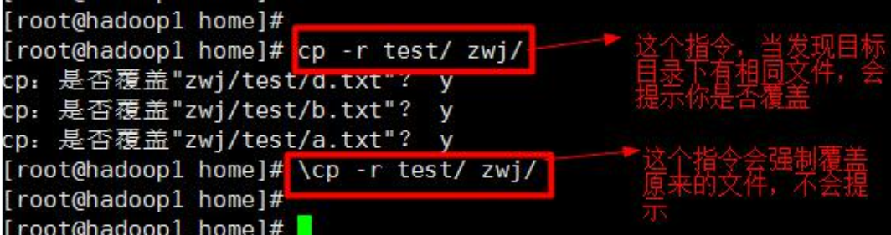
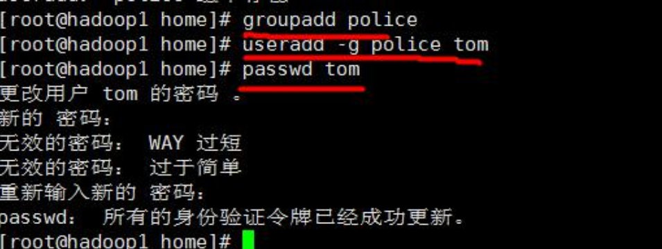
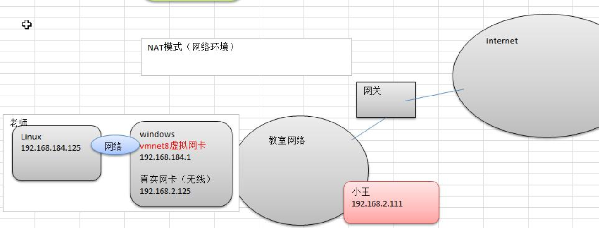
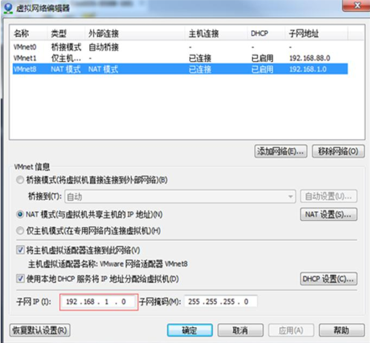

[TOC]
# VM和Linux系统(CentOS)安装


3.1安装vm和Centos

学习Linux需要一个环境，我们需要创建一个虚拟机，然后在虚拟机上安装一个Centos系统来学习。

1)先安装virtualmachine,vm12

2)再安装Linux(CentOS6.8)

3)原理示意图，这里我们画图说明一下VM和CentOS的关系。

3.3VM安装的步骤

1)去BIOS里修改设置开启虚拟化设备支持（f2,f10）

2)安装虚拟机软件（vm12）看老师的具体演示：因为老师的电脑上已经安装了VM12，因此我先卸载然后再安装。

3.4CentOS安装的步骤

1)创建虚拟机(空间)这里在配置网络连接时，有三种形式，需要大家伙注意：


## 3.5CentOS的终端使用和联网

1)终端的使用，点击鼠标右键，即可选择打开终端


2)配置网络，可以上网。点击上面右侧的；两个计算机图片，选择启用eth0,即可成功连接到网络，就可以上网。


## 3.7vmtools的安装和使用

3.7.1安装vmtools的步骤说明

1.进入centos

2.点击vm菜单的->installvmwaretools

3.centos会出现一个vm的安装包

4.点击右键解压,得到一个安装文件

5.进入该vm解压的目录，该文件在/root/桌面/vmware-tools-distrib/下

6.安装./vmware-install.pl

7.全部使用默认设置即可8.需要reboot重新启动即可生效

3.7.2使用vmtools来设置windows和linux的共享文件夹

1)菜单->vm->setting,如图设置即可注意:设置选项为alwaysenable,这样可以读写了

2)windows和centos可共享d:/share目录可以读写文件了

3)在centos的/mnt/hgfs/下

# Linux的目录结构

4.1基本介绍

linux的文件系统是采用级层式的树状目录结构，在此结构中的最上层是根目录“/”，然后在此目录下再创建其他的目录。深刻理解linux树状文件目录是非常重要的，这里我给大家说明一下。

记住一句经典的话：==在Linux世界里，一切皆文件。==


具体的目录结构:

**/bin   [重点]   (/usr/bin、/usr/local/bin)**

•是Binary的缩写, 这个目录存放着最经常使用的命令

**/home [重点]**

•存放普通用户的主目录，在Linux中每个用户都有一个自己的目录，一般该目录名是以用户的账号命名的。

**/root [重点]**

•该目录为系统管理员，也称作超级权限者的用户主目录。

**/sbin(/usr/sbin、/usr/local/sbin)**

•s就是Super User的意思，这里存放的是系统管理员使用的系统管理程序。

**/lib**

•系统开机所需要最基本的动态连接共享库，其作用类似于Windows里的DLL文件。几乎所有的应用程序都需要用到这些共享库。

**/lost+found**

•这个目录一般情况下是空的，当系统非法关机后，这里就存放了一些文件。

**/etc \[重点](etcetera,等等)**

•所有的系统管理所需要的配置文件和子目录my.conf 

**/usr  [重点]**

•这是一个非常重要的目录，用户的很多应用程序和文件都放在这个目录下，类似与windows下的program files目录。

**/boot [重点]**

•存放的是启动Linux时使用的一些核心文件，包括一些连接文件以及镜像文件

**/srv**

•service缩写，该目录存放一些服务启动之后需要提取的数据。

**/sys**

•这是linux2.6内核的一个很大的变化。该目录下安装了2.6内核中新出现的一个文件系统sysfs

**/tmp**

•这个目录是用来存放一些临时文件的。

**/dev** 

•类似于windows的设备管理器，把所有的硬件用文件的形式存储。

**/media [重点]**

•linux系统会自动识别一些设备，例如U盘、光驱等等，当识别后，linux会把识别的设备挂载到这个目录下。

**/mnt [重点]**

•系统提供该目录是为了让用户临时挂载别的文件系统的，我们可以将外部的存储挂载在/mnt/上，然后进入该目录就可以查看里的内容了。d:/myshare

**/var [重点]**

•这个目录中存放着在不断扩充着的东西，习惯将经常被修改的目录放在这个目录下。包括各种日志文件。

**/opt**     

•这是给**主机额外安装软件所摆放的目录**。如安装ORACLE数据库就可放到该目录下。默认为空。

**/usr/local [重点]** 

•这是另一个给主机额外安装软件所安装的目录。一般是通过编译源码方式安装的程序

**/selinux [security-enhanced linux] 360**

•SELinux是一种安全子系统,它能控制程序只能访问特定文件。

## 4.3Linux目录总结

1)linux的目录中有且只要一个根目录/
2)linux的各个目录存放的内容是规划好，不用乱放文件。
3)linux是以文件的形式管理我们的设备，因此linux系统，一切皆为文件。

4)linux的各个文件目录下存放什么内容，大家必须有一个认识。
5)学习后，你脑海中应该有一颗linux目录树

# 远程登录Linux系统

5.1为什么需要远程登录Linux

5.1.1示意图


为什么需要远程登录Linux
说明: 公司开发时候，具体的情况是这样的
1) linux服务器是开发小组共享的.
2) 正式上线的项目是运行在公网的.
3) 因此程序员需要远程登录到centos进行项目管理或者开发.
4) 画出简单的网络拓扑示意图(帮助理解)
5) 远程登录客户端有Xshell5，Xftp5 , 我们学习使用Xshell5 和Xftp , 其它的远程工具大同小异.

**远程登录Linux-Xshell5介绍:**

说明: 
Xshell 是目前最好的远程登录到Linux操作的软件，流畅的速度并且完美解决了中文乱码的问题，是目前程序员首选的软件。Xshell[1]是一个强大的安全终端模拟软件，它支持SSH1, SSH2, 以及Microsoft Windows 平台的TELNET 协议。
Xshell可以在Windows界面下用来访问远端不同系统下的服务器，从而比较好的达到远程控制终端的目的。

**特别说明：**如果希望安装好XShell5就可以远程访问Linux系统的话，需要有一个前提，就是Linux启用了SSHD服务，该服务会监听22号端口。

**==终端setup指令查看系统服务中ssh是否开启==**

**如果都有，还是不行，就重新建立连接**

## 5.3安装XShell5并使用

5.3.2XShell5的关键配置


5.3.3XShel5远程登录到Linux后，就可以使用指令来操作Linux系统

## 5.4远程上传下载文件Xftp5

5.4.1XFtp5软件介绍

是一个基于windows平台的功能强大的SFTP、FTP文件传输软件。使用了Xftp以后，windows用户能安全地在UNIX/Linux和WindowsPC之间传输文件。

5.4.2XFtp5软件的安装这个看老师的演示即可.
5.4.3Xftp5的配置和使用

# vi和vim编辑器
6.1vi和vim的基本介绍
所有的Linux系统都会内建vi文本编辑器。
Vim具有程序编辑的能力，可以看做是Vi的增强版本，可以主动的以字体颜色辨别语法的正确性，方便程序设计。代码补完、编译及错误跳转等方便编程的功能特别丰富，在程序员中被广泛使用。

## 6.2vi和vim的三种常见模式

**6.2.1正常模式**

在正常模式下，我们可以使用快捷键。以vim打开一个档案就直接进入一般模式了(这是默认的模式)。在这个模式中，你可以使用『上下左右』按键来移动光标，你可以使用『删除字符』或『删除整行』来处理档案内容，也可以使用『复制、贴上』来处理你的文件数据。**6.2.2插入模式/编辑模式**

在模式下，程序员可以输入内容。按下i,I,o,O,a,A,r,R等任何一个字母之后才会进入编辑模式,一般来说按i即可

**6.2.3命令行模式**

在这个模式当中，可以提供你相关指令，完成读取、存盘、替换、离开vim、显示行号等的动作则是在此模式中达成的！

## 6.4vi和vim三种模式的相互转化图


**快捷键使用练习:**

1) 拷贝当前行yy , 拷贝当前行向下的5行5yy，并粘贴。

2) 删除当前行dd  , 删除当前行向下的5行 5+dd

3) 在**文件中查找某个单词**[命令行下/关键字，回车查找,  输入n 就是查找下一个]

4) **设置文件的行号，取消文件的行号.**

[命令行下: set nu 和:set nonu]

5) 编辑/etc/profile 文件，使用快捷键到底文档的最末行[G]和最首行[gg]

6) 在一个文件中输入"hello" ,然后又撤销这个动作u7) 编辑/etc/profile 文件，并将光标移动到20行shift+g8) 更多的看整理的文档

7)编辑/etc/profile文件，并将光标移动到第20行shift+g

第一步：显示行号:setnu

第二步：输入20这个数

第三步:输入（G）shift+g，

：20在按gg


**uu回退**

## 6.6vim和vi的快捷键键盘一览图


# 实操篇开机、重启和用户登录注销

7.1关机&重启命令

7.1.1基本介绍

**shutdown**

shutdown-hnow:表示立即关机

shutdown-h1:表示1分钟后关机

shutdown-rnow:立即重启

halt

就是直接使用，效果等价于关机

reboot就是重启系统。

sync：把内存的数据同步到磁盘

7.1.2注意细节

当我们关机或者重启时，都应该先执行以下sync指令，把内存的数据写入磁盘，防止数据丢失。

7.2用户登录和注销

7.2.1基本介绍

1)登录时尽量少用root帐号登录，因为它是系统管理员，最大的权限，避免操作失误。可以利用普通用户登录，登录后再用”su-用户名’命令来切换成系统管理员身份.

2)在提示符下输入logout即可注销用户

7.2.2使用细节

1)logout注销指令在图形运行级别无效，在运行级别3下有效.

2)运行级别这个概念，后面给大家介绍

# 实操篇用户管理


8.1基本介绍

给大家画一个示意图，帮助大家理解用户管理的规则。


说明

1)Linux系统是一个多用户多任务的操作系统，任何一个要使用系统资源的用户，都必须首先向系统管理员申请一个账号，然后以这个账号的身份进入系统。

2)Linux的用户需要至少要属于一个组。

## 查看所有用户名

```shell
[root@hapdoop1 ~]# more /etc/passwd
[root@hapdoop1 ~]# more /etc/passwd | cut -f 1 -d :
root
bin
daemon
adm
lp
sync
shutdown
halt
mail
uucp
operator
games
gopher
ftp
nobody
dbus
usbmuxd
rtkit
avahi-autoipd
vcsa
abrt
haldaemon
ntp
apache
saslauth
postfix
gdm
pulse
sshd
tcpdump
xm
fox
tom
```


8.2添加用户

8.2.1基本语法

useradd [选项] 用户名

8.2.2实际案例

特别说明：**==cd表示changedirectory==**,切换目录.

8.2.3细节说明

1)**当创建用户成功后，(加上-m参数)会自动的创建和用户同名的家目录**

**==没有-m参数不会有缺省目录==**

```shell
root@iZuf6i77uwsb2oiszspgvkZ:~# useradd -m nicolas

```

2)也可以通过useradd-d指定目录新的用户名，给新创建的用户指定家目录

```shell
[root@hapdoop1 home]# useradd -d /home/dog xh
```


指定/修改密码基本语法

passwd    用户名

删除用户基本语法userdel   用户名

应用案例1)删除用户xiaoming，但是要保留家目录

```shell
[root@hapdoop1 ~]# userdel xm
```

2)删除用户以及用户主目录

```shell
[root@hapdoop1 home]# userdel -r xh
```

8.4.3思考题在删除用户时，我们一般不会将家目录删除。

8.5查询用户信息

8.5.1基本语法

id 用户名

应用实例案例1：请查询root信息8.5.3


细节说明

1)当用户不存在时，返回”无此用户”

## 8.6切换用户

8.6.1介绍(substitute user)

在操作Linux中，如果当前用户的权限不够，可以通过su-指令，切换到高权限用户，比如root

8.6.2基本语法(run a shell with substitute user and group IDs)

su– 切换用户名

8.6.3应用实例

1)创建一个用户zf,，指定密码，然后切换到zf.


细节说明

1)从权限高的用户切换到权限低的用户，不需要输入密码，反之需要。

2)当需要返回到原来用户时，使用exit指令

```shell
[root@hapdoop1 ~]# whoami
root
```

8.7用户组

8.7.1介绍类似于角色，系统可以对有共性的多个用户进行统一的管理。

**8.7.2增加组**

groupadd 组名

案例演示

```shell
[root@hapdoop1 ~]# groupadd wudang
```

**8.7.4删除组指令**

(基本语法)groupdel 组名

8.7.5案例演示

```shell
[root@hapdoop1 ~]# groupdel wudang
```

## 8.8增加用户时直接加上组

8.8.1指令(基本语法)

useradd -g 用户组 用户名

8.8.2案例演示

增加一个用户zwj,直接将他指定到wudang步骤看演示：


8.9修改用户的组

8.9.1指令(基本语法)

usermod -g 用户组 用户名

8.9.2案例演示创建一个shaolin组，让将zwj用户修改到shaolin


**8.10/etc/passwd文件**

用户（user）的配置文件，记录用户的各种信息

每行的含义：用户名:口令:用户标识号:组标识号:注释性描述:主目录:登录Shell


8.11/etc/shadow文件

口令的配置文件

每行的含义：登录名:加密口令:最后一次修改时间:最小时间间隔:最大时间间隔:警告时间:不活动时间:失效时间:标志

8.12/etc/group文件

组(group)的配置文件，记录Linux包含的组的信息

每行含义：组名:口令:组标识号:组内用户列表


# 实操篇实用指令

## 9.1指定运行级别

**运行级别说明：**

0：关机

1：单用户【找回丢失密码】

2：多用户状态没有网络服务

3：多用户状态有网络服务4：系统未使用保留给用户

5：图形界面

6：系统重启

常用运行级别是3和5，要修改默认的运行级别可改文件/etc/inittab的id:5:initdefault:这一行中的数字运行级别的示意图：


9.2切换到指定运行级别的指令

9.2.1基本语法

init[012356]


9.2.2应用实例案例

1：通过init来切换不同的运行级别，比如动5->3，然后关机

```shell
init3

init5

init0
```

9.2.3面试题

  **如何找回root密码**，如果我们不小心，忘记root密码，怎么找回。

思路：进入到单用户模式，然后修改root密码。

因为进入单用户模式，root不需要密码就可以登录。演示一把（注意观察）：

**总结:**开机->在引导时输入回车键->看到一个界面输入e->看到一个新的界面，选中第二行（编辑内核）在输入e->在这行最后输入1,再输入回车键->再次输入b,这时就会进入到单用户模式。这时，我们就进入到单用户模式，使用passwd指令来修改root密码。

2)请设置我们的运行级别，linux运行后，直接进入到命令行界面，即进入到3

运行级别vim/etc/inittab将id:5:initdefault:这一行中的数字,5这个数字改成对应的运行级别即可。

## 9.3帮助指令

9.3.1介绍

当我们对某个指令不熟悉时，我们可以使用Linux提供的帮助指令来了解这个指令的使用方法。

**9.3.2man(manual)** 获得帮助信息

- 基本语法
- man [命令或配置文件]（功能描述：获得帮助信息）

- 应用实例案例：查看ls命令的帮助信息

```shell
[root@hapdoop1 ~]# man ls
```

9.3.3help指令

 基本语法

help命令（功能描述：获得shell内置命令的帮助信息）

应用实例案例：查看cd命令的帮助信息

```shell
[root@hapdoop1 ~]# help cd
```

## 9.4文件目录类

9.4.1pwd 指令(print name of current/working directory)

•基本语法

pwd (功能描述：显示当前工作目录的绝对路径)

•应用实例案例：显示当前工作目录的绝对路径

```shell
[root@hapdoop1 ~]# pwd
/root
```

9.4.2ls指令 (list directory contents)

•基本语法

ls \[选项] [目录或是文件]

•常用选项

-a：显示当前目录所有的文件和目录，包括隐藏的。

-l：以列表的方式显示信息

•应用实例案例:查看当前目录的所有内容信息

### 9.4.3cd指令

•基本语法

cd \[参数] (功能描述：切换到指定目录)

•常用参数

绝对路径和相对路径

如何理解绝对路径和相对路径：

cd~ 或者 cd：回到自己的家目录

cd.. : 回到当前目录的上一级目录

•应用实例

案例1：使用绝对路径切换到root目录

cd/root

案例2:

使用相对路径到/root目录

这里我们需要知道该用户目录在哪个目录下，才能写出这个指令，假设在/usr/lib

```shell
cd../../root
```

案例3：表示回到当前目录的上一级目录cd..案例4：回到家目录

cd cd~

### 9.4.4 mkdir指令

mkdir指令用于创建目录(makedirectory)

基本语法

mkdir [选项] 要创建的目录

•常用选项

-p(--parents)：创建多级目录

•应用实例案例1:创建一个目录/home/dog


案例2:创建多级目录/home/animal/tiger


### 9.4.5rmdir指令

介绍

rmdir指令删除空目录

基本语法

rmdir [选项] 要删除的空目录

应用实例案例1:删除一个目录/home/dog


使用细节

rmdir删除的是空目录，如果目录下有内容时无法删除的。

提示：如果需要删除非空目录，需要使用rm-rf要删除的目录


### 9.4.6touch指令

touch指令 创建空文件

•基本语法

touch 文件名称

•应用实例案例

1:创建一个空文件hello.txt

```shell
[root@hapdoop1 home]# touch ok1.txt ok2.txt
[root@hapdoop1 home]# ls
ok1.txt  ok2.txt  xm
```

### **9.4.7cp指令[重要]**

cp指令 拷贝文件到指定目录

•基本语法

```shell
cp [选项] source dest
```

•常用选项-r：递归复制整个文件夹

•应用实例案例

1:将/home/aaa.txt拷贝到/home/bbb目录下[拷贝单个文件


案例2:递归复制整个文件夹，举例将/home/test整个目录拷贝到/home/zwj目录


•使用细节

强制覆盖不提示的方法：\cp



9.4.8rm指令

rm 指令移除

【删除】文件或目录

•基本语法rm[选项]要删除的文件或目录

•常用选项

-r：递归删除整个文件夹

-f：强制删除不提示

•应用实例案例1:将/home/aaa.txt删除


案例2:递归删除整个文件夹/bb

```shell
[root@hapdoop1 /]# rm -r bb/
rm：是否删除目录 "bb"？y
```

使用细节

强制删除不提示的方法：带上-f参数即可


9.4.9mv指令

mv 移动文件与目录或重命名

•基本语法

mv oldNameFile newNameFile (功能描述：重命名)

mv /temp/movefile /targetFolder(功能描述：移动文件)

•应用实例

案例1:将/home/aaa.txt文件重新命名为pig.txt

```shell
[root@hapdoop1 home]# mv aaa.txt pig.txt
[root@hapdoop1 home]# ls
ok1.txt  ok2.txt  pig.txt  xm
```

案例2:将/home/pig.txt文件移动到/root目录下

```shell
[root@hapdoop1 home]# mv pig.txt /root
[root@hapdoop1 home]# cd ~
[root@hapdoop1 ~]# ls
anaconda-ks.cfg  install.log.syslog  公共的   视频  下载
hello.java       ok.txt              红1.jpg  图片  音乐
install.log      pig.txt             模板     文档  桌面

```

9.4.10 cat指令(concatenate)

cat查看文件内容，是以只读的方式打开。

•基本语法

cat [选项] 要查看的文件

•常用选项-n：显示行号

•应用实例

案例1:/etc/profile文件内容，并显示行号

```shell
[root@hapdoop1 ~]# cat -n /etc/profile | more
```


•使用细节

cat只能浏览文件，而不能修改文件，为了浏览方便，一般会带上管道命令|more

cat文件名|more[分页浏览]

9.4.11more指令 

more指令是一个基于VI编辑器的文本过滤器，它以**全屏幕的方式按页显示文本文件的内容**。

more指令中内置了若干快捷键，详见操作说明

•基本语法 

more 要查看的文件

•操作说明

•应用实例案例:

采用more查看文件/etc/profile

```shell
[root@hapdoop1 ~]# more /etc/profile
```


9.4.12less指令

less指令用来**分屏查看文件内容**，它的功能与more指令类似，但是比more指令更加强大，支持各种显示终端。less指令在显示文件内容时，并不是一次将整个文件加载之后才显示，而是根据显示需要加载内容，对于**显示大型文件具有较高的效率**。

•基本语法

less 要查看的文件

•操作说明

•应用实例

案例:采用less查看一个大文件文件/opt/金庸-射雕英雄传txt精校版.txt

```shell
[root@hapdoop1 opt]# less 金庸-射雕英雄传txt精校版.txt 
```


### 9.4.13>指令和>>指令

介绍

 指令和>>指令
 **\> 输出重定向:会将原来的文件的内容覆盖**

 \>>追加：不会覆盖原来文件的内容，而是追加到文件的尾部。•

基本语法

1)ls-l>文件（功能描述：列表的内容写入文件a.txt中（覆盖写））

```shell
[root@hapdoop1 home]# ls -l > a.txt
```

说明：ls-l>a.txt,将ls-l的显示的内容覆盖写入到a.txt文件，如果该文件不存在，就创建该文件。

2)ls-al>>文件（功能描述：列表的内容追加到文件aa.txt的末尾）

```shell
[root@hapdoop1 home]# ls -al >> a.txt
```

3)cat文件1>文件2（功能描述：将文件1的内容覆盖到文件2）**相当于复制文件**

```shell
[root@hapdoop1 home]# cat /etc/profile > c.txt
```

9.4.14echo指令

echo输出内容到控制台。

•基本语法echo\[选项] [输出内容]

•应用实例

案例:使用echo指令输出环境变量,输出当前的环境路径。

```SHELL
[root@hapdoop1 ~]# echo $PATH

[root@hapdoop1 ~]# echo "hello"
```

9.4.15head指令

head用于显示文件的开头部分内容，默认情况下head指令显示文件的前10行内容

•基本语法

head 文件(功能描述：查看文件头10行内容)

head -n 5 文件   (功能描述：查看文件头5行内容，5可以是任意行数)

•应用实例

案例:查看/etc/profile的前面5行代码

```shell
[root@hapdoop1 ~]# head -n 5 /etc/profile
```

9.4.16tail指令

tail用于输出文件中尾部的内容，默认情况下tail指令显示文件的后10行内容。

•基本语法

1)tail 文件（功能描述：查看文件后10行内容）

2)tail -n 5 文件（功能描述：查看文件后5行内容，5可以是任意行数）3)tail -f 文件（功能描述：实时追踪该文档的所有更新，工作经常使用）

•应用实例

案例1:查看/etc/profile最后5行的代码

```shell
[root@hapdoop1 ~]# tail -n 5 /etc/profile
```

案例2:实时监控mydate.txt,看看到文件有变化时，是否看到，实时的追加日期

```shell
[root@hapdoop1 home]# tail -f mydate.txt 
```

9.4.17ln指令

软链接也叫符号链接，类似于windows里的快捷方式，主要存放了链接其他文件的路径

•基本语法

ln -s \[原文件或目录] [软链接名]（功能描述：给原文件创建一个软链接）

•应用实例

案例1:在/home目录下创建一个软连接linkToRoot，连接到/root目录

```shell
[root@hapdoop1 home]# ln -s /root linkToRoot
```

案例2:删除软连接linkToRoot

```shell
[root@hapdoop1 home]# rm linkToRoot
```

•细节说明

当我们使用pwd指令查看目录时，仍然看到的是软链接所在目录。

```shell
[root@hapdoop1 home]# cd linkToRoot/
[root@hapdoop1 linkToRoot]# pwd
/home/linkToRoot
[root@hapdoop1 linkToRoot]# ls
anaconda-ks.cfg  install.log.syslog  公共的   视频  下载
hello.java       ok.txt              红1.jpg  图片  音乐
install.log      pig.txt             模板     文档
```

### 9.4.18history指令

查看已经执行过历史命令,也可以执行历史指令

•基本语法history（功能描述：查看已经执行过历史命令）

•应用实例案例1:显示所有的历史命令

```shell
[root@hapdoop1 home]# history
```

案例2:显示最近使用过的10个指令。

```shell
[root@hapdoop1 home]# history 10
```

案例3：执行历史编号为5的指令

```shell
[root@hapdoop1 home]# !111
```

## 9.5时间日期类

9.5.1date指令

-显示当前日期

•基本语法

1)date（功能描述：显示当前时间）

2)date+%Y（功能描述：显示当前年份）

3)date+%m（功能描述：显示当前月份）

4)date+%d（功能描述：显示当前是哪一天）

5)date"+%Y-%m-%d%H:%M:%S"（功能描述：显示年月日时分秒）

•应用实例案例1:显示当前时间信息

```shell
[root@hapdoop1 home]# date
2019年 08月 15日 星期四 17:57:34 CST
```

案例2:显示当前时间年月日

```shell
[root@hapdoop1 home]# date "+%Y %m %d"
2019 08 15
```

案例3:显示当前时间年月日时分秒

```shell
[root@hapdoop1 home]# date "+%Y %m %d %H:%M:%S"
2019 08 15 18:04:05
```

9.5.2date指令

-设置日期

•基本语法

date -s 字符串时间

•应用实例

案例1:设置系统当前时间，比如设置成2018-10-1011:22:22

```shell
[root@hapdoop1 home]# date -s "2019-9-9 11:11:11"
2019年 09月 09日 星期一 11:11:11 CST
```

9.5.3cal指令(calendar)

查看日历指令

•基本语法cal[选项]（功能描述：不加选项，显示本月日历）

•应用实例案例1:显示当前日历

```shell
[root@hapdoop1 home]# cal
```

案例2:显示2020年日历

```shell
[root@hapdoop1 ~]# cal 2020
```

## 9.6搜索查找类

9.6.1find指令

find指令将从指定目录向下递归地遍历其各个子目录，将满足条件的文件或者目录显示在终端。

•基本语法

find \[搜索范围] [选项]

•选项说明


•应用实例

案例1:按文件名：根据名称查找/home目录下的hello.txt文件

```shell
[root@hapdoop1 ~]# find /home -name hello.txt
```

案例2：按拥有者：查找/opt目录下，用户名称为root的文件

```shell
[root@hapdoop1 ~]# find /opt -user root
```

案例3：查找整个linux系统下大于20m的文件（+n大于-n小于n等于）

```shell
[root@hapdoop1 ~]# find /opt -size +20M
```

查询/目录下，所有.txt的文件

```shell
[root@hapdoop1 ~]# find / -name \*.txt
```

9.6.2locate指令

locaate指令可以快速定位文件路径。locate指令利用事先建立的系统中所有文件名称及路径的locate数据库实现快速定位给定的文件。Locate指令无需遍历整个文件系统，查询速度较快。为了保证查询结果的准确度，管理员必须定期更新locate时刻。

•基本语法

locate 搜索文件

•特别说明由于locate指令基于数据库进行查询，所以**第一次运行前，必须使用updatedb指令创建locate数据库。**

•应用实例

案例1:请使用locate指令快速定位hello.txt文件所在目录


### 9.6.3grep指令和管道符号|

**grep过滤查找**，管道符，“|”，表示将前一个命令的处理结果输出传递给后面的命令处理。

•基本语法

grep [选项] 查找内容源文件

•常用选项


•应用实例

案例1:请在hello.txt文件中，查找"yes"所在行，并且显示行号

```shell
[root@hapdoop1 home]# cat hello.txt | grep -n yes
#不区分大小写
[root@hapdoop1 home]# cat hello.txt | grep -ni yes
```

## 9.7压缩和解压类

9.7.1gzip/gunzip指令

gzip用于压缩文件，gunzip用于解压的

•基本语法

gzip 文件（功能描述：压缩文件，只能将文件压缩为*.gz文件）

gunzip 文件.gz（功能描述：解压缩文件命令）

•应用实例

案例1:gzip压缩，将/home下的hello.txt文件进行压缩

```shell
[root@hapdoop1 home]# gzip hello.txt
```

案例2:gunzip压缩，将/home下的hello.txt.gz文件进行解压缩

```shell
[root@hapdoop1 home]# gunzip hello.txt.gz 
```

细节说明

当我们使用gzip对文件进行压缩后，不会保留原来的文件。

9.7.2 zip/unzip指令

zip用于压缩文件，unzip用于解压的，这个在项目打包发布中很有用的

•基本语法

zip [选项] XXX.zip 将要压缩的内容（功能描述：压缩文件和目录的命令）unzip [选项] XXX.zip（功能描述：解压缩文件）

•zip常用选项

-r：递归压缩，即压缩目录

unzip的常用选项

-d <目录>：指定解压后文件的存放目录

•应用实例

案例1:将/home下的所有文件进行压缩成mypackage.zip

```shell
[root@hapdoop1 home]# zip -r mypackge.zip /home/
```

案例2:将mypackge.zip解压到/opt/tmp目录下

```shell
[root@hapdoop1 home]# unzip -d /opt/tmp/ mypackge.zip 
```

### 9.7.3tar指令

tar指令是打包指令，最后打包后的文件是.tar.gz的文件。

•基本语法

tar [选项] XXX.tar.gz 打包的内容(功能描述：打包目录，压缩后的文件格式.tar.gz)

•选项说明


v(verbose)

z(gzip)

f(file)

c(file)

x(extract)


•应用实例

案例1:压缩多个文件，将/home/a1.txt和/home/a2.txt压缩成a.tar.gz

```shell
[root@hapdoop1 home]# tar -zcvf a.tar.gz ok1.txt ok2.txt 
```

案例3:将a.tar.gz解压到当前目录

```shell
[root@hapdoop1 home]# tar -zxvf a.tar.gz 
```

案例4:将myhome.tar.gz解压到/opt/目录下

```shell
[root@hapdoop1 home]# tar -zxvf a.tar.gz -C /opt
```

# 组管理和权限管理

10.1Linux组

基本介绍

在linux中的每个用户必须属于一个组，不能独立于组外。在linux中每个文件有所有者、所在组、其它组的概念。

1)所有者

2)所在组

3)其它组

4)改变用户所在的组


10.2文件/目录所有者

一般为文件的创建者,谁创建了该文件，就自然的成为该文件的所有者。10.2.1查看文件的所有者

1)指令：ls -ahl

2)应用实例：创建一个组police,再创建一个用户tom,将tom放在police组,然后使用tom来创建一个文件ok.txt，看看情况如何




## 10.3组的创建

10.3.1基本指令

groupadd 组名

10.3.2应用实例:

创建一个组,monster

创建一个用户fox，并放入到monster组中

```shell
[root@hapdoop1 ~]# groupadd monster
[root@hapdoop1 ~]# useradd -g monster fox
```

## 10.4文件/目录所在组

当某个用户创建了一个文件后，默认这个文件的所在组就是该用户所在的组。### 10.4.1查看文件/目录所在组

•基本指令

ls –ahl

### 10.4.2修改文件所在的组

•基本指令

 chgrp 组名 文件名

•应用实例

使用root用户创建文件orange.txt,看看当前这个文件属于哪个组，然后将这个文件所在组，修改到police组。

```shell
[root@hapdoop1 ~]# chgrp police orange.txt 
[root@hapdoop1 ~]# ls -ahl
-rw-r--r--.  1 root police   12 9月  16 02:17 orange.txt

```

10.5其它组

除文件的所有者和所在组的用户外，系统的其它用户都是文件的其它组.

10.6改变用户所在组

在添加用户时，可以指定将该用户添加到哪个组中，同样的用root的管理权限可以改变某个用户所在的组。

10.6.1改变用户所在组

1)usermod –g 组名 用户名

2)usermod –d 目录名 用户名 改变该用户登陆的初始目录。

```shell
[root@hapdoop1 ~]# usermod -g  bandit fox
```

## 10.7权限的基本介绍

ls -l中显示的内容如下：

-rwxrw-r--1rootroot1213Feb209:39abc

0-9位说明

1)第0位确定文件类型(d,-,l,c,b)

2)第1-3位确定所有者（该文件的所有者）拥有该文件的权限。---User

3)第4-6位确定所属组（同用户组的）拥有该文件的权限，---Group

4)第7-9位确定其他用户拥有该文件的权限---Other


## 10.8rwx权限详解

**10.8.1rwx作用到文件**

1)[r]代表可读(read):可以读取,查看 ： 数字4

2)[w]代表可写(write):可以修改,但是不代表可以删除该文件,删除一个文件的前提条件是对该文件所在的目录有写权限，才能删除该文件. ：数字2

3)[x]代表可执行(execute):可以被执行 ：数字1

**10.8.2rwx作用到目录**

1)[r]代表可读(read):可以读取，ls查看目录内容

2)[w]代表可写(write):可以修改,目录内创建+删除+重命名目录

3)[x]代表可执行(execute):可以进入该目录10.9文件及目录权限实际案例ls-l中显示的内容如下：(记住)-rwxrw-r--1rootroot1213Feb209:39abc

10个字符确定不同用户能对文件干什么

**第一个字符代表文件类型：文件(-),目录(d),链接(l)**

其余字符每3个一组(rwx)读(r)写(w)执行(x)

第一组rwx:文件拥有者的权限是读、写和执行

第二组rw-:与文件拥有者同一组的用户的权限是读、写但不能执行

第三组r--:不与文件拥有者同组的其他用户的权限是读不能写和执行

可用数字表示为:r=4,w=2,x=1因此rwx=4+2+1=7

1 					文件：硬连接数或目录：子目录数

root 				用户root组

1213				文件大小(字节)，如果是文件夹，显示4096字节

Feb209:39		最后修改日期

abc					文件名

### 10.9文件及目录权限

ls-l中显示的内容如下：(记住)

-rwxrw-r--1rootroot1213Feb209:39abc

## 10.10修改权限-chmod

10.10.1基本说明：

通过chmod指令，可以修改文件或者目录的权限

10.10.2第一种方式：+、-、=变更权限

u:所有者g:所有组o:其他人a:所有人(u、g、o的总和)

1)chmod u=rwx,g=rx,o=x文件目录名

2)chmod o+w 文件目录名

3)chmod a-x 文件目录名

•案例演示

1)给abc文件的所有者读写执行的权限，给所在组读执行权限，给其它组读执行权限

```shell
[root@hapdoop1 ~]# chmod u=rwx,g=x,o=rx abc
[root@hapdoop1 ~]# ls -l
总用量 136
drwx--xr-x. 2 root root    4096 9月  16 02:34 abc
```

2)给abc文件的所有用户添加读的权限

```shell
[root@hapdoop1 ~]# chmod a+r abc
```

10.10.3第二种方式：通过数字变更权限

规则：r=4 w=2 x=1 ,rwx=4+2+1=7

chmod u=rwx, g=rx, o=x文件目录名

相当于 chmod 751 文件目录名

•案例演示

要求：将/home/abc.txt文件的权限修改成rwxr-xr-x,使用给数字的方式实现：rwx=4+2+1=7

r-x=4+1=5

r-x=4+1=5

指令：chmod755/home/abc.txt

## 10.11修改文件所有者-chown

(chmod - **change** file **mode** bits)

10.11.1基本介绍

```shell
chown newowner file 改变文件的所有者
```

```shell
chown  [-R]  newowner:newgroupfile  改变用户的所有者和所有组 [-R] 如果是目录则使其下所有子文件或目录递归生效
```

10.11.2案例演示：

1)请将/home/abc.txt文件的所有者修改成tom

```shell
[root@hapdoop1 ~]# chown fox abc.txt
```

2)请将/home/kkk目录下所有的文件和目录的所有者都修改成tom

```shell
[root@hapdoop1 ~]# chown -R tom kkk/
```


## 10.13最佳实践-警察和土匪游戏

police，bandit

jack,jerry:警察

xh,xq:土匪

(1)创建组

```shell
[root@hapdoop1 ~]# groupadd police
[root@hapdoop1 ~]# groupadd bandit
```


(2)创建用户

# crond任务调度

11.1原理示意图


crontab进行定时任务的设置。

1.2概述

任务调度：是指系统在某个时间执行的特定的命令或程序。

任务调度分类：

1.系统工作：有些重要的工作必须周而复始地执行。如病毒扫描等

2.个别用户工作：个别用户可能希望执行某些程序，比如对mysql数据库的备份。

11.3基本语法

crontab [选项]

11.3.1常用选项


11.4快速入门

11.4.1任务的要求

设置任务调度文件：/etc/crontab

设置个人任务调度。执行crontab–e命令。

接着输入任务到调度文件如：*/1ls–l/etc/>/tmp/to.txt意思说每小时的每分钟执行ls–l/etc/>/tmp/to.txt命令*

*11.4.2步骤如下*

1)

```shell
[root@hapdoop1 ~]# crontab -e
```

2) */1 * * * * ls -l /etc >> /tmp/to.txt

3)当保存退出后就程序。

4)在每一分钟都会自动的调用

ls -l /etc >> /tmp/to.txt

11.4.3参数细节说明


11.5.1

案例1：每隔1分钟，就将当前的日期信息，追加到/tmp/mydate文件中

1)先编写一个文件/home/mytask1.sh

```shell
date >> /tmp/mydate
```

2)给mytask1.sh一个可以执行权限

```shell
[root@hapdoop1 home]# chmod 774 mytask1.sh 
```

3)crontab-e

4)

```shell
*/1 * * * * /home/mytask1.sh
```

11.5.2

案例2：每隔1分钟，将当前日期和日历都追加到/home/mycal文件中

1)先编写一个文件/home/mytask2.sh

```shell
date >> /tmp/mycal
cal >> /tmp/mycal
```

2)给mytask2.sh一个可以执行权限

```shell
[root@hapdoop1 home]# chmod 774 mytask2.sh 
```

3)crontab -e

4)

```shell
*/1 * * * * /home/mytask2.sh
```

11.5.3

案例3:每天凌晨2:00将mysql数据库testdb，备份到文件中mydb.bak。

1)先编写一个文件/home/mytask2.sh

```shell
/usr/local/mysql/bin/mysqldump -u root-proot testdb>/tmp/mydb.bak
```

2)给mytask3.sh一个可以执行权限

```shell
[root@hapdoop1 home]# chmod 774 mytask2.sh 
```

3)crontab -e

4)

```shell
0 2 * * */home/mytask3.sh
```

11.6crond相关指令:

1)conrtab–r：终止任务调度。

2)crontab–l：列出当前有那些任务调度

3)service crond restart [重启任务调度]

# Linux磁盘分区、挂载

## 分区基础知识

12.1.1分区的方式：

1)mbr分区:

1.最多支持四个主分区

2.系统只能安装在主分区

3.扩展分区要占一个主分区4.MBR最大只支持2TB，但拥有最好的兼容性

2)gpt分区:

1.支持无限多个主分区（但操作系统可能限制，比如windows下最多128个分区）

2.最大支持18EB的大容量（1EB=1024PB，1PB=1024TB）3.windows764位以后支持gpt

12.1.2windows下的磁盘分区


## 12.2Linux分区

12.2.1原理介绍

1)Linux来说无论有几个分区，分给哪一目录使用，它归根结底就只有一个根目录，一个独立且唯一的文件结构,Linux中每个分区都是用来组成整个文件系统的一部分。

2)Linux采用了一种叫“载入”的处理方法，它的整个文件系统中包含了一整套的文件和目录，且将一个分区和一个目录联系起来。这时要载入的一个分区将使它的存储空间在一个目录下获得。

3)示意图


12.2.2硬盘说明

1)Linux硬盘分IDE硬盘和SCSI硬盘，目前基本上是SCSI硬盘

2)对于IDE硬盘，驱动器标识符为“hdx~”,其中“hd”表明分区所在设备的类型，这里是指IDE硬盘了。“x”为盘号（a为基本盘，b为基本从属盘，c为辅助主盘，d为辅助从属盘）,“~”代表分区，前四个分区用数字1到4表示，它们是主分区或扩展分区，从5开始就是逻辑分区。例，hda3表示为第一个IDE硬盘上的第三个主分区或扩展分区,hdb2表示为第二个IDE硬盘上的第二个主分区或扩展分区。

3)对于SCSI硬盘则标识为“sdx~”，SCSI硬盘是用“sd”来表示分区所在设备的类型的，其余则和IDE硬盘的表示方法一样

12.2.3使用lsblk指令查看当前系统的分区情况


## 12.5磁盘情况查询

12.5.1查询系统整体磁盘使用情况

基本语法

df -h

应用实例

查询系统整体磁盘使用情况

```shell
[root@hapdoop1 ~]# df -lh
Filesystem      Size  Used Avail Use% Mounted on
/dev/sda3        18G  4.2G   13G  26% /
tmpfs          1003M   80K 1003M   1% /dev/shm
/dev/sda1       190M   39M  142M  22% /boot
/dev/sr0        3.7G  3.7G     0 100% /media/CentOS_6.8_Final
```

12.5.2查询指定目录的磁盘占用情况

•基本语法

du -h/目录查询指定目录的磁盘占用情况，默认为当前目录

-s指定目录占用大小汇总

-h带计量单位

-a含文件

--max-depth=1子目录深度

-c列出明细的同时，增加汇总值

•应用实例查询/opt目录的磁盘占用情况，深度为1

```shell
[root@hapdoop1 ~]# du -ach --max-depth=1 /opt
4.0K	/opt/Hello.java
64K	/opt/tmp
147M	/opt/jdk-7u79-linux-x64.gz
35M	/opt/mysql-5.6.14.tar.gz
8.6M	/opt/apache-tomcat-7.0.70.tar.gz
298M	/opt/jdk1.7.0_79
4.0K	/opt/rh
4.0K	/opt/Hello.class
0	/opt/ok2.txt
28M	/opt/金庸-射雕英雄传txt精校版.txt
69M	/opt/VMwareTools-10.0.5-3228253.tar.gz
15M	/opt/apache-tomcat-7.0.70
214M	/opt/vmware-tools-distrib
0	/opt/ok1.txt
274M	/opt/eclipse-jee-mars-2-linux-gtk-x86_64.tar.gz
1.1G	/opt
1.1G	总用量
```

## 12.6磁盘情况-工作实用指令

1)统计/home文件夹下文件的个数

```shell
[root@hapdoop1 home]# ll /home | grep "^-" | wc -l
11

```

2)统计/home文件夹下目录的个数

```shell
[root@hapdoop1 home]# ll /home | grep "^d" | wc -l
3
```

3)统计/home文件夹下文件的个数，包括子文件夹里的

```shell
[root@hapdoop1 home]# ls -lR /home | grep "^-" | wc -l
11
```

4)统计文件夹下目录的个数，包括子文件夹里的

```shell
[root@hapdoop1 home]# ls -lR /home | grep "^d" | wc -l
3
```

5)以树状显示目录结构

```shell
[root@hapdoop1 home]# yum install tree
[root@hapdoop1 home]# tree
.
├── a.tar.gz
├── a.txt
├── c.txt
├── fox
├── hello.txt
├── mydate.txt
├── mydate.txt~
├── mypackge.zip
├── mytask1.sh
├── mytask2.sh
├── ok1.txt
├── ok2.txt
├── tom
└── xm

```

# 实操篇网络配置

13.1Linux网络配置

原理图(含虚拟机)

目前我们的网络配置采用的是NAT。



13.2查看网络IP和网关

13.2.1查看虚拟网络编辑器


13.2.2修改ip地址(修改虚拟网络的ip)



3.2.3查看网关


13.2.4查看windows环境的中VMnet8网络配置(ipconfig指令)

1)使用ipconfig查看

2)界面查看


13.3ping测试主机之间网络连通

13.3.1基本语法ping目的主机（功能描述：测试当前服务器是否可以连接目的主机）

13.3.2应用实例测试当前服务器是否可以连接百度

[root@hadoop100桌面]#pingwww.baidu.com

```shell
[root@hapdoop1 home]# vim /etc/sysconfig/network-scripts/ifcfg-eth0 
```

13.4linux网络环境配置

13.4.1第一种方法(自动获取)


缺点:linux启动后会自动获取IP,缺点是每次自动获取的ip地址可能不一样。这个不适用于做服务器，因为我们的服务器的ip需要时固定的。

**13.4.2第二种方法(指定固定的ip)**

说明直接修改配置文件来指定IP,并可以连接到外网(程序员推荐)，编辑vi/etc/sysconfig/network-scripts/ifcfg-eth0

要求：将ip地址配置的静态的，ip地址为192.168.184.130


修改后，一定要重启服务

1)service network restart

2)reboot重启系统 不推荐


# 实操篇进程管理

## 14.1进程的基本介绍

1)在LINUX中，每个执行的程序（代码）都称为一个进程。每一个进程都分配一个ID号。

2)每一个进程，都会对应一个父进程，而这个父进程可以复制多个子进程。例如www服务器。

3)每个进程都可能以两种方式存在的。前台与后台，所谓前台进程就是用户目前的屏幕上可以进行操作的。后台进程则是实际在操作，但由于屏幕上无法看到的进程，通常使用后台方式执行。

4)一般系统的服务都是以后台进程的方式存在，而且都会常驻在系统中。直到关机才才结束。

## 14.2显示系统执行的进程ps

14.2.1说明：

查看进行使用的指令是ps,一般来说使用的参数是ps-aux


14.2.2ps指令详解

1)指令：ps –aux| grep xxx，比如我看看有没有sshd服务

2)指令说明

•SystemV展示风格•USER：用户名称

•PID：进程号•%CPU：进程占用CPU的百分比

•%MEM：进程占用物理内存的百分比

•VSZ：进程占用的虚拟内存大小（单位：KB）

•RSS：进程占用的物理内存大小（单位：KB）

•TT：终端名称,缩写

.•STAT：进程状态，其中S-睡眠，s-表示该进程是会话的先导进程，N-表示进程拥有比普通优先级更低的优先级，R-正在运行，D-短期等待，Z-僵死进程，T-被跟踪或者被停止等等

•STARTED：进程的启动时间

•TIME：CPU时间，即进程使用CPU的总时间•COMMAND：启动进程所用的命令和参数，如果过长会被截断显示

14.2.3应用实例

要求：以全格式显示当前所有的进程，查看进程的父进程。


•ps -ef是以全格式显示当前所有的进程

 -e显示所有进程(every)。

 -f全格式(Do **full-format** listing)。

•ps -ef|grep xxx

•是BSD风格

•UID：用户ID

•PID：进程ID

•PPID：父进程ID

•C：CPU用于计算执行优先级的因子。数值越大，表明进程是CPU密集型运算，执行优先级会降低；数值越小，表明进程是I/O密集型运算，执行优先级会提高•STIME：进程启动的时间

•TTY：完整的终端名称

•TIME：CPU时间

•CMD：启动进程所用的命令和参数

思考题，如果我们希望查看sshd进程的父进程号是多少，应该怎样查询？

```shell
[root@hapdoop1 ~]# ps -ef | grep sshd
root      14263      1  0 (ppid) 05:34 ?        00:00:00 /usr/sbin/sshd
root      16269  14263  0 06:07 ?        00:00:00 sshd: root@pts/1 
root      16321  16273  0 06:19 pts/1    00:00:00 grep sshd
```

## 14.3终止进程kill和killall

14.3.1介绍:

若是某个进程执行一半需要停止时，或是已消了很大的系统资源时，此时可以考虑停止该进程。使用kill命令来完成此项任务。

14.3.2基本语法：

kill [选项] 进程号（功能描述：通过进程号杀死进程）

killall进程名称（功能描述：通过进程名称杀死进程，也支持通配符，这在系统因负载过大而变得很慢时很有用）

14.3.3常用选项：

-9:表示强迫进程立即停止

14.3.4最佳实践：

案例1：踢掉某个非法登录用户

```shell
[root@hapdoop1 ~]# ps -aux | grep sshd
Warning: bad syntax, perhaps a bogus '-'? See /usr/share/doc/procps-3.2.8/FAQ
root      14263  0.0  0.0  66236  1200 ?        Ss   05:34   0:00 /usr/sbin/sshd
root      16269  0.0  0.2 102084  4156 ?        Ss   06:07   0:00 sshd: root@pts/1 
root      16357  0.4  0.1 102084  4040 ?        Ss   06:28   0:00 sshd: fox [priv] 
fox       16361  0.1  0.0 102084  1904 ?        S    06:28   0:00 sshd: fox@pts/2  
root      16387  0.0  0.0 103332   860 pts/1    S+   06:29   0:00 grep sshd
[root@hapdoop1 ~]# kill 16361
```

案例2:终止远程登录服务sshd,在适当时候再次重启sshd服

```shell
[root@hapdoop1 ~]# ps -aux | grep sshd
Warning: bad syntax, perhaps a bogus '-'? See /usr/share/doc/procps-3.2.8/FAQ
root      14263  0.0  0.0  66236  1200 ?        Ss   05:34   0:00 /usr/sbin/sshd
root      16269  0.0  0.2 102084  4156 ?        Ss   06:07   0:00 sshd: root@pts/1 
root      16357  0.4  0.1 102084  4040 ?        Ss   06:28   0:00 sshd: fox [priv] 
fox       16361  0.1  0.0 102084  1904 ?        S    06:28   0:00 sshd: fox@pts/2  
root      16387  0.0  0.0 103332   860 pts/1    S+   06:29   0:00 grep sshd
[root@hapdoop1 ~]# kill 14263
```

案例3:终止多个gedit编辑器【killall,通过进程名称来终止进程】

```shell
[root@hapdoop1 桌面]# killall gedit
```

案例4：强制杀掉一个终端

```shell
[root@hapdoop1 桌面]# ps -aux |grep bash
Warning: bad syntax, perhaps a bogus '-'? See /usr/share/doc/procps-3.2.8/FAQ
root      15158  0.0  0.0 108348  1840 pts/0    Ss   05:37   0:00 /bin/bash
root      16273  0.0  0.0 108348  1820 pts/1    Ss+  06:07   0:00 -bash
root      16398  0.0  0.0 108428  1828 pts/2    Ss+  06:33   0:00 /bin/bash
root      16411  0.0  0.0 108348  1788 pts/3    Ss   06:33   0:00 /bin/bash
root      16438  0.0  0.0 103328   856 pts/3    S+   06:37   0:00 grep bash
[root@hapdoop1 桌面]# kill -9 16398
```

## 14.4查看进程树pstree

14.4.1基本语法：

pstree [选项] ,可以更加直观的来看进程信息

14.4.2常用选项：

-p:显示进程的PID

-u:显示进程的所属用户

14.4.3应用实例：

案例1：请你树状的形式显示进程的pid

```shell
[root@hapdoop1 ~]# pstree -p
init(1)─┬─ManagementAgent(13688)─┬─{ManagementAgen}(13706)
        │                        └─{ManagementAgen}(13707)
        ├─NetworkManager(14070)─┬─dhclient(16203)
        │                       └─{NetworkManager}(14099)
        ├─VGAuthService(13576)
        ├─abrtd(14468)
        ├─acpid(14133)
        ├─atd(14495)
```

## 14.5服务(Service)管理

4.5.1介绍:

服务(service)本质就是进程，但是是运行在后台的，通常都会监听某个端口，等待其它程序的请求，比如(mysql,sshd防火墙等)，因此我们又称为守护进程，是Linux中非常重要的知识点。

【原理图】


14.5.2service管理指令：

```shell
service 服务名 [start|stop|restart|reload|status]
```

在CentOS7.0后不再使用service,而是systemctl

14.5.3使用案例：

1)查看当前防火墙的状况，关闭防火墙和重启防火墙。

```shell
[root@hapdoop1 ~]# service iptables status
表格：filter
Chain INPUT (policy ACCEPT)
num  target     prot opt source               destination         
1    ACCEPT     all  --  0.0.0.0/0            0.0.0.0/0           state RELATED,ESTABLISHED 
2    ACCEPT     icmp --  0.0.0.0/0            0.0.0.0/0           
3    ACCEPT     all  --  0.0.0.0/0            0.0.0.0/0           
4    ACCEPT     tcp  --  0.0.0.0/0            0.0.0.0/0           state NEW tcp dpt:22 
5    ACCEPT     tcp  --  0.0.0.0/0            0.0.0.0/0           state NEW tcp dpt:8080 
6    REJECT     all  --  0.0.0.0/0            0.0.0.0/0           reject-with icmp-host-prohibited 

Chain FORWARD (policy ACCEPT)
num  target     prot opt source               destination         
1    REJECT     all  --  0.0.0.0/0            0.0.0.0/0           reject-with icmp-host-prohibited 

Chain OUTPUT (policy ACCEPT)
num  target     prot opt source               destination
```

```shell
[root@hapdoop1 ~]# service iptables stop
iptables：将链设置为政策 ACCEPT：filter                    [确定]
iptables：清除防火墙规则：                                 [确定]
iptables：正在卸载模块：                                   [确定]
[root@hapdoop1 ~]# service iptables status
iptables：未运行防火墙。
[root@hapdoop1 ~]# service iptables start
iptables：应用防火墙规则：                                 [确定]
[root@hapdoop1 ~]# service iptables status
表格：filter
Chain INPUT (policy ACCEPT)
```


14.5.4细节讨论：

1)关闭或者启用防火墙后，立即生效。[telnet测试某个端口即可]windows

```cmd
C:\Users\11623>Telnet 192.168.163.129 22
```

2)这种方式只是临时生效，当重启系统后，还是回归以前对服务的设置。如果希望设置某个服务自启动或关闭永久生效，要使用chkconfig指令，马上讲

14.5.5查看服务名:

方式1：使用setup->系统服务就可以看到。


方式2:/etc/init.d/服务名称

```shell
root@hapdoop1 ~]#  ll /etc/init.d/
总用量 376
-rwxr-xr-x. 1 root root  1288 5月  12 2016 abrt-ccpp
-rwxr-xr-x. 1 root root  1628 5月  12 2016 abrtd
-rwxr-xr-x. 1 root root  1642 5月  12 2016 abrt-oops
-rwxr-xr-x. 1 root root  1818 2月  17 2016 acpid
```

14.5.6服务的运行级别(runlevel):

查看或者修改默认级别：vi/etc/inittab

Linux系统有7种运行级别(runlevel)：常用的是级别3和5

•运行级别0：系统停机状态，系统默认运行级别不能设为0，否则不能正常启动

•运行级别1：单用户工作状态，root权限，用于系统维护，禁止远程登陆

•运行级别2：多用户状态(没有NFS)，不支持网络

•运行级别3：完全的多用户状态(有NFS)，登陆后进入控制台命令行模式

•运行级别4：系统未使用，保留

•运行级别5：X11控制台，登陆后进入图形GUI模式

•运行级别6：系统正常关闭并重启，默认运行级别不能设为6，否则不能正常启动

14.5.7开机的流程说明


14.5.8chkconfig指令

介绍

通过chkconfig命令可以给每个服务的各个运行级别设置自启动/关闭

基本语法

1)查看服务chkconfig --list| grep xxx

```shell
[root@hapdoop1 ~]# chkconfig --list 
NetworkManager 	0:关闭	1:关闭	2:启用	3:启用	4:启用	5:启用	6:关闭
abrt-ccpp      	0:关闭	1:关闭	2:关闭	3:启用	4:关闭	5:启用	6:关闭
abrtd          	0:关闭	1:关闭	2:关闭	3:启用	4:关闭	5:启用	6:关闭
....
[root@hapdoop1 ~]# chkconfig --list | grep ssh
sshd           	0:关闭	1:关闭	2:启用	3:启用	4:启用	5:启用	6:关闭
```

2)chkconfig 服务名 --list

```shell
[root@hapdoop1 ~]# chkconfig iptables --list
iptables       	0:关闭	1:关闭	2:启用	3:启用	4:启用	5:启用	6:关闭
```

3)chkconfig --level 5 服务名 on/off

```shell
[root@hapdoop1 ~]# chkconfig --list | grep ssh
sshd           	0:关闭	1:关闭	2:启用	3:启用	4:启用	5:启用	6:关闭
[root@hapdoop1 ~]# chkconfig --level 5 sshd off
[root@hapdoop1 ~]# chkconfig sshd --list
sshd           	0:关闭	1:关闭	2:启用	3:启用	4:启用	5:关闭	6:关闭
```

14.5.9应用实例：

1)案例1：请显示当前系统所有服务的各个运行级别的运行状态bash>chkconfig--list

2)案例2：请查看sshd服务的运行状态bash>servicesshdstatus

3)案例3：将sshd服务在运行级别5下设置为不自动启动，看看有什么效果？bash>chkconfig--level5sshdoff

4)案例4：当运行级别为5时，关闭防火墙。bash>chkconfig--level5iptablesoff

5)案例5：在所有运行级别下，关闭防火墙bash>chkconfigiptablesoff

6)案例6：在所有运行级别下，开启防火墙bash>chkconfigiptableson

14.5.10•使用细节

1)chkconfig重新设置服务后自启动或关闭，需要重启机器reboot才能生效.

## 14.6动态监控进程

14.6.1介绍：

top与ps命令很相似。它们都用来显示正在执行的进程。Top与ps最大的不同之处，在于top在执行一段时间可以更新正在运行的的进程。

14.6.2基本语法：

top [选项]

14.6.3 选项说明：


14.6.4应用实例：

案例1.监视特定用户top：输入此命令，按回车键，查看执行的进程。

u：然后输入“u”回车，再输入用户名，即可


案例2：终止指定的进程。

top：输入此命令，按回车键，查看执行的进程。

k：然后输入“k”回车，再输入要结束的进程ID号


案例3:指定系统状态更新的时间(每隔10秒自动更新，默认是3秒)：

bash>top -d 10

14.6.5查看系统网络情况netstat(重要)

•基本语法

netstat[选项]

```shell
netstat -anp
```

•选项说明

-an按一定顺序排列输出

-p显示哪个进程在调用

•应用案例

查看系统所有的网络服务

```shell
[root@hapdoop1 ~]# netstat -anp | more
Active Internet connections (servers and established)
Proto Recv-Q Send-Q Local Address               Foreign Address             State       PID/Program na
me   
tcp        0      0 0.0.0.0:22                  0.0.0.0:*                   LISTEN      14263/sshd    
```

请查看服务名为sshd的服务的信息。

```shell
[root@hapdoop1 ~]# netstat  -anp |grep sshd 
tcp        0      0 0.0.0.0:22                  0.0.0.0:*                   LISTEN      14263/sshd          
tcp        0      0 127.0.0.1:6010              0.0.0.0:*                   LISTEN      16552/sshd          
tcp        0      0 192.168.163.129:22          192.168.163.1:61806         ESTABLISHED 16552/sshd          
tcp        0      0 :::22                       :::*                        LISTEN      14263/sshd          
tcp        0      0 ::1:6010                    :::*                        LISTEN      16552/sshd          
unix  2      [ ]         DGRAM                    48552  16552/sshd  
```


# JavaEE篇搭建

JavaEE环境

16.1概述16.1.1示意图：


## 16.2安装JDK

16.2.1看老师演示，一会整理笔记：

16.2.2安装步骤

0)先将软件通过xftp5上传到/opt下

1)解压缩到/opt

```shell
nicolas@ubuntu:~$ sudo tar -zxvf jdk-8u221-linux-x64.tar.gz -C /opt/jvm
```

2)配置环境变量的配置文件vim/etc/profile

```shell
unset i
unset -f pathmunge

JAVA_HOME=/opt/jdk1.7.0_79
PATH=/opt/jdk1.7.0_79/bin:$PATH
export JAVA_HOME PATH
```

3)需要注销用户，环境变量才能生效。如果是在3运行级别，logout如果是在5运行级别，

4)在任何目录下就可以使用java和javac

16.2.3测试是否安装成功

编写一个简单的Hello.java输出"hello,world!"

```java
public class Hello{
    public static void main(String[] args){
    	System.out.println("hello");
    }
}
```

```shell
[root@hapdoop1 opt]# vim Hello.java
[root@hapdoop1 opt]# javac Hello.java 
[root@hapdoop1 opt]# java Hello
hello
```

## 16.3安装tomcat

16.3.1步骤:

1)解压缩到/opt

```shell
[root@hapdoop1 bin]# tar -zxvf apache-tomcat-7.0.70.tar.gz 
```

2)启动tomcat./startup.sh

先进入到tomcat的bin目录

```shell
[root@hapdoop1 bin]# cd apache-tomcat-7.0.70/bin/
[root@hapdoop1 bin]# ./startup.sh 
```

使用Linux本地的浏览是可以访问到tomcat

3)开放端口8080,这样外网才能访问到tomcat

vim /etc/sysconfig/iptables

```shell
-A INPUT -m state --state NEW -m tcp -p tcp --dport 22 -j ACCEPT
-A INPUT -m state --state NEW -m tcp -p tcp --dport 8080 -j ACCEPT

```

重启防火墙

```shell
[root@hapdoop1 bin]# service iptables restart
iptables：将链设置为政策 ACCEPT：filter                    [确定]
iptables：清除防火墙规则：                                 [确定]
iptables：正在卸载模块：                                   [确定]
iptables：应用防火墙规则：                                 [确定]
[root@hapdoop1 bin]# service iptables status
表格：filter
Chain INPUT (policy ACCEPT)
num  target     prot opt source               destination         
1    ACCEPT     all  --  0.0.0.0/0            0.0.0.0/0           state RELATED,ESTABLISHED 
2    ACCEPT     icmp --  0.0.0.0/0            0.0.0.0/0           
3    ACCEPT     all  --  0.0.0.0/0            0.0.0.0/0           
4    ACCEPT     tcp  --  0.0.0.0/0            0.0.0.0/0           state NEW tcp dpt:22 
5    ACCEPT     tcp  --  0.0.0.0/0            0.0.0.0/0           state NEW tcp dpt:8080 
6    REJECT     all  --  0.0.0.0/0            0.0.0.0/0           reject-with icmp-host-prohibited 

Chain FORWARD (policy ACCEPT)
num  target     prot opt source               destination         
1    REJECT     all  --  0.0.0.0/0            0.0.0.0/0           reject-with icmp-host-prohibited 

Chain OUTPUT (policy ACCEPT)
num  target     prot opt source               destination         


```

## 16.4Eclipse的安装

16.4.1步骤:

1)解压缩到/opt

```shell
nicolas@ubuntu:~$ sudo tar -zxvf eclipse-java-2019-06-R-linux-gtk-x86_64.tar.gz -C /opt
```

2)启动eclipse，配置jre和server

```shell
nicolas@ubuntu:/opt/sts-4.3.2.RELEASE$ sudo mkdir /opt/sts-4.3.2.RELEASE/jre
nicolas@ubuntu:/opt/sts-4.3.2.RELEASE$ sudo ln -s /opt/jvm/jdk1.8.0_221/bin/ /opt/sts-4.3.2.RELEASE/jre/
```

启动方法1:创建一个快捷方式

启动方式2:进入到eclipse解压后的文件夹，然后执行./eclipse即可

3)编写jsp页面,并测试成功!

# Python篇开发平台Ubuntu

## 18.1Ubuntu的介绍Ubuntu

（友帮拓、优般图、乌班图）是一个以桌面应用为主的开源GNU/Linux操作系统，Ubuntu是基于GNU/Linux，支持x86、amd64（即x64）和ppc架构，由全球化的专业开发团队（CanonicalLtd）打造的。

专业的Python开发者一般会选择Ubuntu这款Linux系统作为生产平台.

温馨提示：Ubuntu和Centos都是基于GNU/Linux内核的，因此基本使用和Centos是几乎一样的，它们的各种指令可以通用，同学们在学习和使用Ubuntu的过程中，会发现各种操作指令在前面学习CentOS都使用过。只是界面和预安装的软件有所差别。

Ubuntu下载地址：http://cn.ubuntu.com/download/

**ubuntu的root密码：abc123**


## 18.2Ubuntu的安装

18.2.1安装的步骤

18.2.2设置Ubuntu支持中文

默认安装的ubuntu中只有英文语言，因此是不能显示汉字的。要正确显示汉字，需要安装中文语言包。安装中文支持步骤

1.单击左侧图标栏打开SystemSettings（系统设置）菜单，点击打开LanguageSupport（语言支持）选项卡。

2.**点击Install/RemoveLanguages**，在弹出的选项卡中下拉找到**Chinese(Simplified)**，即中文简体，在后面的选项框中打勾。然后点击ApplyChanges提交，系统会自动联网下载中文语言包。（保证ubuntu是联网的）。

3.这时“汉语（中国）”在最后一位因为当前第一位是”English”，所以默认显示都是英文。我们如果希望默认显示用中文，则应该将“汉语（中国）”设置为第一位。设置方法是拖动，鼠标单击“汉语（中国）”，当底色变化（表示选中了）后，按住鼠标左键不松手，**向上拖动放置到第一位。**

4.设置后不会即刻生效，需要下一次登录时才会生效。

**==如果中文包下载时间过长，可以给ubuntu换源（阿里源）；==**

## 18.3Ubuntu的roo用户 

18.3.1介绍

安装ubuntu成功后，**都是普通用户权限**，并没有最高root权限，如果需要使用root权限的时候，通常都会在命令前面加上sudo。

有的时候感觉很麻烦。我们一般使用su命令来直接切换到root用户的，但是如果没有给root设置初始密码，就会抛出su:Authentication failure这样的问题。所以，我们只要给root用户设置一个初始密码就好了。

18.3.2 给root用户设置密码并使用

1)输入sudo passwd命令，输入一般用户密码并设定root用户密码。

2)设定root密码成功后，输入su命令，并输入刚才设定的root密码，就可以切换成root了。提示符$代表一般用户，提示符#代表root用户。3)输入exit命令，退出root并返回一般用户4)以后就可以使用root用户了

```shell
nicolas@ubuntu:~$ sudo passwd
[sudo] nicolas 的密码： 
对不起，请重试。
[sudo] nicolas 的密码： 
对不起，请重试。
[sudo] nicolas 的密码： 
输入新的 UNIX 密码： 
重新输入新的 UNIX 密码： 
passwd：已成功更新密码
```

18.4Ubuntu下开发Python

18.4.1说明安装好Ubuntu后，默认就已经安装好Python的开发环境[Python2.7和Python3.5]

```shell
nicolas@ubuntu:~$ python
Python 2.7.12 (default, Nov 19 2016, 06:48:10) 
[GCC 5.4.0 20160609] on linux2
Type "help", "copyright", "credits" or "license" for more information.
>>> 
nicolas@ubuntu:~$ python3
Python 3.5.2 (default, Nov 17 2016, 17:05:23) 
[GCC 5.4.0 20160609] on linux
Type "help", "copyright", "credits" or "license" for more information.
```

18.4.2在Ubuntu下开发一个Python程序

1)vim hello.py[编写hello.py]

提示：如果Ubuntu没有vim我们可以根据提示信息安装一个vim

```shell
sudo apt install vim
```

# Python篇apt软件管理和远程登录

## 19.1apt介绍

apt是Advanced Packaging Tool的简称，是一款安装包管理工具。在Ubuntu下，我们可以使用apt命令可用于软件包的安装、删除、清理等，类似于Windows中的软件管理工具。

unbuntu软件管理的原理示意图：


19.2Ubuntu软件操作的相关命令

sudo apt-get update更新源

sudo apt-get install package安装包

sudo apt-get remove package删除包

sudo apt-cache search  package搜索软件包

sudo apt-cache show package 获取包的相关信息，如说明、大小、版本等sudo apt-get install package--reinstall重新安装包

sudoapt-get-finstall修复安装

sudoapt-getremovepackage--purge删除包，包括配置文件等

sudoapt-getbuild-deppackage安装相关的编译环境

sudoapt-getupgrade更新已安装的包

sudoapt-getdist-upgrade升级系统

sudoapt-cachedependspackage了解使用该包依赖那些包

sudoapt-cacherdependspackage查看该包被哪些包依赖

sudoapt-getsourcepackage下载该包的源代码

## 19.3更新Ubuntu软件下载地址

19.3.1原理示意图


19.3.2寻找国内镜像源

https://mirrors.tuna.tsinghua.edu.cn/

所谓的镜像源：可以理解为提供下载软件的地方，比如Android手机上可以下载软件的安卓市场；iOS手机上可以下载软件的AppStore

19.3.3 备份Ubuntu默认的源地址

```shell
nicolas@ubuntu:/etc/apt$ sudo cp /etc/apt/sources.list /etc/apt/sources.list.backup #拷贝
root@ubuntu:/etc/apt# echo '' > sources.list #清空
root@ubuntu:/etc/apt# vim sources.list #拷贝清华镜像
root@ubuntu:/etc/apt# exit
exit
nicolas@ubuntu:~$ sudo apt-get update #更新ubuntu软件列表
```

## 19.5使用ssh远程登录Ubuntu

19.5.1ssh介绍

SSH为SecureShell的缩写，由IETF的网络工作小组（NetworkWorkingGroup）所制定；SSH为建立在应用层和传输层基础上的安全协议。

SSH是目前较可靠，专为远程登录会话和其他网络服务提供安全性的协议。常用于远程登录，以及用户之间进行资料拷贝。几乎所有UNIX平台—包括HP-UX、Linux、AIX、Solaris、DigitalUNIX、Irix，以及其他平台，都可运行SSH。

使用SSH服务，需要安装相应的服务器和客户端。客户端和服务器的关系：如果，A机器想被B机器远程控制，那么，A机器需要安装SSH服务器，B机器需要安装SSH客户端。和CentOS不一样，Ubuntu默认没有安装SSHD服务，因此，我们不能进行远程登录。

## 19.6使用ssh远程登录Ubuntu

19.6.1安装SSH和启用

```shell
nicolas@ubuntu:~$ sudo apt-get install openssh-server
```

执行上面指令后，在当前这台Linux上就安装了SSH服务端和客户端。

```shell
nicolas@ubuntu:~$ service sshd restart
```

执行上面的指令，就启动了sshd服务。会监听端口22

```shell
nicolas@ubuntu:~$ netstat -anp | more
（并非所有进程都能被检测到，所有非本用户的进程信息将不会显示，如果想看到所有信息，则必须切换到 root 用户）
激活Internet连接 (服务器和已建立连接的)
Proto Recv-Q Send-Q Local Address           Foreign Address         State       
PID/Program name
tcp        0      0 127.0.1.1:53            0.0.0.0:*               LISTEN      
-               
tcp        0      0 0.0.0.0:22              0.0.0.0:*               LISTEN      
-               
tcp6       0      0 :::22                   :::*                    LISTEN      
-               
udp        0      0 0.0.0.0:631             0.0.0.0:*                           
-               
udp        0      0 0.0.0.0:36829           0.0.0.0:*                           
-               
udp        0      0 127.0.1.1:53            0.0.0.0:*                           
-               
udp        0      0 0.0.0.0:68              0.0.0.0:*                           
-               
udp        0      0 0.0.0.0:5353            0.0.0.0:*                           
-               
udp6       0      0 :::50035                :::*                                
-               
udp6       0      0 :::5353                 :::*                                
-               
--更多--

```

19.6.2在Windows使用XShell5/XFTP5登录Ubuntu

前面我们已经安装了XShell5，直接使用即可。

注意：使用atguigu用户登录，需要的时候再su-切换成root用户

19.6.3从linux系统客户机远程登陆linux

系统服务机首先，我们需要在linux的系统客户机也要安装openssh-server

•基本语法：ssh 用户名@IP

例如：sshatguigu@192.168.188.131使用ssh访问，如访问出现错误。可查看是否有该文件～/.ssh/known_ssh尝试删除该文件解决。

•登出登出命令：exit或者logout

# nohup

nohup 

命令运行由 Command参数和任何相关的 Arg参数指定的命令，忽略所有挂断（SIGHUP）信号。在注销后使用 nohup 命令运行后台中的程序。要运行后台中的 nohup 命令，添加 & （ 表示“and”的符号）到命令的尾部。

**nohup 是 no hang up 的缩写，就是不挂断的意思。**

nohup命令：

如果你正在运行一个进程，而且你觉得在退出帐户时该进程还不会结束，那么可以使用nohup命令。该命令可以在你退出帐户/关闭终端之后继续运行相应的进程。

在缺省情况下该作业的所有输出都被重定向到一个名为nohup.out的文件中。

## 案例

1. nohup command > myout.file 2>&1 &   

在上面的例子中，0 – stdin (standard input)，1 – stdout (standard output)，2 – stderr (standard error) ；

2>&1是将标准错误（2）重定向到标准输出（&1），标准输出（&1）再被重定向输入到myout.file文件中。

\2. 0 22 * * * /usr/bin/python /home/pu/download_pdf/download_dfcf_pdf_to_oss.py > /home/pu/download_pdf/download_dfcf_pdf_to_oss.log 2>&1

这是放在crontab中的定时任务，晚上22点时候怕这个任务，启动这个python的脚本，并把日志写在download_dfcf_pdf_to_oss.log文件中

# 常见问题

## 每次进入命令都要重新source /etc/profile 才能生效

如java命令

### 1、也可以放在~/.bashrc里面。或者在~/.bashrc里面加一句source /etc/profile

###  2、你可以把这几条命令写在 /etc/bash里面   就会自动执行了

