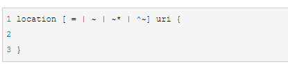
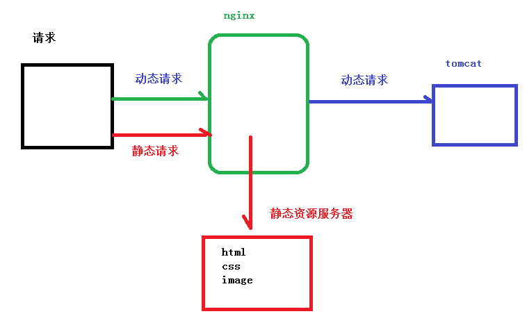

# nginx

http://nginx.org/en/docs/http/ngx_http_proxy_module.html#example

1、 nginx 简介

（1）  什么是 nginx 和可以做什么事情

（2）  正向代理

（3）  反向代理

（4）  动静分离

 

2、 Nginx 的安装

（1） 在 linux 系统中安装 nginx 3、 Nginx 的常用命令和配置文件

4、 Nginx 配置实例 1 反向代理

 

5、 Nginx 配置实例 2 负载均衡

 

6、 Nginx 配置实例 3 动静分离

7、 Nginx 的高可用集群

**（1）**   **nginx** **配置主从模式**

**（2）**   **nginx** **配置双主模式**

# **Nginx 的简介**

### 什么是 **nginx**

Nginx 是高性能的 HTTP 和反向代理的服务器，处理高并发能力是十分强大的，能经受高负载的考验,有报告表明能支持高达 50,000 个并发连接数。

### 2、正向代理

Nginx
不仅可以做反向代理，实现负载均衡。还能用作正向代理来进行上网等功能。
正向代理：如果把局域网外的
Internet 想象成一个巨大的资源库，则局域网中的客户端要访
问 Internet ，则需要通过代理服务器来访问，这种代理服务就称为正向代理。

**需要在==客户端配置代理服务器==进行指定网站访问**

 

### 3、反向代理

**暴露的是代理服务器地址，隐藏了真实服务器** **IP** **地址。**

**代理服务器**

反向代理，其实客户端对代理是无感知的，因为**客户端不需要任何配置就可以访问，我们只**
**需要将请求发送到反向代理服务器**，由反向代理服务器去选择目标服务器获取数据后，在返
回给客户端，此时反向代理服务器和目标服务器对外就是一个服务器，暴露的是代理服务器
地址，隐藏了真实服务器 IP 地址。


 

### 4、负载均衡

增加服务器的数量，然后将请求分发到各个服务器上，将原先请求集中到单个服务器上的情况改为将请求分发到**多个服务器上**，将负载分发到不同的服务器，也就是我们所说的**负载均衡**


### 5、动静分离

为了加快网站的解析速度，可以把动态页面和静态页面由不同的服务器来解析，加快解析速
度。降低原来单个服务器的压力。


# Nginx 的安装

[Nginx 安装配置|菜鸟教程](https://www.runoob.com/linux/nginx-install-setup.html)

进入 nginx 官网，下载

http://nginx.org/

## 1.安装 pcre

一般放在 `/usr/src`中

```shell
wget http://downloads.sourceforge.net/project/pcre/pcre/8.37/pcre
8.37.tar.gz
```

第二步 解压压缩文件
使用命令 

```shell
 tar -xvf pcre-8.37.tar.gz 
```

3、进入安装包目录

```
[root@bogon src]# cd pcre-8.35
```

4、编译安装 

```
[root@bogon pcre-8.35]# ./configure
[root@bogon pcre-8.35]# make && make install
```

5、查看pcre版本

```
[root@bogon pcre-8.35]# pcre-config --version
```

2 ）安装 openssl 、 zlib 、 gcc 依赖

centos

```
yum -y install make zlib zlib devel gcc c++ libtool openssl openssl devel
```

3 ）安装 nginx
* 使用命令解压

```
tar -xvf nginx-1.12.2.tar.gz 
```


```shell
./configure
make && make install
```


进入目录 /usr/local/nginx/sbin/nginx 启动服务

```shell
cd /usr/local/nginx/sbin/
./nginx
```

nginx默认监听80端口，直接在浏览器中访问ip地址即可

```
server {
    listen       80;
    ...
}
```

在 window s 系统中访问 linu x 中 nginx ，默认不能访问的，因为防火墙问题

1 ）关闭防火墙

2 ）开放访问的端口号 80 端口

查看开放的端口号

firewall cmd list all

设置开放的端口号

firewall cmd add service=http permanent
firewall cmd add port=80/tcp permanent

重启防火墙

firewall cmd reload

# Nginx 的常用的命令

```shell
export LD_LIBRARY_PATH=/usr/local/lib:$LD_LIBRARY_PATH
```

首先要进入nginx 目录中 

```
cd  /usr/local/nginx/sbin 
```

注意 自己安装的 为 ./nginx

| 命令            | 描述                            |
| --------------- | ------------------------------- |
| nginx -h        | 查看Nginx的帮助                 |
| nginx -v        | 查看Nginx的版本                 |
| nginx -t        | 测试Nginx的配置                 |
| nginx -T        | 测试Nginx的配置，并打印配置信息 |
| nginx           | 启动nginx                       |
| nginx -s reload | 重新加载配置文件，平滑启动nginx |
| nginx -s stop   | 停止nginx的命令                 |

#  Nginx 的配置文件

## nginx 配置文件位置

用apt-get或者yum安装都是/etc,与源码安装的`/usr/local/nginx/conf/nginx.conf`不一样

## 配置文件中的内容 

包含三部分内容 

### 1.全局块：

从配置文件开始到 events 块之间的内容，**主要会设置一些影响nginx 服务器整体运行的配置指令**，主要包括配置运行 Nginx 服务器的用户（组）、允许生成的 worker process 数，进程 PID 存放路径、日志存放路径和类型以及配置文件的引入等。

比如worker_processes  1;处理并发数的配置

### 2.events 块

events 块涉及的指令**主要影响 Nginx 服务器与用户的网络连接**，常用的设置包括是否开启对多 work process 下的网络连接进行序列化，是否允许同时接收多个网络连接，选取哪种事件驱动模型来处理连接请求，每个 word process 可以同时支持的最大连接数等。

比如worker_connections  1024; 支持的最大连接数为 1024

这部分的配置对 Nginx 的性能影响较大，在实际中应该灵活配置。

## 3.http 块

还包含两部分：
http 全局块
server 块

这算是 Nginx 服务器配置中最频繁的部分，代理、缓存和日志定义等绝大多数功能和第三方模块的配置都在这里。 

需要注意的是：http 块也可以包括 http全局块、server 块。

### http 全局块

http全局块配置的指令包括文件引入、MIME-TYPE 定义、日志自定义、连接超时时间、单链接请求数上限等。

### server 块

这块和虚拟主机有密切关系，虚拟主机从用户角度看，和一台独立的硬件主机是完全一样的，该技术的产生是为了节省互联网服务器硬件成本。 每个 http 块可以包括多个 server 块，而每个 server 块就相当于一个虚拟主机。 而每个 server 块也分为全局 server 块，以及可以同时包含多个 locaton 块。 

1、全局 server 块 最常见的配置是本虚拟机主机的监听配置和本虚拟主机的名称或IP配置。 

2、location 块 一个 server 块可以配置多个 location 块。 这块的主要作用是基于 Nginx 服务器接收到的请求字符串（例如 server_name/uri-string），对虚拟主机名称（也可以是IP别名）之外的字符串（例如 前面的 /uri-string）进行匹配，对特定的请求进行处理。地址定向、数据缓存和应答控制等功能，还有许多第三方模块的配置也在这里进行。

## 具体事例

```
server {   
        listen 8080;   
        root /data/up1;   
       location / {   
        }
}
```

**root 指令放在 server 上下文中**。当响应请求的 location 区块中，没有自己的 root 指令，上述的 root 指令才会被使用。

# 反向代理

## nginx 配置实例 反向代理1

**代理端口  ip:80 -> localhost:8080**

1、实现效果

（1）打开浏览器，在浏览器地址栏输入地址 www.123.com，跳转到liunx 系统tomcat 主页

面中 

2.准备工作

1）在liunx 系统安装tomcat，使用默认端口8080

- tomcat 安装文件放到liunx 系统中，解压
- 进入tomcat 的bin 目录中，./startup.sh 启动tomcat 服务器

（2）对外开放访问的端口

3）在windows 系统中通过浏览器访问tomcat 服务器

3、访问过程的分析


4、具体配置 

第一步 在windows 系统的host 文件进行域名和ip 对应关系的配置 

`C:\Windows\System32\drivers\etc`目录下的`hosts`文件文末添加一行

```
106.54.94.80 www.123.com
```

第二步 在nginx 进行请求转发的配置（反向代理配置） 

在server组中的location中添加一行

```
proxy_pass   http://127.0.0.1:8080;
```

```
server {
    location / {
        root   html;
        proxy_pass   http://127.0.0.1:8080;
        index  index.html index.htm;
    }
	...
}
```


## Nginx 配置实例-反向代理实例 2

实现效果：

使用 nginx 反向代理， 根据访问的路径跳转到不同端口的服务中

nginx 监听端口为 80

访问 http://127.0.0.1/edu/ 直接跳转到 127.0.0.1:8080

访问 http://127.0.0.1/vod/ 直接跳转到 127.0.0.1:8081

2 、准备工作

1 ）准备两个 tomcat 服务器，一个 8080 端口，一个 8081 端口

2 ）创建文件夹和测试页面

**放在webapps目录下即可**

3 、具体配置

1 ）找到 nginx 配置文件，进行反向代理配置

2 ）开放对外访问的端口号 9001 8080 8081

```
 server {
        listen       80;
        server_name  localhost;

         location ~ /edu/ {
             proxy_pass http://127.0.0.1:8080;
         }
         location ~ /vod/ {
             proxy_pass http://127.0.0.1:8081;
         }
}
```

## location 指令说明

该指令用于匹配 URL。

 语法如下：



1、= ：用于不含正则表达式的 uri 前，要求请求字符串与 uri 严格匹配，如果匹配成功，就停止继续向下搜索并立即处理该请求。 

2、~：用于表示 uri 包含正则表达式，并且区分大小写。 

3、~*：用于表示 uri 包含正则表达式，并且不区分大小写。 

4、^~：**用于不含正则表达式的 uri 前**，要求 Nginx 服务器找到标识 uri 和请求字符串匹配度最高的 location 后，立即使用此 location 处理请求，而不再使用 location 块中的正则 uri 和请求字符串做匹配。 注意：如果 uri 包含正则表达式，则必须要有 ~ 或者 ~* 标识。


# Nginx 配置实例-负载均衡

1 、实现效果

1 ）浏览器地址栏输入地址 http://192.168. 17.129/edu/a.html ，负载均衡效果，平均 8080
和 8081 端口中

2 、准备工作

1 ）准备两台 tomcat 服务器，一台 8080 ，一台 8081

2 ）在两台 tomcat 里面 webapps 目录中，创建名称是 edu 文件夹，在 edu 文件夹中创建
页面 a.html ，用于测试

3 、在 nginx 的配置文件中进行负载均衡的配置

```json
upstream myserver{
        server localhost:8080;
        server localhost:8081;
    }   
    server {
        listen       80;
        server_name  localhost;

        #charset koi8-r;

        #access_log  logs/host.access.log  main;

        location / {
            proxy_pass http://myserver;
            root   html;
            index  index.html index.htm;
        }

	}
```

# 负载均衡

随着互联网信息的爆炸性增长，负载均衡（
load balance ）已经不再是一个很陌生的话题
**顾名思义，负载均衡即是将负载分摊到不同的服务单元，既保证服务的可用性，又保证响应**
**足够快**，给用户很好的体验。快速增长的访问量和数据流量催生了各式各样的负载均衡产品，
很多专业的负载均衡硬件提供了很好的功能，但却价格不菲，这使得负载均衡软件大受欢迎，
nginx 就是其中的一个，在 linux 下有 Nginx 、 LVS 、 Haproxy 等等服务可以提供负载均衡服
务，而且 Nginx 提供了几种分配方式 策略

1、轮询（默认）
每个请求按时间顺序逐一分配到不同的后端服务器，如果后端服务器down掉，能自动剔除。

2、weight
weight
代表权 重默认为 1, 权重越高被分配的客户端越多

指定轮询几率，weight和访问比率成正比，用于后端服务器性能不均的情况。 例如：

```
upstream server_pool{ 
    server 192.168.5.21 weight=10; 
    server 192.168.5.22 weight=10; 
}
```

3、ip_hash

每个请求按访问ip的hash结果分配，这样每个访客固定访问一个后端服务器，可以解决session的问题。 例如：

```
 upstream server_pool{ 
     ip_hash; 
     server 192.168.5.21:80; 
     server 192.168.5.22:80; 
 }
```

4、fair（第三方）

按后端服务器的响应时间来分配请求，响应时间短的优先分配。 

```
upstream server_pool{ 
    server 192.168.5.21:80; 
    server 192.168.5.22:80; fair; 
}
```

# Nginx 配置实例-动静分离

1 、什么是动静分离



Nginx 动静分离简单来说就是把动态跟静态请求分开，不能理解成只是单纯的把动态页面和静态页面物理分离。严格意义上说应该是动态请求跟静态请求分开，可以理解成使用Nginx 处理静态页面，Tomcat处理动态页面。动静分离从目前实现角度来讲大致分为两种， 一种是纯粹把静态文件独立成单独的域名，放在独立的服务器上，也是目前主流推崇的方案； 另外一种方法就是动态跟静态文件混合在一起发布，通过 nginx 来分开。 

通过 location 指定不同的后缀名实现不同的请求转发。通过 expires 参数设置，可以使浏览器缓存过期时间，减少与服务器之前的请求和流量。具体 Expires 定义：是给一个资源设定一个过期时间，也就是说无需去服务端验证，直接通过浏览器自身确认是否过期即可，所以不会产生额外的流量。此种方法非常适合不经常变动的资源。（如果经常更新的文件，不建议使用 Expires 来缓存），我这里设置 3d，表示在这 3 天之内访问这个 URL，发送一个请求，比对服务器该文件最后更新时间没有变化，则不会从服务器抓取，返回状态码 304，如果有修改，则直接从服务器重新下载，返回状态码 200。

2 、准备工作

1 ）在 liunx 系统中准备静态资源，用于进行访问

**在根目录创建data文件件**

3 、具体配置

1 ）在 nginx 配置文件中进行配置

```
location /www/ {
    root   /data/;
    index  index.html index.htm;
}

location /image/ {
    root   /data/;
    autoindex on;
}
```

# Nginx 配置高可用的集群
<!-- skip -->

https://www.bilibili.com/video/av68136734?p=14


# my

[ngx_http_proxy_module](http://nginx.org/en/docs/http/ngx_http_proxy_module.html)

## cros

https://blog.csdn.net/envon123/article/details/83270277

在相应后端服务url中（location）添加

```json
	add_header 'Access-Control-Allow-Origin' $http_origin;
	add_header 'Access-Control-Allow-Credentials' 'true';
	add_header 'Access-Control-Allow-Methods' 'GET, POST, OPTIONS';
	add_header 'Access-Control-Allow-Headers' 'DNT,web-token,app-token,Authorization,Accept,Origin,Keep-Alive,User-Agent,X-Mx-ReqToken,X-Data-Type,X-Auth-Token,X-Requested-With,If-Modified-Since,Cache-Control,Content-Type,Range';
	add_header 'Access-Control-Expose-Headers' 'Content-Length,Content-Range';
	if ($request_method = 'OPTIONS') {
		add_header 'Access-Control-Max-Age' 1728000;
		add_header 'Content-Type' 'text/plain; charset=utf-8';
		add_header 'Content-Length' 0;
		return 204;
	}
```


## vue

修改配置文件主要做两件事：

1. 把Nginx服务器的默认路径改成我们项目所在的路径。
2. 如果你的vue工程用的路由是history模式，需要将客户端发来的url重定向到默认的index.html，才能正常访问。否则只能看到主页。刷新或点击其他页面都会404。
    在配置文件中的server里如下修改。

```bash
location / {
  root /home/CRExpress/www;
  try_files $uri $uri/ /index.html last;
  index index.html;
}
```

root后面的地址是项目上传的路径。try_files是添加到index的映射。

```
location / {
    root   /home/ubuntu/static;
    proxy_pass   http://127.0.0.1:8080;
    try_files $uri $uri/ /index.html last;
    index  index.html index.htm;
}
```

## 部署前后端分离项目

https://segmentfault.com/a/1190000014972747

在前后端分离端项目里，前端的代码会被打包成为纯静态文件。使用 Nginx的目的就是让静态文件运行起服务，由于后端的接口也是分离的，直接请求可能会产生跨域问题，此时就需要Nginx转发代理后端接口。

### **Nginx配置如下**

```
# For more information on configuration, see:
#   * Official English Documentation: http://nginx.org/en/docs/
#   * Official Russian Documentation: http://nginx.org/ru/docs/

user nginx;
worker_processes auto; #启动进程
error_log /var/log/nginx/error.log; #全局错误日志
pid /run/nginx.pid; #PID文件

# Load dynamic modules. See /usr/share/nginx/README.dynamic.
include /usr/share/nginx/modules/*.conf;

events {
    worker_connections 1024; #单个后台worker process进程的最大并发链接数 
}

http {
    gzip on; #开启gzip压缩
    gzip_min_length 1k; #设置对数据启用压缩的最少字节数
    gzip_buffers    4 16k;
    gzip_http_version 1.0;
    gzip_comp_level 6; #设置数据的压缩等级,等级为1-9，压缩比从小到大
    gzip_types text/plain text/css text/javascript application/json application/javascript application/x-javascript application/xml; #设置需要压缩的数据格式
    gzip_vary on;

    #虚拟主机配置
    server {
        listen       80;
        server_name  mark.binlive.cn;
        root /home/spa-project/dist; #定义服务器的默认网站根目录位置
        index index.html; #定义index页面
        error_page    404         /index.html; #将404错误页面重定向到index.html可以解决history模式访问不到页面问题
        location ^~ /api/{
            proxy_pass http://127.0.0.1:7000;
            proxy_send_timeout 1800;
            proxy_read_timeout 1800;
            proxy_connect_timeout 1800;
            client_max_body_size 2048m;
            proxy_http_version 1.1;  
            proxy_set_header Upgrade $http_upgrade;  
            proxy_set_header Connection "Upgrade"; 
            proxy_set_header  Host              $http_host;   # required for docker client's sake
            proxy_set_header  X-Real-IP         $remote_addr; # pass on real client's IP
            proxy_set_header  X-Forwarded-For   $proxy_add_x_forwarded_for;
            proxy_set_header  X-Forwarded-Proto $scheme;
        }
        location ^~ /auth/{
            proxy_pass http://127.0.0.1:7000;
            proxy_send_timeout 1800;
            proxy_read_timeout 1800;
            proxy_connect_timeout 1800;
            client_max_body_size 2048m;
            proxy_http_version 1.1;  
            proxy_set_header Upgrade $http_upgrade;  
            proxy_set_header Connection "Upgrade"; 
            proxy_set_header  Host              $http_host;   # required for docker client's sake
            proxy_set_header  X-Real-IP         $remote_addr; # pass on real client's IP
            proxy_set_header  X-Forwarded-For   $proxy_add_x_forwarded_for;
            proxy_set_header  X-Forwarded-Proto $scheme;
        }
    }    
}
```

- 将前端代码打包后的`dist`文件放入指定服务目录
- 将服务目录指定到`spa-project/dist`目录下即可代理静态服务
- 配置里开启了gzip压缩，可以很大程度上减小文件体积大小
- 将404错误页面重定向到index.html，可以解决前端history路由模式由于刷新页面访问不到服务出现404的问题
- `location`为代理接口，可以转发代理后端的请求接口域名或者ip，即可解决接口跨域问题


> 
>
> **Nginx 配置高可用的集群**


> 2、配置高可用的准备工作
>
> （1）需要两台服务器 192.168.17.129 和 192.168.17.131

2.  **在两台服务器安装 nginx**

3.  **在两台服务器安装 keepalived**

> 3、在两台服务器安装 keepalived

1.  **使用 yum 命令进行安装**

> yum install keepalived –y

1.  **安装之后，在 etc 里面生成目录 keepalived，有文件 keepalived.conf**

> 4、完成高可用配置（主从配置）
>
> （1）修改/etc/keepalived/keepalivec.conf 配置文件
>
> global\_defs { notification\_email {
>
> <acassen@firewall.loc> <failover@firewall.loc> <sysadmin@firewall.loc>
>
> }
>
> notification\_email\_fr[om Alexandre.Cassen@firewall.loc](mailto:Alexandre.Cassen@firewall.loc) smtp\_server 192.168.17.129
>
> smtp\_connect\_timeout 30 router\_id LVS\_DEVEL
>
> }
>
> vrrp\_script chk\_http\_port {
>
> script "/usr/local/src/nginx\_check.sh"
>
> interval 2 \#（检测脚本执行的间隔）
>
> weight 2
>
> }
>
> vrrp\_instance VI\_1 {
>
> state BACKUP \# 备份服务器上将 MASTER 改为 BACKUP interface ens33 //网卡
>
> virtual\_router\_id 51 \# 主、备机的 virtual\_router\_id 必须相同
>
> priority 90 \# 主、备机取不同的优先级，主机值较大，备份机值较小
>
> advert\_int 1
>
> 
>
> 
>
> **Nginx 的原理**


> 2、worker 如何进行工作的
>
> 3、一个 master 和多个 woker 有好处

1.  **可以使用 nginx –s reload 热部署，利用 nginx 进行热部署操作**

2.  **每个 woker 是独立的进程，如果有其中的一个woker 出现问题，其他 woker 独立的， 继续进行争抢，实现请求过程，不会造成服务中断**

> 4、设置多少个 woker 合适

## 安装ssl证书

[腾讯云安装教程](https://cloud.tencent.com/document/product/400/4143)

记得开放相应的端口

```
server {
        listen       443 ssl;
        server_name  www.yestojudge.cn;
	#启用 SSL 功能
	#  ssl on; deprecated
	#证书文件名称
	ssl_certificate 1_www.yestojudge.cn_bundle.crt; 
	#私钥文件名称
	ssl_certificate_key 2_www.yestojudge.cn.key; 
	ssl_session_timeout 5m;
 	#请按照以下协议配置
	ssl_protocols TLSv1 TLSv1.1 TLSv1.2; 
	 #请按照以下套件配置，配置加密套件，写法遵循 openssl 标准。
	ssl_ciphers ECDHE-RSA-AES128-GCM-SHA256:HIGH:!aNULL:!MD5:!RC4:!DHE; 
	ssl_prefer_server_ciphers on;
	root /home/ubuntu/static;
	location ^~ /api/{
	    proxy_pass http://127.0.0.1:8080;
	}
        #charset koi8-r;

        #access_log  logs/host.access.log  main;

        location / {
            root   /home/ubuntu/static/;
	    proxy_pass   http://127.0.0.1:8080;
	    try_files $uri $uri/ /index.html last;
            index  index.html index.htm;
        }


        #error_page  404              /404.html;

        # redirect server error pages to the static page /50x.html
        #
        error_page   500 502 503 504  /50x.html;
        location = /50x.html {
            root   html;
        }

        # proxy the PHP scripts to Apache listening on 127.0.0.1:80
        #
        #location ~ \.php$ {
        #    proxy_pass   http://127.0.0.1;
        #}

        # pass the PHP scripts to FastCGI server listening on 127.0.0.1:9000
        #
        #location ~ \.php$ {
        #    root           html;
        #    fastcgi_pass   127.0.0.1:9000;
        #    fastcgi_index  index.php;
        #    fastcgi_param  SCRIPT_FILENAME  /scripts$fastcgi_script_name;
        #    include        fastcgi_params;
        #}

        # deny access to .htaccess files, if Apache's document root
        # concurs with nginx's one
        #
        #location ~ /\.ht {
        #    deny  all;
        #}
    }
    server {
	listen 80;
	#填写绑定证书的域名
	server_name www.yestojudge.cn; 
	#把http的域名请求转成https
	rewrite ^(.*)$ https://www.yestojudge.cn:443$1 permanent; 
    }
```

# 开启gzip

https://blog.csdn.net/huangbaokang/article/details/79931429

### 加入gzip配置

在nginx.conf文件的http模块中加入gzip的配置

```json
[root@localhost html]# cat ../conf/nginx.conf

user root;
worker_processes  4;
worker_rlimit_nofile 65535;

events {
    worker_connections  65535;
}


http {
    include       mime.types;
    default_type  application/octet-stream;
    sendfile        on;
    keepalive_timeout  65;

    gzip  on;   #开启gzip
    gzip_min_length 1k; #低于1kb的资源不压缩
    gzip_comp_level 3; #压缩级别【1-9】，越大压缩率越高，同时消耗cpu资源也越多，建议设置在4左右。
    gzip_types text/plain application/javascript application/x-javascript text/javascript text/xml text/css;  #需要压缩哪些响应类型的资源，多个空格隔开。不建议压缩图片，下面会讲为什么。
    gzip_disable "MSIE [1-6]\.";  #配置禁用gzip条件，支持正则。此处表示ie6及以下不启用gzip（因为ie低版本不支持）
    gzip_vary on;  #是否添加“Vary: Accept-Encoding”响应头

    server {
        listen       80;
        server_name  localhost;
        location / {
            root   html;
            index  index.html index.htm;
        }
        error_page   500 502 503 504  /50x.html;
        location = /50x.html {
            root   html;
        }
    }

}
```

可以看到相应头带上了Content-Encoding:gzip标识，说明gzip压缩起效果了。

gzip虽然好用，但是一下类型的资源不建议启用。

1、图片类型

原因：图片如jpg、png本身就会有压缩，所以就算开启gzip后，压缩前和压缩后大小没有多大区别，所以开启了反而会白白的浪费资源。（Tips：可以试试将一张jpg图片压缩为zip，观察大小并没有多大的变化。虽然zip和gzip算法不一样，但是可以看出压缩图片的价值并不大）

2、大文件

原因：会消耗大量的cpu资源，且不一定有明显的效果。


显著减少,vue只是支持gzip,开启需要服务器进行

# windows

https://blog.csdn.net/u010648555/article/details/79418779

为了方便本地的开发和验证，于是Windows上安装Nginx

注意不要直接双击nginx.exe，这样会导致修改配置后重启、停止nginx无效，需要手动关闭任务管理器内的所有nginx进程。[参考博文1]
在nginx.exe目录，打开命令行工具，用命令 启动

1.进入解压的目标,我的 E:\nginx-1.13.9
2.执行启动命令 ，有一个一闪而过的效果！

```shell
start nginx.exe
```

六 简单的一些启动、关闭服务命令介绍

在nginx.exe目录，打开命令行工具，用命令 启动/关闭/重启nginx

| command     | name |
| ----------- | ---- |
| start nginx | 启动 |
|             |      |
|             |      |

:

关闭nginx：

nginx -s quit ：完整有序的停止nginx

名称	命令
启动nginx	start nginx
修改配置后重新加载生效	nginx -s reload
重新打开日志文件	nginx -s reopen
测试nginx配置文件是否正确	nnginx -t -c nginx.conf
关闭nginx ：快速停止nginx	nginx -s stop
完整有序的停止nginx	nginx -s quit


