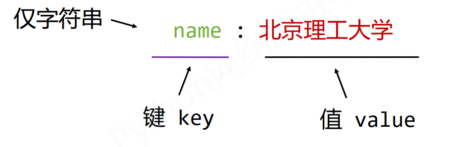
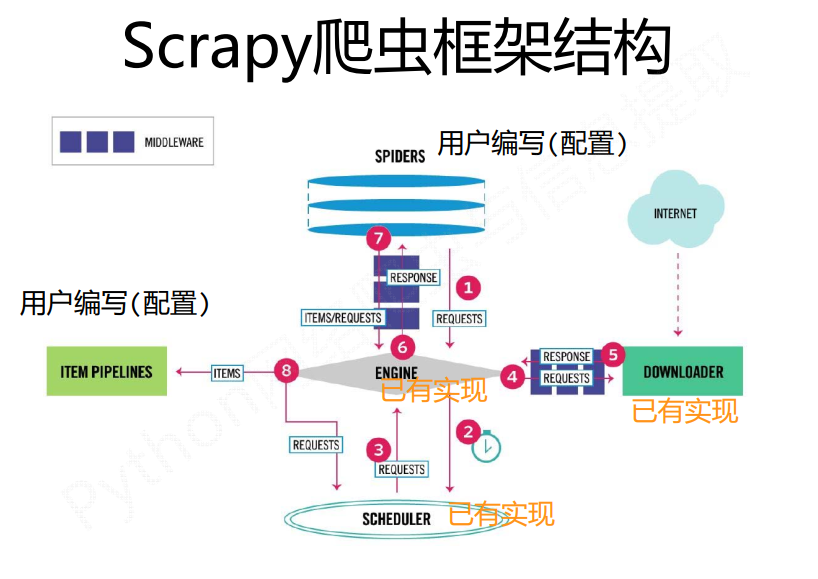

  

# requests库  

## requests库的安装  

http://www.python-requests.org   

Win平台: “以管理员身份运行” cmd，执行 pip install requests   

  

## requests库的7个主要方法  

| 方法                                               | 说明                                           |
| -------------------------------------------------- | ---------------------------------------------- |
| requests.request()                                 | **构造一个请求，支撑以下各方法的基础方法**     |
| requests.get(url, params=None, **kwargs)           | 获取HTML网页的主要方法，对应于HTTP的GET        |
| requests.head(url, **kwargs)                       | 获取HTML网页头信息的方法，对应于HTTP的HEAD     |
| requests.post(url, data=None, json=None, **kwargs) | 向HTML网页提交POST请求的方法，对应于HTTP的POST |
| requests.put(url, data=None, **kwargs)             | 向HTML网页提交PUT请求的方法，对应于HTTP的PUT   |
| requests.patch(url, data=None, **kwargs)           | 向HTML网页提交局部修改请求，对应于HTTP的PATCH  |
| requests.delete(url, **kwargs)                     | 向HTML页面提交删除请求，对应于HTTP的DELETE     |

**requests库的get方法：**  

  

**requests.get(url, params=None, kwargs)**  
∙ url : 拟获取页面的url链接  
∙ params : url中的额外参数，字典或字节流格式，可选  
∙ kwargs: 12个控制访问的参数   

```python  
def get(url, params=None, **kwargs):  
    r"""Sends a GET request.  
  
    :param url: URL for the new :class:`Request` object.  
    :param params: (optional) Dictionary or bytes to be sent in the query string for the :class:`Request`.  
    :param \*\*kwargs: Optional arguments that ``request`` takes.  
    :return: :class:`Response <Response>` object  
    :rtype: requests.Response  
    """  
  
    kwargs.setdefault('allow_redirects', True)  
    return request('get', url, params=params, **kwargs)  
```

### 主要方法解析  

**requests.request(method, url, kwargs)**  
∙ method : 请求方式，对应get/put/post等7种  
∙ url : 拟获取页面的url链接  
∙ kwargs: 控制访问的参数，共13个   

**method : 请求方式**  

```python  
r = requests.request('GET', url, **kwargs)  
r = requests.request('HEAD', url, **kwargs)  
r = requests.request('POST', url, **kwargs)  
r = requests.request('PUT', url, **kwargs)  
r = requests.request('PATCH', url, **kwargs)  
r = requests.request('delete', url, **kwargs)  
r = requests.request('OPTIONS', url, **kwargs)  
```

**\**kwargs: 控制访问的参数，均为可选项**  
params : 字典或字节序列，作为参数增加到url中  
data : 字典、字节序列或文件对象，作为Request的内容   

| json | : JSON格式的数据，作为Request的内容 |
| ---- | ----------------------------------- |
|      |                                     |

headers : 字典， HTTP定制头   

| cookies : 字典或CookieJar， Request中的cookie |                          |
| --------------------------------------------- | ------------------------ |
| auth                                          | : 元组，支持HTTP认证功能 |

files : 字典类型，传输文件   

timeout : 设定超时时间，秒为单位   

proxies : 字典类型，设定访问代理服务器，可以增加登录认证   

allow_redirects : True/False，默认为True，重定向开关  
stream : True/False，默认为True，获取内容立即下载开关  
verify : True/False，默认为True，认证SSL证书开关  
cert : 本地SSL证书路径   

  

## Response对象  

Response对象包含服务器返回的所有信息，**也包含请求的Request信息**   

**Response 对象的属性**  

| 属性                | 说明                                               |
| ------------------- | -------------------------------------------------- |
| r.status_code       | HTTP请求的返回状态， 200表示连接成功， 404表示失败 |
| r.text              | HTTP响应内容的字符串形式，即， url对应的页面内容   |
| r.encoding          | 从HTTP header中猜测的响应内容编码方式              |
| r.apparent_encoding | 从内容中分析出的响应内容编码方式（备选编码方式）   |
| r.content           | HTTP响应内容的二进制形式                           |

**Response的编码**  

| r.encoding              | 从HTTP header中猜测的响应内容编码方式                |
| ----------------------- | ---------------------------------------------------- |
| **r.apparent_encoding** | **从内容中分析出的响应内容编码方式（备选编码方式）** |

r.encoding：如果header中不存在charset，则认为编码为ISO‐8859‐1  
r.text根据r.encoding显示网页内容   
r.apparent_encoding ：根据网页内容分析出的编码方式  
可以看作是r.encoding的备选   

  

  

## request库的异常  

| 异常                      | 说明                                         |
| ------------------------- | -------------------------------------------- |
| requests.ConnectionError  | 网络连接错误异常，如DNS查询失败、拒绝连接等  |
| requests.HTTPError        | HTTP错误异常                                 |
| requests.URLRequired      | URL缺失异常                                  |
| requests.TooManyRedirects | 超过最大重定向次数，产生重定向异常           |
| requests.ConnectTimeout   | 连接远程服务器超时异常                       |
| requests.Timeout          | 请求URL超时，产生超时异常                    |
| **r.raise_for_status()**  | **如果不是200，产生异常 requests.HTTPError** |

**r.raise_for_status()在方法内部判断r.status_code是否等于200**，不需要  
增加额外的if语句，该语句便于利用try‐except进行异常处理   

## 爬取网页通用的代码(块)框架  

```python  
import requests  
  
def getHTMLText(url):  
    try:  
        r = requests.get(url)  
        r.raise_for_status()  
        r.encoding = r.apparent_encoding  
        return r.text  
    except:  
        return 'processing exception'  
  
if __name__ == "__main__":  
    url = 'https://www.baidu.com/'  
    print(getHTMLText(url))  
  
response = requests.get('https://www.baidu.com/')  
print(type(response))  
```

  

## HTTP协议  
HTTP， Hypertext Transfer Protocol，超文本传输协议  
HTTP是一个基于“请求与响应”模式的、无状态的应用层协议  
HTTP协议采用URL作为定位网络资源的标识， URL格式如下：  
`http://host[:port][path]`  
host: 合法的Internet主机域名或IP地址  
port: 端口号，缺省端口为80  
path: 请求资源的路径   

HTTP URL的理解：  
URL是通过HTTP协议存取资源的Internet路径，**一个URL对应一个数据资源**   

### http协议对资源的操作  

| 方法   | 说明                                                      |
| ------ | --------------------------------------------------------- |
| GET    | 请求获取URL位置的资源                                     |
| HEAD   | 请求获取URL位置资源的响应消息报告，即获得该资源的头部信息 |
| POST   | 请求向URL位置的资源后附加新的数据                         |
| PUT    | 请求向URL位置存储一个资源，覆盖原URL位置的资源            |
| PATCH  | 请求局部更新URL位置的资源，即改变该处资源的部分内容       |
| DELETE | 请求删除URL位置存储的资源                                 |

### 理解patch和put的区别  

假设URL位置有一组数据UserInfo，包括UserID、 UserName等20个字段  
需求：用户修改了UserName，其他不变  
• 采用PATCH，仅向URL提交UserName的局部更新请求  
• 采用PUT，必须将所有20个字段一并提交到URL，未提交字段被删除  
PATCH的最主要好处：节省网络带宽   

### http协议与requests库  

| TTP协议方法 | Requests库方法    | 功能一致性 |
| ----------- | ----------------- | ---------- |
| GET         | requests.get()    | 一致       |
| HEAD        | requests.head()   | 一致       |
| POST        | requests.post()   | 一致       |
| PUT         | requests.put()    | 一致       |
| PATCH       | requests.patch()  | 一致       |
| DELETE      | requests.delete() | 一致       |

## Requests库网络爬取实战  

实例2：亚马逊商品页面的爬取  

```python  
import requests  
url = 'https://item.jd.com/2967929.html'  
kv = {'user-agent':'Mozilla/5.0'}  
try:  
    r = requests.get(url,headers=kv)  
    r.raise_for_status()  
    r.encoding = r.apparent_encoding  
    print(r.status_code)  
except:  
    'processing exception'  
```

实例3：百度/360搜索关键字提交  

百度的关键词接口：  
http://www.baidu.com/s?wd=keyword   

```python  
# https://item.jd.com/2967929.html  
import requests  
url = 'http://www.baidu.com/s'  
kv = {'wd':'python'}  
try:  
    r = requests.get(url,params=kv)  
    r.raise_for_status()  
    r.encoding = r.apparent_encoding  
    print(len(r.text))  
    print(r.status_code)  
except:  
    'processing exception'  
```

实例4：网络图片的爬取和存储  

```python  
import requests,os  
url = 'http://image.nationalgeographic.com.cn/2017/0211/20170211061910157.jpg'  
root = 'E://img//'  
path = root + url.split('/')[-1]  
try:  
    if not os.path.exists(root):  
        os.mkdir(root)  
    if not os.path.exists(path):  
        r = requests.get(url)  
        r.raise_for_status()  
        with open(path,'wb') as f:  
            f.write(r.content)  
            f.close()  
            print('save file successfully')  
    else:  
        print('file exist')  
except:  
    'processing exception'  
```

  

# 网络爬虫的相关问题  

  

## 网络爬虫的限制  

来源审查：判断User‐Agent进行限制  
检查来访HTTP协议头的User‐Agent域，只响应浏览器或友好爬虫的访问  
• 发布公告： Robots协议  
告知所有爬虫网站的爬取策略，要求爬虫遵守   

##  Robots协议  

Robots Exclusion Standard，网络爬虫排除标准   

作用：  
网站告知网络爬虫哪些页面可以抓取，哪些不行  
形式：  
在网站根目录下的robots.txt文件   

  

http://www.baidu.com/robots.txt  
http://news.sina.com.cn/robots.txt  
http://www.qq.com/robots.txt  
http://news.qq.com/robots.txt  
http://www.moe.edu.cn/robots.txt （无robots协议）   

### Robots协议使用  

网络爬虫：  
自动或人工识别robots.txt，再进行内容爬取  
约束性：  
Robots协议是建议但非约束性，网络爬虫可以不遵守，但存在法律风险   

  

# beautifulSoup库  

https://www.crummy.com/software/BeautifulSoup/   

https://beautifulsoup.readthedocs.io/zh_CN/v4.4.0/  

[Beautiful Soup](http://www.crummy.com/software/BeautifulSoup/) 是一个可以从**HTML或XML文件中提取数据**的Python库.  

安装  

```python  
pip install beautifulsoup4   
```

使用  

```python  
from bs4 import BeautifulSoup  
html_doc = """  
<html><head><title>The Dormouse's story</title></head>  
<body>  
<p class="title"><b>The Dormouse's story</b></p>  
  
<p class="story">Once upon a time there were three little sisters; and their names were  
<a href="http://example.com/elsie" class="sister" id="link1">Elsie</a>,  
<a href="http://example.com/lacie" class="sister" id="link2">Lacie</a> and  
<a href="http://example.com/tillie" class="sister" id="link3">Tillie</a>;  
and they lived at the bottom of a well.</p>  
  
<p class="story">...</p>  
"""  
soup = BeautifulSoup(html_doc, 'html.parser')  
print(soup.prettify())  
```

## Beautiful Soup库解析器  
```python  
soup = BeautifulSoup('<html>data</html>'， 'html.parser')  
```

| 解析器           | 使用方法                        | 条件                 |
| ---------------- | ------------------------------- | -------------------- |
| bs4的HTML解析器  | BeautifulSoup(mk,'html.parser') | 安装bs4库            |
| lxml的LXML解析器 | BeautifulSoup(mk,'lxml')        | pip install lxml     |
| lxml的XML解析器  | BeautifulSoup(mk,'xml')         | pip install lxml     |
| html5lib的解析器 | BeautifulSoup(mk,'html5lib')    | pip install html5lib |

BeautifulSoup类的基本元素  

```html  
<p class="title"> … </p>   
```

| 基本元素        | 说明                                                     |
| --------------- | -------------------------------------------------------- |
| Tag             | 标签，最基本的信息组织单元，分别用<>和</>标明开头和结尾  |
| Name            | 标签的名字， <p>…</p>的名字是'p'，格式： <tag>.name      |
| Attributes      | 标签的属性，字典形式组织，格式： <tag>.attrs             |
| NavigableString | 标签内非属性字符串， <>…</>中字符串，格式： <tag>.string |
| Comment         | 标签内字符串的注释部分，一种特殊的Comment类型            |

Tag 标签  

| 基本元素        | 说明                                                     |
| --------------- | -------------------------------------------------------- |
| Tag             | 标签，最基本的信息组织单元，分别用<>和</>标明开头和结尾  |
| Name            | 标签的名字， <p>…</p>的名字是'p'，格式： <tag>.name      |
| Attributes      | 标签的属性，字典形式组织，格式： <tag>.attrs             |
| NavigableString | 标签内非属性字符串， <>…</>中字符串，格式： <tag>.string |
| Comment         | 标签内字符串的注释部分，一种特殊的Comment类型            |

任何存在于HTML语法中的标签都可以用soup.\<tag>访问获得  
当HTML文档中存在多个相同\<tag>对应内容时， soup.\<tag>返回第一个   

## 基于bs4库的HTML内容遍历方法   

  

### 标签树的下行遍历  

| 属性         | 说明                                                    |
| ------------ | ------------------------------------------------------- |
| .contents    | 子节点的列表，将<tag>所有儿子节点存入列表               |
| .children    | 子节点的迭代类型，与.contents类似，用于循环遍历儿子节点 |
| .descendants | 子孙节点的迭代类型，包含所有子孙节点，用于循环遍历      |

**BeautifulSoup类型是标签树的根节点**  

标签树的下行遍历  

```python  
for child in soup.body.children:  
	print(child) 遍历儿子节点  
for child in soup.body.descendants:  
	print(child) 遍历子孙节点  
```

标签树的上行遍历  

| 属性     | 说明                                         |
| -------- | -------------------------------------------- |
| .parent  | 节点的父亲标签                               |
| .parents | 节点先辈标签的迭代类型，用于循环遍历先辈节点 |

标签树的上行遍历  

  

遍历所有先辈节点，包括soup本身，所以要区别判断   

### 标签树的平行遍历  

| 属性               | 说明                                                 |
| ------------------ | ---------------------------------------------------- |
| .next_sibling      | 返回按照HTML文本顺序的下一个平行节点标签             |
| .previous_sibling  | 返回按照HTML文本顺序的上一个平行节点标签             |
| .next_siblings     | 迭代类型，返回按照HTML文本顺序的后续所有平行节点标签 |
| .previous_siblings | 迭代类型，返回按照HTML文本顺序的前续所有平行节点标签 |

```python  
标签树的平行遍历  
for sibling in soup.a.next_sibling:  
print(sibling)  
for sibling in soup.a.previous_sibling:  
print(sibling)  
遍历后续节点  
遍历前续节点  
```

  

# 信息标记和提取方法  

## 信息标记  

标记后的信息可形成信息组织结构，增加了信息维度  
标记的结构与信息一样具有重要价值  
标记后的信息可用于通信、存储或展示  
标记后的信息更利于程序理解和运用   

## 信息标记的三种信息  

xml，json，yaml  

### html的信息标记  

HTML是WWW(World Wide Web)的信息组织方式   

HTML通过预定义的<>…</>标签形式组织不同类型的信息   

**xml**  

eXtensible Markup Language   

  

空元素的缩写形式   

```xml  
  
```

注释书写形式   

```xml  
<!‐‐ This is a comment, very useful ‐‐>  
```

**json**  

JavsScript Object Notation  
有类型的键值对 key:value   

yaml  

YAML Ain’t Markup Language  
无类型键值对 key:value   

  

```yaml  
缩进表达所属关系  
name :  
    newName : 北京理工大学  
    oldName : 延安自然科学院  
```

```yaml  
‐ 表达并列关系  
name :  
‐北京理工大学  
‐延安自然科学院  
```

```yaml  
| 表达整块数据 # 表示注释  
text: | #学校介绍  
北京理工大学创立于1940年，前身是延安自然科学院， 是中国共产党创办的第一所理工科大学，毛泽东同志亲  
自题写校名，李富春、徐特立、李强等老一辈无产阶级革命家先后担任学校主要领导。学校是新中国成立以来  
国家历批次重点建设的高校，首批进入国家“211工程”和“985工程”建设行列；在全球具有广泛影响力的英  
国QS“世界大学500强”中，位列入选的中国大陆高校第15位。学校现隶属于工业和信息化部。  
```

XML  
JSON  
YAML  
最早的通用信息标记语言，可扩展性好，但繁琐  
信息有类型，适合程序处理(js)，较XML简洁  
信息无类型，文本信息比例最高，可读性好   

  

XML  
JSON  
YAML  
Internet上的信息交互与传递  
移动应用云端和节点的信息通信，无注释  
各类系统的配置文件，有注释易读  

## 信息提取  

融合方法：结合形式解析与搜索方法，提取关键信息  
XML JSON YAML 搜索  
需要标记解析器及文本查找函数   

```python  
from bs4 import BeautifulSoup  
import requests  
  
r =requests.get('http://python123.io/ws/demo.html')  
demo = r.text  
soup = BeautifulSoup(demo, 'html.parser')  
for link in soup('a'):  
    print(link)  
```

  

**<>.find_all(name, attrs, recursive, string, **kwargs)**  
∙ name : 对标签名称的检索字符串  
返回一个列表类型，存储查找的结果   

attrs: 对标签属性值的检索字符串，可标注属性检索   

recursive: 是否对子孙全部检索，默认True   

string: <>…</>中字符串区域的检索字符串   

  

**\<tag>(..) 等价于 \<tag>.find_all(..)**  
**soup(..) 等价于 soup.find_all(..)**  

| 方法                        | 说明                                                  |
| --------------------------- | ----------------------------------------------------- |
| <>.find()                   | 搜索且只返回一个结果，同.find_all()参数               |
| <>.find_parents()           | 在先辈节点中搜索，返回列表类型，同.find_all()参数     |
| <>.find_parent()            | 在先辈节点中返回一个结果，同.find()参数               |
| <>.find_next_siblings()     | 在后续平行节点中搜索，返回列表类型，同.find_all()参数 |
| <>.find_next_sibling()      | 在后续平行节点中返回一个结果，同.find()参数           |
| <>.find_previous_siblings() | 在前序平行节点中搜索，返回列表类型，同.find_all()参数 |
| <>.find_previous_sibling()  | 在前序平行节点中返回一个结果，同.find()参数           |

# 中国大学定向排名实例  

http://www.zuihaodaxue.cn/zuihaodaxuepaiming2016.html   

技术路线： requests‐bs4  
定向爬虫：仅对输入URL进行爬取，不扩展爬取   

```js  
# CrawUnivRankingB.py  
import requests  
from bs4 import BeautifulSoup  
import bs4  
  
def getHTMLText(url):  
    try:  
        r = requests.get(url, timeout=30)  
        r.raise_for_status()  
        r.encoding = r.apparent_encoding  
        return r.text  
    except:  
        return ""  
  
def fillUnivList(ulist, html):  
    soup = BeautifulSoup(html, "html.parser")  
    for tr in soup.find('tbody').children:  
        if isinstance(tr, bs4.element.Tag):  
            tds = tr('td')  
            ulist.append([tds[0].string, tds[1].string, tds[3].string])  
  
def printUnivList(ulist, num):  
    tplt = "{0:^10}\t{1:{3}^10}\t{2:^10}"  
    print(tplt.format("排名", "学校名称", "总分", chr(12288)))  
    for i in range(num):  
        u = ulist[i]  
        print(tplt.format(u[0], u[1], u[2], chr(12288)))  
  
  
def main():  
    uinfo = []  
    url = 'http://www.zuihaodaxue.cn/zuihaodaxuepaiming2016.html'  
    html = getHTMLText(url)  
    fillUnivList(uinfo, html)  
    printUnivList(uinfo, 20)  # 20 univs  
  
main()  
  
```

  

  

当中文字符宽度不够时，采用西文字符填充；中西文字符占用宽度不同  
**采用中文字符的空格填充 chr(12288)**   

# 正则表达式  

**regular expression, regex, RE**   

正则表达式是用来简洁表达一组字符串的表达式   

正则表达式在文本处理中十分常用：  
表达文本类型的特征（病毒、入侵等）  
同时查找或替换一组字符串  
匹配字符串的全部或部分  
……  
最主要应用在字符串匹配中   

正则表达式语法由字符和操作符构成   

## 正则表达式常用操作符  

| 操作符 | 说明                             | 实例                                       |
| ------ | -------------------------------- | ------------------------------------------ |
| .      | 表示任何单个字符                 |                                            |
| [ ]    | 字符集，对单个字符给出取值范围   | [abc]表示a、 b、 c， [a‐z]表示a到z单个字符 |
| [^ ]   | 非字符集，对单个字符给出排除范围 | [^abc]表示非a或b或c的单个字符              |
| *      | 前一个字符0次或无限次扩展        | abc* 表示 ab、 abc、 abcc、 abccc等        |
| +      | 前一个字符1次或无限次扩展        | abc+ 表示 abc、 abcc、 abccc等             |
| ?      | 前一个字符0次或1次扩展           | abc? 表示 ab、 abc                         |
| \|     | 左右表达式任意一个               | abc\|def 表示 abc、 def                    |
| {m}    | 扩展前一个字符m次                | ab{2}c表示abbc                             |
| {m,n}  | 扩展前一个字符m至n次（含n）      | ab{1,2}c表示abc、 abbc                     |
| ^      | 匹配字符串开头                   | ^abc表示abc且在一个字符串的开头            |
| $      | 匹配字符串结尾                   | abc$表示abc且在一个字符串的结尾            |
| ( )    | 分组标记，内部只能使用 \| 操作符 | (abc)表示abc， (abc\|def)表示abc、 def     |
| \d     | 数字，等价于[0‐9]                |                                            |
| \w     | 单词字符，等价于[A‐Za‐z0‐9_]     |                                            |

## 经典正则表达式  

```python  
^[A‐Za‐z]+$ 由26个字母组成的字符串  
^[A‐Za‐z0‐9]+$ 由26个字母和数字组成的字符串  
^‐?\d+$ 整数形式的字符串  
^[0‐9]*[1‐9][0‐9]*$ 正整数形式的字符串  
[1‐9]\d{5} 中国境内邮政编码， 6位  
[\u4e00‐\u9fa5] 匹配中文字符  
\d{3}‐\d{8}|\d{4}‐\d{7} 国内电话号码， 010‐68913536  
```

**ip地址正则**  
P地址字符串形式的正则表达式（ IP地址分4段，每段0‐255）  

```python  
  
精确写法 0‐99： [1‐9]?\d  
100‐199: 1\d{2}  
200‐249: 2[0‐4]\d  
250‐255: 25[0‐5]  
(([1‐9]?\d|1\d{2}|2[0‐4]\d|25[0‐5]).){3}([1‐9]?\d|1\d{2}|2[0‐4]\d|25[0‐5])  
```

## re库  

Re库是Python的标准库，主要用于字符串匹配   

### 正则表达式的表示类型  

raw string类型（原生字符串类型）  
库采用类型表示正则表达式，表示为：  

```python  
例如： r'[1‐9]\d{5}' r'\d{3}‐\d{8}|\d{4}‐\d{7}'  
```

raw string是不包含对转义符再次转义的字符串   

re库也可以采用string类型表示正则表达式，但更繁琐  
例如：  
'[1‐9]\\d{5}'  
'\\d{3}‐\\d{8}|\\d{4}‐\\d{7}'  
**建议：当正则表达式包含转义符时，使用raw string**   

### Re库的主要功能函数  

| 函数          | 说明                                                         |
| ------------- | ------------------------------------------------------------ |
| re.search()   | 在一个字符串中搜索匹配正则表达式的第一个位置，返回match对象  |
| re.match()    | 从一个字符串的开始位置起匹配正则表达式，返回match对象        |
| re.findall()  | 搜索字符串，以列表类型返回全部能匹配的子串                   |
| re.split()    | 将一个字符串按照正则表达式匹配结果进行分割，返回列表类型     |
| re.finditer() | 搜索字符串，返回一个匹配结果的迭代类型，每个迭代元素是match对象 |
| re.sub()      | 在一个字符串中替换所有匹配正则表达式的子串，返回替换后的字符串 |

  

**re.search(pattern, string, flags=0)**  
∙ pattern : 正则表达式的字符串或原生字符串表示  
∙ string : 待匹配字符串  
∙ flags : 正则表达式使用时的控制标记  
在一个字符串中搜索匹配正则表达式的第一个位置  
返回match对象  

| 常用标记           | 说明                                                         |
| ------------------ | ------------------------------------------------------------ |
| re.I re.IGNORECASE | 忽略正则表达式的大小写， [A‐Z]能够匹配小写字符               |
| re.M re.MULTILINE  | 正则表达式中的^操作符能够将给定字符串的每行当作匹配开始      |
| re.S re.DOTALL     | 正则表达式中的.操作符能够匹配所有字符，默认匹配除换行外的所有字符 |

```python  
import re  
match = re.search(r'[1-9]\d{5}','bit 100001')  
if match:  
    print(match.group(0))  
```

**re.match(pattern, string, flags=0)**  
∙ pattern : 正则表达式的字符串或原生字符串表示  
∙ string : 待匹配字符串  
∙ flags : 正则表达式使用时的控制标记  
从一个字符串的开始位置起匹配正则表达式  
返回match对象   

**re.findall(pattern, string, flags=0)**  
∙ pattern : 正则表达式的字符串或原生字符串表示  
∙ string : 待匹配字符串  
∙ flags : 正则表达式使用时的控制标记  
搜索字符串，以列表类型返回全部能匹配的子串   

**re.split(pattern, string, maxsplit=0, flags=0)**  
∙ pattern : 正则表达式的字符串或原生字符串表示  
∙ string : 待匹配字符串  
∙ maxsplit: 最大分割数，剩余部分作为最后一个元素输出  
∙ flags : 正则表达式使用时的控制标记  
将一个字符串按照正则表达式匹配结果进行分割  
返回列表类型   

**re.finditer(pattern, string, flags=0)**  
∙ pattern : 正则表达式的字符串或原生字符串表示  
∙ string : 待匹配字符串  
∙ flags : 正则表达式使用时的控制标记  
搜索字符串，返回一个匹配结果的迭代类型，每个迭代  
元素是match对象   

```python  
import refor m in re.finditer(r'[1-9]\d{5}','bit100001 lmz312552'):    if m:          print(m.group(0))  
```

**re.sub(pattern, repl, string, count=0, flags=0)**  
在一个字符串中替换所有匹配正则表达式的子串  
返回替换后的字符串   

∙ pattern 正则表达式的字符串或原生字符串表示  
: ∙ repl : 替换匹配字符串的字符串∙ string : 待匹配字符串∙ count   
∙ flags : 匹配的最大替换次数  
: 正则表达式使用时的控制标记   

```python  
import resub = re.sub(r'[1-9]\d{5}', 'bitzip', 'bit100001 lmz312552')print(sub)  
```

### 正则表达式对象  

```python
rst = re.search(r'[1‐9]\d{5}', 'BIT 100081')  
pat = re.compile(r'[1‐9]\d{5}')  
rst = pat.search('BIT 100081') 
```


面向对象用法：编译后的多次操作  
函数式用法：一次性操作   

regex = re.compile(pattern, flags=0)  
∙ pattern : 正则表达式的字符串或原生字符串表示  
∙ flags : 正则表达式使用时的控制标记  

**regex = re.compile(r'[1‐9]\d{5}')**  
**将正则表达式的字符串形式编译成正则表达式对象**   

### re库的match对象  

Match对象是一次匹配的结果，包含匹配的很多信息   

| 属性    | 说明                                 |
| ------- | ------------------------------------ |
| .string | 待匹配的文本                         |
| .re     | 匹配时使用的patter对象（正则表达式） |
| .pos    | 正则表达式搜索文本的开始位置         |
| .endpos | 正则表达式搜索文本的结束位置         |

  

### re库的贪婪匹配和最小匹配  

```python  
match = re.search(r'PY.*N', 'PYANBNCNDN')  
print(match.group(0))  
'PYANBNCNDN'  
```

Re库默认采用**贪婪匹配，即输出匹配最长的子串**   

| 操作符 | 说明                                  |
| ------ | ------------------------------------- |
| *?     | 前一个字符0次或无限次扩展，最小匹配   |
| +?     | 前一个字符1次或无限次扩展，最小匹配   |
| ??     | 前一个字符0次或1次扩展，最小匹配      |
| {m,n}? | 扩展前一个字符m至n次（含n），最小匹配 |

**只要长度输出可能不同的，都可以通过在操作符后增加?变成最小匹配 **  

# Scrapy   

Scrapy是一个快速功能强大的网络爬虫框架   

爬虫框架是实现爬虫功能的一个软件结构和功能组件集合。  
爬虫框架是一个半成品，能够帮助用户实现专业网络爬虫。   

**scrapy的安装**  

Win平台: “以管理员身份运行” cmd执行   

```shell  
pip install scrapy  
```

```shell  
conda install scrapy  
```

安装后小测：执行   

```shell  
scrapy  
```

## Scrapy结构  

  

  

  

  

  

  

  

**Engine**  
(1) 控制所有模块之间的数据流  
(2) 根据条件触发事件  
不需要用户修改   

**Downloader**  
根据请求下载网页  
不需要用户修改   

**Scheduler**  
对所有爬取请求进行调度管理  
不需要用户修改   

**Downloader Middleware**  
目的：实施Engine、 Scheduler和Downloader  
之间进行用户可配置的控制  
功能：修改、丢弃、新增请求或响应  
用户可以编写配置代码   

**Spider**  
(1) 解析Downloader返回的响应（ Response）  
(2) 产生爬取项（ scraped item）  
(3) 产生额外的爬取请求（ Request）  
需要用户编写配置代码   

**Item Pipelines**  
(1) 以流水线方式处理Spider产生的爬取项  
(2) 由一组操作顺序组成，类似流水线，每个操  
作是一个Item Pipeline类型  
(3) 可能操作包括：清理、检验和查重爬取项中  
的HTML数据、将数据存储到数据库  
需要用户编写配置代码   

**Spider Middleware**  
目的：对请求和爬取项的再处理  
功能：修改、丢弃、新增请求或爬取项  
用户可以编写配置代码   

## requests和scrapy  

相同点：  
两者都可以进行页面请求和爬取， Python爬虫的两个重要技术路线  
两者可用性都好，文档丰富，入门简单  
两者都没有处理js、提交表单、应对验证码等功能（可扩展）   

| requests                 | scrapy                     |
| ------------------------ | -------------------------- |
| 页面级爬虫               | 网站级爬虫                 |
| 功能库                   | 框架                       |
| 并发性考虑不足，性能较差 | 并发性好，性能较高         |
| 重点在于页面下载         | 重点在于爬虫结构           |
| 定制灵活                 | 一般定制灵活，深度定制困难 |
| 上手十分简单             | 入门稍难                   |

## scrapy常用命令  

Scrapy是为持续运行设计的专业爬虫框架，提供操作的Scrapy命令行  
Win下，启动cmd控制台   

为什么Scrapy采用命令行创建和运行爬虫？  
命令行（不是图形界面）更容易自动化，适合脚本控制  
本质上， Scrapy是给程序员用的，功能（而不是界面）更重要   

```shell  
scrapy <command> [options] [args]  
```

| 命令         | 说明               | 格式                                       |
| ------------ | ------------------ | ------------------------------------------ |
| startproject | 创建一个新工程     | scrapy startproject <name> [dir]           |
| genspider    | 创建一个爬虫       | scrapy genspider [options] <name> <domain> |
| settings     | 获得爬虫配置信息   | scrapy settings [options]                  |
| crawl        | 运行一个爬虫       | scrapy crawl <spider>                      |
| list         | 列出工程中所有爬虫 | scrapy list                                |
| shell        | 启动URL调试命令行  | scrapy shell [url]                         |

## 产生的步骤  

应用Scrapy爬虫框架主要是编写配置型代码  
### 步骤1：建立一个Scrapy爬虫工程  
选取一个目录（ D:\pycodes\），然后执行如下命令：   

```shell  
scrapy startproject python123demo  
```

### 生成的工程目录  

```  
python123demo/ 		外层目录  
	scrapy.cfg 		部署Scrapy爬虫的配置文件  
	python123demo/	Scrapy框架的用户自定义Python代码  
		__init__.py		初始化脚本	  
		items.py 		Items代码模板（继承类）  
		middlewares.py	Middlewares代码模板（继承类）  
		pipelines.py	Pipelines代码模板（继承类）  
		settings.py		Scrapy爬虫的配置文件  
		spiders/		Spiders代码模板目录（继承类）  
目录结构 __pycache__/	 缓存目录，无需修改  
```

**内层目录结构**  

用户自定义的spider代码增加在此处   

```  
spiders/	Spiders代码模板目录（继承类）  
    __init__.py		初始文件，无需修改  
    __pycache__/	缓存目录，无需修改  
```

### 步骤2：在工程中产生一个Scrapy爬虫  
进入工程目录（ D:\pycodes\python123demo），然后执行如下命令：  

```shell  
You can start your first spider with:  
    cd python123demo  
    scrapy genspider example example.com  
```

  

```shell  
E:\Codes\Python\reptile\python123demo>scrapy genspider demo python123.io  
```

该命令作用：  
(1) 生成一个名称为demo的spider  
(2) 在spiders目录下增加代码文件demo.py  

该命令仅用于生成demo.py，该文件也可以手工生成   

**demo.py文件**  

```python  
# -*- coding: utf-8 -*-  
import scrapy  
  
class DemoSpider(scrapy.Spider):  
    name = 'demo'  
    allowed_domains = ['python123.io']  
    start_urls = ['http://python123.io/']  
#parse()用于处理响应，解析内容形成字典，发现新的URL爬取请求   
    def parse(self, response):  
        pass  
```

### 步骤3：配置产生的spider爬虫  
配置：（ 1）初始URL地址  

 （ 2）获取页面后的解析方式   

```python  
# -*- coding: utf-8 -*-  
import scrapy  
  
  
class DemoSpider(scrapy.Spider):  
    name = 'demo'  
    # allowed_domains = ['python123.io'] 可选  
    start_urls = ['http://python123.io/ws/demo.html']  
  
    def parse(self, response):  
        fname = response.url.split('/')[-1]  
        with open(fname,"wb") as f:  
            f.write(response.body)  
        self.log('Saved file %s.' % fname)  
```

### 步骤4：运行爬虫，获取网页  
在命令行下，执行如下命令：   

```shell  
scrapy crawl demo  
```

  

**完整版代码：**  

```python  
# -*- coding: utf-8 -*-  
import scrapy  
  
class DemoSpider(scrapy.Spider):  
    name = 'demo'  
  
    def start_requests(self):  
        urls = [  
            'http://python123.io/ws/demo.html'  
        ]  
        for url in urls:  
            yield scrapy.Request(url=url,callback=self.parse)  
  
    def parse(self, response):  
        fname = response.url.split('/')[-1]  
        with open(fname,"wb") as f:  
            f.write(response.body)  
        self.log('Saved file %s.' % fname)  
  
```

## 数据类型  

### Request类  

**class scrapy.http.Request()**  
Request对象表示一个HTTP请求  
由Spider生成，由Downloader执行   

| 属性或方法 | 说明                                               |
| ---------- | -------------------------------------------------- |
| .url       | Request对应的请求URL地址                           |
| .method    | 对应的请求方法， 'GET' 'POST'等                    |
| .headers   | 字典类型风格的请求头                               |
| .body      | 请求内容主体，字符串类型                           |
| .meta      | 用户添加的扩展信息，在Scrapy内部模块间传递信息使用 |
| .copy()    | 复制该请求                                         |

### Response类  

class scrapy.http.Response()  
Response对象表示一个HTTP响应  
由Downloader生成，由Spider处理   

| 属性或方法 | 说明                               |
| ---------- | ---------------------------------- |
| .url       | Response对应的URL地址              |
| .status    | HTTP状态码，默认是200              |
| .headers   | Response对应的头部信息             |
| .body      | Response对应的内容信息，字符串类型 |
| .flags     | 一组标记                           |
| .request   | 产生Response类型对应的Request对象  |
| .copy()    | 复制该响应                         |

### Item类   

class scrapy.item.Item()  
Item对象表示一个从HTML页面中提取的信息内容  
由Spider生成，由Item Pipeline处理  
Item类似字典类型，可以按照字典类型操作   

## scrapy基本使用  

### 使用步骤  

步骤1：创建一个工程和Spider模板  
步骤2：编写Spider  
步骤3：编写Item Pipeline  
步骤4：优化配置策略  

### Scrapy爬虫支持多种HTML信息提取方法：  

• Beautiful Soup  
• lxml  
• re  
• XPath Selector  
• CSS Selector   

CSS Selector  

```python  
<HTML>.css('a::attr(href)').extract()  
```

CSS Selector由W3C组织维护并规范  
标签名称 标签属性   

## 配置并发连接选项  

 **settings.py文件**  

| 选项                           | 说明                                         |
| ------------------------------ | -------------------------------------------- |
| CONCURRENT_REQUESTS            | Downloader最大并发请求下载数量，默认32       |
| CONCURRENT_ITEMS               | Item Pipeline最大并发ITEM处理数量，默认100   |
| CONCURRENT_REQUESTS_PER_DOMAIN | 每个目标域名最大的并发请求数量，默认8        |
| CONCURRENT_REQUESTS_PER_IP     | 每个目标IP最大的并发请求数量，默认0，非0有效 |
