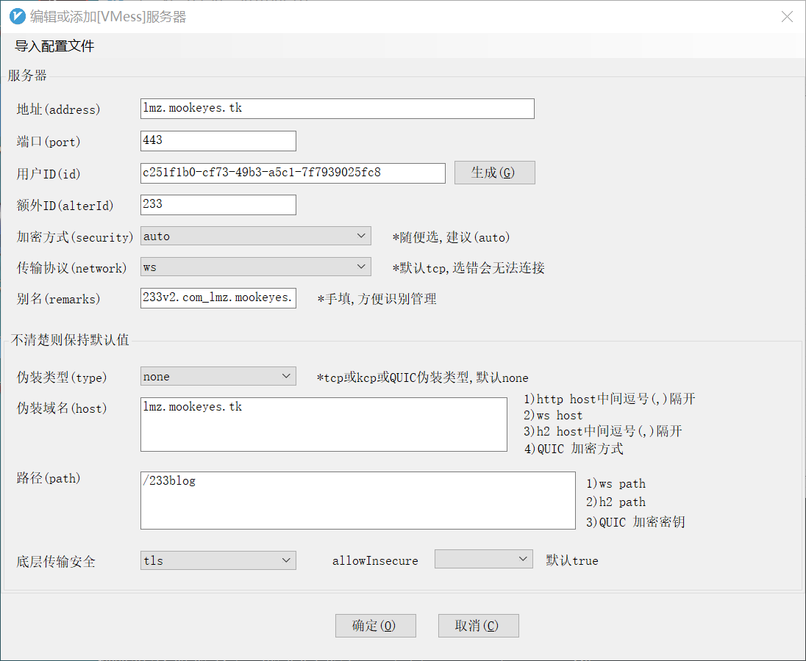

[github仓库](https://github.com/v2ray/manual)

[v2ray.com](https://www.v2ray.com/)

[V2Ray一键安装脚本]([https://github.com/233boy/v2ray/wiki/V2Ray%E4%B8%80%E9%94%AE%E5%AE%89%E8%A3%85%E8%84%9A%E6%9C%AC](https://github.com/233boy/v2ray/wiki/V2Ray一键安装脚本))

首先买个服务器

解析域名

能在国内ping到

当前服务器

```
lmz.mookeyes.tk
```

linux 安装脚本

```shell
bash <(curl -s -L https://git.io/v2ray.sh)
```

自行配置

```
---------- 安装信息 -------------

 V2Ray 传输协议 = WebSocket + TLS

 V2Ray 端口 = 56911

 你的域名 = lmz.yestojudge.cn

 域名解析 = 我确定已经有解析了

 自动配置 TLS = 打开

 路径分流 = /233blog

 是否配置 Shadowsocks = 未配置

---------- END -------------

```

```
..由于你的 VPS 内核支持开启 BBR ...已经为你启用 BBR 优化....


---------- V2Ray 配置信息 -------------

 地址 (Address) = lmz.yestojudge.cn

 端口 (Port) = 443

 用户ID (User ID / UUID) = 347b6ad3-8e14-492a-b05f-241cf9679401

 额外ID (Alter Id) = 233

 传输协议 (Network) = ws

 伪装类型 (header type) = none

 伪装域名 (host) = lmz.yestojudge.cn

 路径 (path) = /233blog

 TLS (Enable TLS) = 打开

---------- END -------------
```


```shell
---------- V2Ray 配置信息 -------------

 地址 (Address) = lmz.yestojudge.cn

 端口 (Port) = 443

 用户ID (User ID / UUID) = c0cc4cce-0993-4b40-a956-162ebee3d3e2

 额外ID (Alter Id) = 233

 传输协议 (Network) = ws

 伪装类型 (header type) = none

 伪装域名 (host) = lmz.yestojudge.cn

 路径 (path) = /233blog

 TLS (Enable TLS) = 打开

---------- END -------------
```


获取连接

```
v2ray url
```

```
vmess://ewoidiI6ICIyIiwKInBzIjogIjIzM3YyLmNvbV9sbXoueWVzdG9qdWRnZS5jbiIsCiJhZGQiOiAibG16Lnllc3RvanVkZ2UuY24iLAoicG9ydCI6ICI0NDMiLAoiaWQiOiAiMzQ3YjZhZDMtOGUxNC00OTJhLWIwNWYtMjQxY2Y5Njc5NDAxIiwKImFpZCI6ICIyMzMiLAoibmV0IjogIndzIiwKInR5cGUiOiAibm9uZSIsCiJob3N0IjogImxtei55ZXN0b2p1ZGdlLmNuIiwKInBhdGgiOiAiLzIzM2Jsb2ciLAoidGxzIjogInRscyIKfQo=
```





```
---------- V2Ray 配置信息 -------------

 地址 (Address) = lmz.mookeyes.tk

 端口 (Port) = 443

 用户ID (User ID / UUID) = d18116c8-8535-470b-80be-47aae169c2b3

 额外ID (Alter Id) = 233

 传输协议 (Network) = ws

 伪装类型 (header type) = none

 伪装域名 (host) = lmz.mookeyes.tk

 路径 (path) = /233blog

 TLS (Enable TLS) = 打开

---------- END -------------

V2Ray 客户端使用教程: https://233v2.com/post/4/

提示: 输入 v2ray url 可生成 vmess URL 链接 / 输入 v2ray qr 可生成二维码链接
```

# My

Problem:**ListenIP6**

https://www.linodovultr.com/post/resolve-v2ray-after-install-can-not-connect.html?replytocom=69

## 时间不同步，误差要小于90s

https://www.529i.com/archives/363.html

```shell
date -R #查看系统时间
dpkg-reconfigure tzdata #设置时区
```

```shell
date -s "2020-05-10 9:05:30" #设置时间
```

```

hwclock --systohc #同步到硬件时间
hwclock #chak查看硬件时间

service v2ray stop
service v2ray start
```

# Ubuntu 18.04/18.10快速开启Google BBR的方法

https://www.moerats.com/archives/612/

```shell
root@nicolas:~# cat /etc/issue
Ubuntu 18.04.2 LTS \n \l
```

