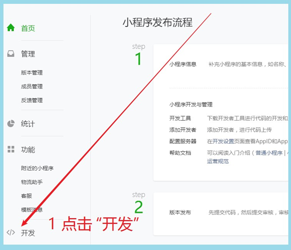
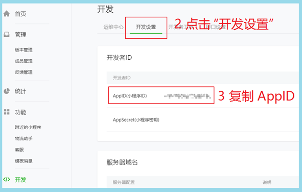
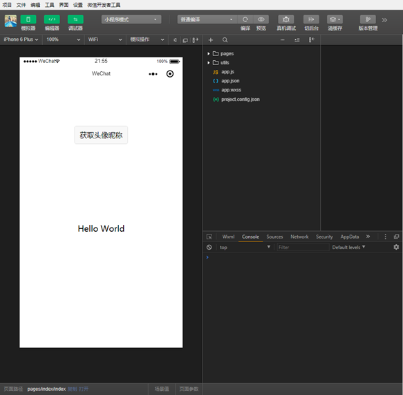
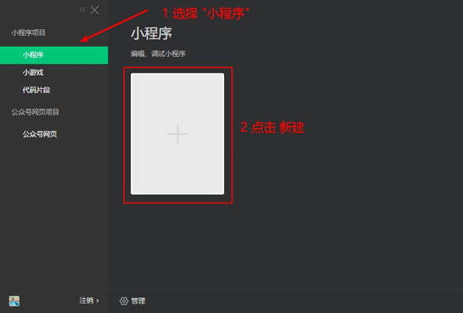
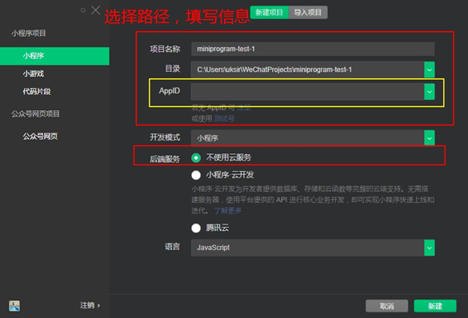
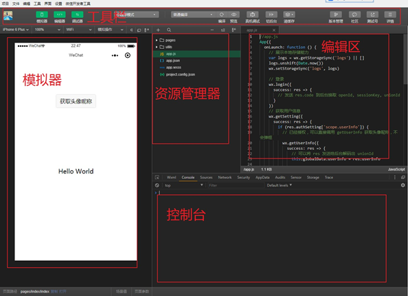
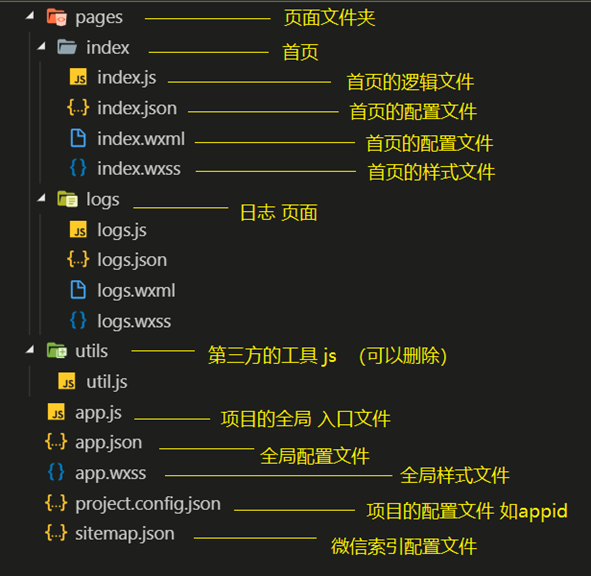
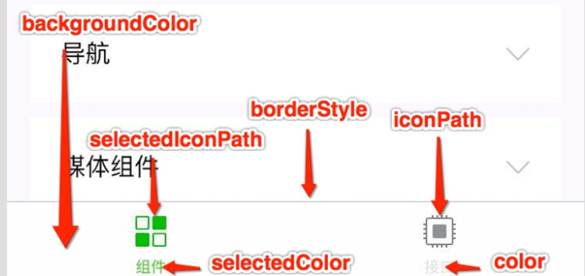
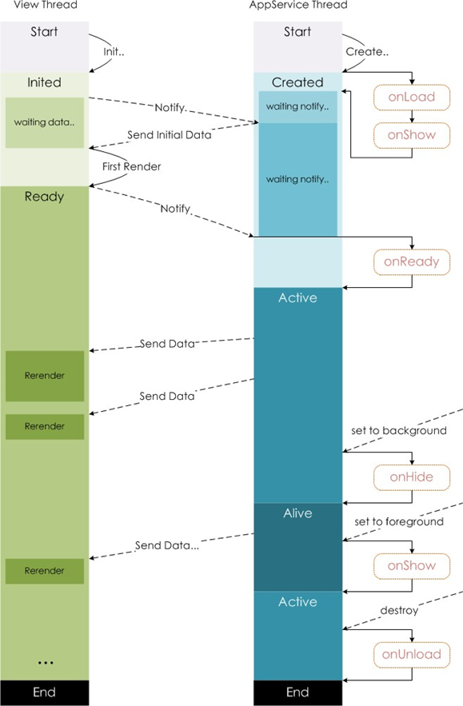

1.

# 2. 环境准备

开发微信⼩程序之前，必须要准备好相应的环境

## 2.1. 注册账号

建议使用全新的邮箱，没有注册过其他小程序或者公众号的。
传智播客-黑马程序员
访问[注册⻚⾯](https://mp.weixin.qq.com/wxopen/waregister?action=step1)，耐⼼完成注册即可。

https://mp.weixin.qq.com/wxamp/home/guide?token=970725262

762792495@qq.com

## 2.2. 获取APPID

由于后期调⽤微信⼩程序的接⼝等功能，需要索取开发者的⼩程序中的 AAPPPPIIDD ，所以在注册成功后，
可登录，然后获取APPID。
登录，成功后可看到如下界⾯
然后复制你的APPID,悄悄的保存起来，不要给别⼈看到😄。





2.3. 开发⼯具
[下载地址](https://developers.weixin.qq.com/miniprogram/dev/devtools/download.html)



微信⼩程序⾃带开发者⼯具，集 开发 预览 调试 发布 于⼀⾝的 完整环境。
但是由于编码的体验不算好，因此 建议使⽤ vvss ccooddee + 微信小程序编辑工具 来实现编码
vs code 负责敲代码， 微信编辑工具 负责预览

# 3第⼀个微信⼩程序

## 3.1. 打开微信开发者⼯具

注意 第⼀次登录的时候 需要扫码登录

## 3.2. 新建⼩程序项⽬



## 3.3. 填写项⽬信息



# 4微信开发者⼯具介绍

详细的使⽤，可以查看[官⽹](https://developers.weixin.qq.com/miniprogram/dev/devtools/devtools.html)



## 1快捷键

快捷键

Ctrl+S：保存文件
Ctrl+【， Ctrl+】：代码行缩进
Ctrl+Shift+【， Ctrl+Shift+】：折叠打开代码块
Ctrl+C Ctrl+V：复制粘贴，如果没有选中任何文字则复制粘贴一行
Shift+Alt+F：代码格式化
Alt+Up，Alt+Down：上下移动一行
Shift+Alt+Up，Shift+Alt+Down：向上向下复制一行
Ctrl+Shift+Enter：在当前行上方插入一行

Ctrl+End：移动到文件结尾
Ctrl+Home：移动到文件开头
Ctrl+i：选中当前行
Shift+End：选择从光标到行尾
Shift+Home：选择从行首到光标处
Ctrl+Shift+L：选中所有匹配
Ctrl+D：选中匹配
Ctrl+U：光标回退

# 5⼩程序结构⽬录

[⼩程序框架的](https://developers.weixin.qq.com/miniprogram/dev/framework/MINA.html)⽬标是通过尽可能简单、⾼效的⽅式让开发者可以在微信中开发具有原⽣ APP 体验的服
务。
⼩程序框架提供了⾃⼰的视图层描述语⾔ wxml和 sxss，以及 JavaScript，并在视图层与逻
辑层间提供了数据传输和事件系统，让开发者能够专注于数据与逻辑。

## 5.1. ⼩程序⽂件结构和传统web对⽐


| 结构 | 传统web    | 微信⼩程序 |
| ---- | ---------- | ---------- |
| 结构 | HTML       | WXML       |
| 样式 | CSS        | WXSS       |
| 逻辑 | JavaScript | Javascript |
| 配置 | ⽆         | JSON       |

通过以上对⽐得出，传统web 是三层结构。⽽微信⼩程序 是四层结构，多了⼀层 配置.json

## 5.2. 基本的项⽬⽬录



# 6⼩程序配置⽂件

⼀个⼩程序应⽤程序会包括最基本的两种配置⽂件。⼀种是全局的app.json 和 ⻚⾯⾃⼰的
page.json
注意：配置文件中不能出现注释

## 6.1.  [全局配置 app.json](https://developers.weixin.qq.com/miniprogram/dev/framework/config.html)

app.json 是当前⼩程序的全局配置，包括了⼩程序的所有⻚⾯路径、界⾯表现、⽹络超时时间、底
部 tab 等。**普通快速启动项⽬**⾥边的 app.json配置

```json
{
  "pages":[
    "pages/index/index",
    "pages/logs/logs"
  ],
  "window":{
    "backgroundTextStyle":"light",
    "navigationBarBackgroundColor": "#fff",
    "navigationBarTitleText": "Weixin",
    "navigationBarTextStyle":"black"
  },
  "style": "v2",
  "sitemapLocation": "sitemap.json"
}
```

字段的含义
1. page字段 ⸺ ⽤于描述当前⼩程序所有⻚⾯路径，这是为了让微信客⼾端知道当前你的⼩程序
⻚⾯定义在哪个⽬录。
2. window字段 ⸺ 定义⼩程序所有⻚⾯的顶部背景颜⾊，⽂字颜⾊定义等。
3. 完整的配置信息请参考 app.json配置

### 6.1.1. [tabbar](https://developers.weixin.qq.com/miniprogram/dev/reference/configuration/app.html)



## 6.2. ⻚⾯配置 [page.json](https://developers.weixin.qq.com/miniprogram/dev/reference/configuration/page.html)

这⾥的 page.json 其实⽤来表⽰**⻚⾯⽬录（pages/xx/xx.json）下的 page.json** 这类和⼩程序⻚⾯相关的配置。
开发者可以独⽴定义**每个⻚⾯的⼀些属性**，如顶部颜⾊、是否允许下拉刷新等等。
**⻚⾯的配置只能设置 app.json 中部分 window配置项的内容**，⻚⾯中配置项会覆盖 app.json
的 window中相同的配置项。

| 属性                         | 类型     | 默认值  | 描述                                                         |
| ---------------------------- | -------- | ------- | ------------------------------------------------------------ |
| navigationBarBackgroundColor | HexColor | #000000 | 导航栏背景颜⾊，如 #000000                                   |
| navigationBarTextStyle       | String   | white   | 导航栏标题颜⾊，仅⽀持 black / white                         |
| navigationBarTitleText       | String   |         | 导航栏标题⽂字内容                                           |
| backgroundColor              | HexColor | #ffffff | 窗⼝的背景⾊                                                 |
| backgroundTextStyle          | String   | dark    | 下拉 loading 的样式，仅⽀持 dark / light                     |
| enablePullDownRefresh        | Boolean  | false   | 是否全局开启下拉刷新。 详⻅ [Page.onPullDownRefresh](https://developers.weixin.qq.com/miniprogram/dev/framework/app-service/page.html#onpulldownrefresh) |
| onReachBottomDistance        | Number   | 50      | ⻚⾯上拉触底事件触发时距⻚⾯底部距离，单位为px。 详⻅[Page.onReachBottom](https://developers.weixin.qq.com/miniprogram/dev/framework/app-service/page.html#onreachbottom) |
| disableScroll                | Boolean  | false   | 设置为 true 则⻚⾯整体不能上下滚动；只在⻚⾯配置中有效，⽆法在 app.json 中设置该项 |

## 6.3. [sitemap 配置-了解即可](https://developers.weixin.qq.com/miniprogram/dev/reference/configuration/sitemap.html)

⼩程序根⽬录下的 ssiitteemmaapp..jjssoonn ⽂件⽤于配置⼩程序及其⻚⾯是否允许被微信索引。


```js
// pages/demo01/demo01.js
Page({

    /**
     * 页面的初始数据
     */
    data: {

    },

    /**
     * 生命周期函数--监听页面加载
     */
    onLoad: function (options) {

    },

    /**
     * 生命周期函数--监听页面初次渲染完成
     */
    onReady: function () {

    },

    /**
     * 生命周期函数--监听页面显示
     */
    onShow: function () {

    },

    /**
     * 生命周期函数--监听页面隐藏
     */
    onHide: function () {

    },

    /**
     * 生命周期函数--监听页面卸载
     */
    onUnload: function () {

    },

    /**
     * 页面相关事件处理函数--监听用户下拉动作
     */
    onPullDownRefresh: function () {

    },

    /**
     * 页面上拉触底事件的处理函数
     */
    onReachBottom: function () {

    },

    /**
     * 用户点击右上角分享
     */
    onShareAppMessage: function () {

    }
})
```

# 7模板语法

WXML（WeiXin Markup Language）是框架设计的⼀套标签语⾔，结合基础组件、事件系统，可以构
建出⻚⾯的结构。

## 7.1. 数据绑定

7.1.1. 普通写法

# 14 15p跳过

### 7.3.2. block

渲染⼀个包含多节点的结构块 block最终不会变成真正的dom元素

```vue
<block wx:for="{{[1, 2, 3]}}" wx:key="*this" >
    <view> {{index}}: </view>
    <view> {{item}} </view>
</block>
```

hidden只是隐藏，if的话会直接删除元素，会导致“重排”，频繁重排，会影响性能，浪费资源，不懂的可以看下浏览器渲染HTML的过程

## 7.4. 条件渲染

### 7.4.1. wx:if

在框架中，使⽤ wx:if==""{{{{ccoonnddiittiioonn}}}}"" 来判断是否需要渲染该代码块：

```xml
 <!-- 
    11 条件渲染
      1 wx:if="{{true/false}}"
        1 if , else , if else
        wx:if
        wx:elif
        wx:else 
      2 hidden 
        1 在标签上直接加入属性 hidden 
        2 hidden="{{true}}"

      3 什么场景下用哪个
        1 当标签不是频繁的切换显示 优先使用 wx:if
          直接把标签从 页面结构给移除掉 
        2 当标签频繁的切换显示的时候 优先使用 hidden
          通过添加样式的方式来切换显示 
          hidden 属性 不要和 样式 display一起使用
   -->
<view wx:if="{{false}}">1</view>
<view wx:elif="{{true}}">2</view>
<view wx:else>3</view>
```

### 7.4.2. hidden

```
<view hidden="{{condition}}"> True </view>
```

类似 wx:if
频繁切换 ⽤ hhiiddddeenn

不常使⽤ ⽤ wx:if

# 8⼩程序事件的绑定

⼩程序中绑定事件，通过bind关键字来实现。如 bbiinnddttaapp bbiinnddiinnppuutt bbiinnddcchhaannggee 等
不同的组件⽀持不同的事件，具体看组件的说明即可。

8.1. wxml

```
<input bindinput="handleInput" />
```


8.2. page

```js
Page({
// 绑定的事件
handleInput: function(e) {
    console.log(e);
    console.log("值被改变了");
}
})
```


8.3. 特别注意

1. 绑定事件时不能带参数 不能带括号 以下为错误写法

   ```
   <input bindinput="handleInput(100)" />
   ```

   

2. 事件传值 通过标签⾃定义属性的⽅式 和 value

   ```
   <input bindinput="handleInput" data-item="100" />
   ```

   

3. 事件触发时获取数据

   ```js
   // pages/demo04/demo04.js
   Page({
     data: {
       num: 0
     },
     // 输入框的input事件的执行逻辑
     handleInput(e) {
       // console.log(e.detail.value );
       this.setData({
         num: e.detail.value
       })
     }
   })
   ```

   

   

# p19-p34 跳过

# 12⼩程序⽣命周期

分为应⽤⽣命周期和⻚⾯⽣命周期

> 关于小程序前后台的定义和小程序的运行机制，请参考[运行机制章节](https://developers.weixin.qq.com/miniprogram/dev/framework/operating-mechanism.html)。

```js
// app.js
App({
  onLaunch() {
    // 展示本地存储能力
    const logs = wx.getStorageSync('logs') || []
    logs.unshift(Date.now())
    wx.setStorageSync('logs', logs)

    // 登录
    wx.login({
      success: res => {
        // 发送 res.code 到后台换取 openId, sessionKey, unionId
      }
    })
  },
  globalData: {
    userInfo: null
  }
})
```

## 12.1. [应⽤⽣命周期](https://developers.weixin.qq.com/miniprogram/dev/reference/api/App.html)

| 属性                                                         | 类型     | 默认值 | 必填 | 说明                     |
| ------------------------------------------------------------ | -------- | ------ | ---- | ------------------------ |
| [onLaunch](https://developers.weixin.qq.com/miniprogram/dev/reference/api/App.html#onlaunchobject-object) | function |        | 否   | 监听⼩程序初始化。       |
| [onShow](https://developers.weixin.qq.com/miniprogram/dev/reference/api/App.html#onshowobject-object) | function |        | 否   | 监听⼩程序启动或切前台。 |
| [onHide](https://developers.weixin.qq.com/miniprogram/dev/reference/api/App.html#onhide) | function |        | 否   | 监听⼩程序切后台。       |
| [onError](https://developers.weixin.qq.com/miniprogram/dev/reference/api/App.html#onerrorstring-error) | function |        | 否   | 错误监听函数。           |
| [onPageNotFound](https://developers.weixin.qq.com/miniprogram/dev/reference/api/App.html#onpagenotfoundobject-object) | function |        | 否   | ⻚⾯不存在监听函数。     |

```js
//app.js
App({
  //  1 应用第一次启动的就会触发的事件  
  onLaunch() {
    //  在应用第一次启动的时候 获取用户的个人信息 
    // console.log("onLaunch");
    // aabbcc

    // js的方式来跳转 不能触发 onPageNotFound
    // wx.navigateTo({
    //   url: '/11/22/33'
    // });
      
  },

  // 2 应用 被用户看到 
  onShow(){
    // 对应用的数据或者页面效果 重置 
    // console.log("onShow");
  },
  // 3 应用 被隐藏了 
  onHide(){
    // 暂停或者清除定时器 
    // console.log("Hide");
  },
  // 4 应用的代码发生了报错的时候 就会触发
  onError(err){
    // 在应用发生代码报错的时候，收集用户的错误信息，通过异步请求 将错误的信息发送后台去
    // console.log("onError");
    // console.log(err);
  },
  // 5 页面找不到就会触发 
  //  应用第一次启动的时候，如果找不到第一个入口页面 才会触发
  onPageNotFound(){
    // 如果页面不存在了 通过js的方式来重新跳转页面 重新跳到第二个首页
    // 不能跳到tabbar页面  导航组件类似  
    wx.navigateTo({
      url: '/pages/demo09/demo09' 
    });  
      
    // console.log("onPageNotFound");
  }
})
```


## 12.2. [⻚⾯⽣命周期](https://developers.weixin.qq.com/miniprogram/dev/reference/api/Page.html)

| 属性                                                         | 类型     | 说明                                                         |
| ------------------------------------------------------------ | -------- | ------------------------------------------------------------ |
| [data](https://developers.weixin.qq.com/miniprogram/dev/reference/api/Page.html#data) | Object   | ⻚⾯的初始数据                                               |
| [onLoad](https://developers.weixin.qq.com/miniprogram/dev/reference/api/Page.html#onloadobject-query) | function | ⽣命周期回调—监听⻚⾯加载                                    |
| [onShow](https://developers.weixin.qq.com/miniprogram/dev/reference/api/Page.html#onshow) | function | ⽣命周期回调—监听⻚⾯显⽰                                    |
| [onReady](https://developers.weixin.qq.com/miniprogram/dev/reference/api/Page.html#onready) | function | ⽣命周期回调—监听⻚⾯初次渲染完成                            |
| [onHide](https://developers.weixin.qq.com/miniprogram/dev/reference/api/Page.html#onhide) | function | ⽣命周期回调—监听⻚⾯隐藏                                    |
| [onUnload](https://developers.weixin.qq.com/miniprogram/dev/reference/api/Page.html#onunload) | function | ⽣命周期回调—监听⻚⾯卸载                                    |
| [onPullDownRefresh](https://developers.weixin.qq.com/miniprogram/dev/reference/api/Page.html#onpulldownrefresh) | function | 监听⽤⼾下拉动作                                             |
| [onReachBottom](https://developers.weixin.qq.com/miniprogram/dev/reference/api/Page.html#onreachbottom) | function | ⻚⾯上拉触底事件的处理函数                                   |
| [onShareAppMessage](https://developers.weixin.qq.com/miniprogram/dev/reference/api/Page.html#onshareappmessageobject-object) | function | ⽤⼾点击右上⻆转发                                           |
| [onPageScroll](https://developers.weixin.qq.com/miniprogram/dev/reference/api/Page.html#onpagescrollobject-object) | function | ⻚⾯滚动触发事件的处理函数                                   |
| [onResize](https://developers.weixin.qq.com/miniprogram/dev/reference/api/Page.html#onresize) | function | ⻚⾯尺⼨改变时触发，详⻅ [响应显⽰区域变化](https://developers.weixin.qq.com/miniprogram/dev/framework/view/resizable.html#在手机上启用屏幕旋转支持) |
| [onTabItemTap](https://developers.weixin.qq.com/miniprogram/dev/reference/api/Page.html#ontabitemtapobject-object) | function | 当前是 tab ⻚时，点击 tab 时触发                             |

## 12.3. ⻚⾯⽣命周期图解

